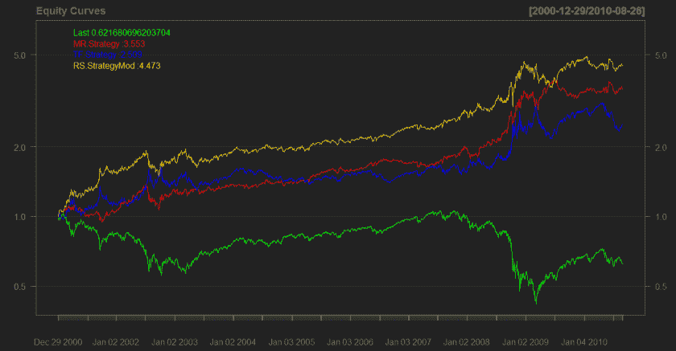
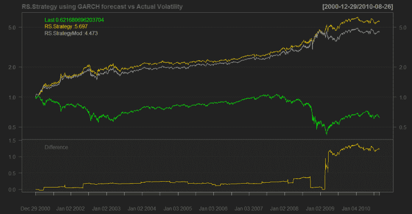
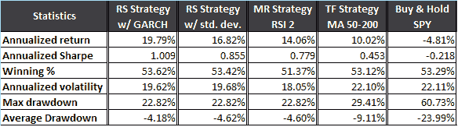

<!--yml
category: 未分类
date: 2024-05-18 14:03:03
-->

# Regime Switching System Using Volatility Forecast – Quantum Financier

> 来源：[https://quantumfinancier.wordpress.com/2010/08/27/regime-switching-system-using-volatility-forecast/#0001-01-01](https://quantumfinancier.wordpress.com/2010/08/27/regime-switching-system-using-volatility-forecast/#0001-01-01)

In the same line of thoughts as last post, today we will look at a way to incorporate the GARCH volatility model we introduced yesterday to create a regime switching strategy.

It is often discussed on the blogosphere that high volatility is good for daily MR, see previous editions of the state of short-term mean-reversion report by Michael over at MarketSci [here](http://marketsci.wordpress.com/2010/08/01/the-new-state-of-short-term-mean-reversion-july-2010/) and the moderator of daily follow-through MR series by David at CSS Analytics [here](http://cssanalytics.wordpress.com/2009/08/24/moderators-of-daily-follow-through-mr-volatility-part-1-of-3/) and [here](http://cssanalytics.wordpress.com/2009/08/25/moderators-of-daily-follow-through-mr-implied-volatility-vs-historical-volatility/). Concurrently, a low volatility environment is usually a good environment for trend following strategies; see Jez Liberty’s state of trend following report [here](http://www.automated-trading-system.com/state-trend-following-ijuly/).

With this in mind, since we want to maximize our return we want to be trading the appropriate strategy based on the volatility environment. Using volatility we can switch between MR and TF strategies dynamically to better adapt to the current market paradigm. To do this we can classify current volatility by percentile using a 252 day lookback period. The resulting series oscillate between 0 and 1, and is smoothed using a 21 day [percentrankSMA](http://cssanalytics.wordpress.com/2010/05/19/percentrank-sma/) (developed by David Varadi) using a 252 day lookback period. We now have a back of the envelope smoothed volatility regime oscillator where reading greater than .5 indicate high volatility and smaller than .5 low volatility in place.

For the following example, the regime switching (RS) strategy will be as follows: if the oscilliator is greater than .5 we trade the MR strategy and we trade the TF strategy when the oscillator is below the .5 treshold. The MR strategy proxy is the RSI2, and the TF strategy proxy is the MA 50-200 crossover for this simple test. Results on the SPY are presented below with equity curves for MR only (red), TF only (blue), buy and hold (green) and RS (yellow). Note that for this test, the input for the volatility is the running 21 day standard deviation of returns (ie. historical volatility).

The RS strategy outperforms both MR and TF strategies over 10 years. But wait a minute, the post was about regime switching using volatility forecast, not historical volatility. Simple, to do so, we calculate the oscilliator using the results of the garch model introduced in the last post. We now have the RS strategy using volatility forecast, good news is: it performs better! Results below using GARCH forecast (gold) vs using historical volatility (grey).

As mentioned before on many other blogs, incorporating volatility forecast in a strategy seems to improve results in this regime switching strategy.

QF