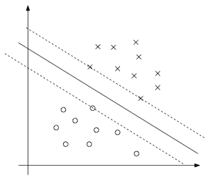

<!--yml
category: 未分类
date: 2024-05-18 15:37:42
-->

# Regression Approaches | Tr8dr

> 来源：[https://tr8dr.wordpress.com/2009/11/13/probabilistic-regressors-the-mean/#0001-01-01](https://tr8dr.wordpress.com/2009/11/13/probabilistic-regressors-the-mean/#0001-01-01)

One of the readers of this blog (skauf) suggested looking into KRLS (Kernel Recursive Least Squares), which is an “online” algorithm for multivariate regression closely related to SVM and Gaussian Processes approaches.    What struck me as clever in the KRLS algorithm is that it incorporates an online sparsification approach.  Why this is important, I will attempt to explain briefly in the next section.

The sparsification approach is similar in effect to PCA in that it reduces dimension and determines the most influential aspects of your system.  I had been thinking about a combined PCA / basis decomposition approach for some time, and it struck me that KRLS might be the way to do it.

**Kernal-based Learning Algorithms**
KRLS and SVM algorithms use a common approach to classification (or regression).   In the simplest case, let us assume that we want to find some function f(x) that will classify n-dimensional vectors as belonging to one of 2 sets (apples or oranges), which we will distinguish by + and – values from f(x):

Assuming the vectors X are linearly separable, we could try to find a hyperplane on the n-dimensional space that would separate the vectors such that there is a balance of distance between the two categories (and one that is maximal subject to some constraints).   The distance between the hyperplane (or in 2 dimensions a line) and the points is determined by a **margin** function.

Optimization is accomplished by maximizing the **margins** subject to constraints.  The optimization solves for the weights α  such that the sum of the weighted dot product of  X with each Xi yields the predicted value.  The form of f(x) is the following:

Now the above graph shows a very well-behaved data set, with a clear boundary for classification.  Many data sets, however, will have significant noise in the data and/or outliers that refuse to be categorized correctly.   This data has an overall impact on the regression line.

Supposing we have N samples in our training set {{X1,Y1}, {X2,Y2}, … {Xn, Yn}}.   In simple terms, sparsification is the process of removing (or discounting) samples that are already represented in the existing set, reducing the bias of the regressor.   One approach to determining the degree of representation is to observe the “degree of orthogonality” represented by a given vector with respect to the existing set.   Sparsification also points to an approach to evolving the regressor over time relative to new observations.

**The Kernel
Above gave a brief overview of how SVM uses the notion of margin to classify data.  A kernel is not necessary for data that is linearly separable.   The kernel is “simply” a function that maps data from the “attribute” space to “feature” space.   We design or choose the kernel function so that our data is largely linearly separable in the “feature” space and with the constraint that the covariance matrix of all possible vectors mapped from attribute to feature space will be positive semi-definite.**

**Since our linear SVM equations are expressed in terms of inner products, given a feature mapping function Φ(x) mapping X from non-linear space to “linearly separable space”, we can express the kernel as a function of the inner product of two vectors, later to plug in to our linear equations:**

****

**The trick is to choose a kernel function that maximizes dispersion of the data into sets that are linearly separable.**

****How does this relate to an explicit probability based regression?**
It turns out that the process of optimizing the margin function on a Gaussian kernel  is equivalent to finding the unnormalized maximum likelihood, whereas the Gaussian Process approach makes this explicit.**

****Which model does one choose?** The Gaussian Process approach is strictly bayesian.   It has the upside of providing explicit probabilities / confidence measures on predictions.  If one knows the likelihoods of the desired labels with respect to the attribute vectors, the model works very well and provides more information than the SVM family.**

**The SVM family of approaches use a margin function to determine the similarity between vectors (for the purpose of classification).   This does not explicitly involve probabilities, but for the Gaussian kernel can be shown to be equivalent to the Gaussian Process approach.   The SVM family has the upside that one does not need to know the likelihoods.**

**Finally, both models allow the use of kernels to map data from a non-normal or non-linear space to a linear or gaussian space.   Some have shown that there is a degree of equivalence between the likelihood function in the Gaussian Process algorithm and the kernel function used in SVM.**