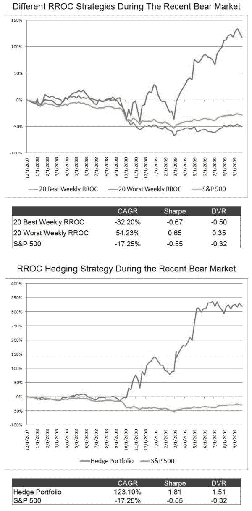

<!--yml
category: 未分类
date: 2024-05-12 18:45:35
-->

# Relative ROC (RROC) as a Relative Stock Selection Mechanism (Part 1) | CSSA

> 来源：[https://cssanalytics.wordpress.com/2009/10/10/relative-roc-rroc-as-a-relative-stock-selection-mechanism-part-1/#0001-01-01](https://cssanalytics.wordpress.com/2009/10/10/relative-roc-rroc-as-a-relative-stock-selection-mechanism-part-1/#0001-01-01)

For all the work that is sometimes done on indicator refinement, sometimes its the simple things that work best. When your goal is to find the best stocks or ETFs, often indicators like RSI2 or DV2 are not completely sufficient as they do not account for relative volatility between stocks. That is, given two stocks with DV2 readings below 10—you could have widely different results because one could be a slow moving defensive stock, and the other could be a high tech stock.  The defensive stock could be down 3% on the week and the high tech stock could be down 12%. Other things being equal, to maximize return you will want to focus on the stock that has gone up or down the most–and the high tech stock will make you more money most of the time. This is a whole subject area in itself and differences in volatilities and betas, even alphas (the residual) have substantial impacts in the relative selection process.

Today we will look at a couple simple tests using only relative ROCs. I will use only S&P500 stocks to ensure that we do not include stocks that are untradeable. For this post we will focus only on 1-week returns (5-day ROC). Below are the returns to two different 20-stock portfolios: the stocks with the   20  best and worst five day ROCs (1-week returns) from the S&P500 index from December 28, 2007 to the beginning of October 2009\. The strategy only involves buying the top or bottom 20 and exiting 1-week later and rebalancing . Thus there is no dynamic exit here, which understates the strategy performance.

