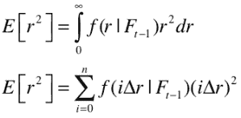
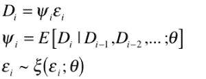

<!--yml
category: 未分类
date: 2024-05-18 15:36:47
-->

# Rethinking Variance | Tr8dr

> 来源：[https://tr8dr.wordpress.com/2009/11/26/rethinking-variance/#0001-01-01](https://tr8dr.wordpress.com/2009/11/26/rethinking-variance/#0001-01-01)

Volatility (variance) estimation is probably one of the most difficult areas of research in finance.   As mentioned in previous posts, recent research has been largely focused on duration based models for variance estimation.

I’ve done some experimentation with duration-based models, but have yet to find a satisfactory approach, but feel I am now beginning to understand what a satisfactory model might look like.    I don’t have the luxury of time to make it a full study, but hope to come up with an approach, however heuristic, that meets my needs.

There is a view that volatility (quadratic variation) can be separated into at least 2 distinct components:

*   integrated variance (IV)
    This is the primary return variation generated by the diffusive process component in our price process
*   squared jump term
    Jumps due to news or other behavior, not modeled by the diffusive process.

Together these explain what we call quadratic variance (QV):

The fundamental that underlies both “jumps” and “local volatility” is the notion of expected squared returns over a given time interval (in the continuous case infinitesimal, in real markets, discretely).   A pdf for the probability of a “jump” of size J at time t can be constructed as:

Where **f(I)** is the indicator of the “jump” event pdf and **f(Δr|I,F)** is the conditional distribution of jump size Δr given the event.  Together provide a posterior representing the probability of a price movement of Δr.   Variance can then be estimated with either the continuous or discrete form:

Thinking about “jumps” versus diffusion based volatility (as in the local vol estimates σ^2), the processes of the 2 differ in terms of intensity.   However we can still estimate both with the above expectation.   Both jumps and local vol can be **estimated with the same approach**, **only the parameterization of the probability distribution need differ** for different price jump levels(Δt).

One of the “hangups” in my recent attempts to model variance was in trying to model the timing and size of jumps as one process.   Now, what if we split this out:

1.  model the duration (or intensity) of events in jump level range
    Use an exponential-ACD model calibrated for duration between events in the range.
2.  model the size of events within the range
    Consider an autoregressive self-exciting process.  The AR component will model the reversion to the mean.

I can model variance as a set of self-exciting intensity processes, one for each range of price (return) levels.   I can the use the specialization of the **f(I)** and  **f(Δr|I,F)** conditional distributions for each price range to compute expected squared returns:

**The indicator process**
The indicator (or intensity) process can be modeled with an ACD model such as the Burr-ACD (which has shown to fit well empirically).   This can be calibrated for 2 sets of durations, one for “local vol” and one for “jump vol”.   Potentially we could consider sub-dividing into more levels.

The ACD process as developed by Engle and Russell specifies the duration as a mixing process:

The conditional density of **Di** is is then:

The ultimate form is subject to the choice of hazard function.   The general form of the ACD update equation is reminiscent of GARCH:

Where g(D) is an analog of our hazard function for the distribution. In our case we will use the Burr distribution as proposed by Grammig and Maurer (2000).  The Burr distribution density, survival and hazard functions are given by:

We use the Burr density as the distribution ξ[i] for the indicator component ε[i] in Di = ψ[i]ε[i].  We choose a density for the distribution of ψ[i] as a gamma mixture (from Guirreri 2009):

And the distribution of the indicator process **ε[i]** as the Burr distribution from above.   To determine the probability of duration **D[i]** given **ψ[i]**, as we have  **ε[i] = D[i] /** **ψ[i]**:

Addendum: having done more exploration on this, looks like the **Stochastic Volatility Duration model** proposed by Ghysels,   Gourieroux, Jasiak, and Joann (2004), would offer a much better prediction capability.

**The level process**
The jump level process can be relatively simple.   We observe autoregressive decay across returns, both for diffusion related and jump returns.   There are gaps in between return events in both scenarios, but our mixture with the indicator process will allow us to model this.

A relatively simple autoregressive process can be used to model the event size decay from a self-exciting jump level for each range.   Given that observations will be made at non-uniform times, an exponential time-dependent AR model is probably best.   The distribution will need to be estimated.

**Conclusion** Model volatility with two processes:

1.  intensity process to represent periodicity / gapping behavior
2.  magnitude process representing self-exciting AR behavior

Addendum: discovered that others are thinking along the same lines.   There are a couple of papers circa 2008/2009 proposing models similar to what I have outlined.