<!--yml
category: 未分类
date: 2024-05-18 13:46:26
-->

# Return Decomposition via Mixing | Quantivity

> 来源：[https://quantivity.wordpress.com/2011/12/28/estimating-mixture-index-return-decomposition-via-maximum-likelihood/#0001-01-01](https://quantivity.wordpress.com/2011/12/28/estimating-mixture-index-return-decomposition-via-maximum-likelihood/#0001-01-01)

A variety of techniques exist for estimating parameters of the return decomposition model, previously introduced in [Index Return Decomposition](https://quantivity.wordpress.com/2011/12/14/index-return-decomposition/). This post considers estimation of an *independent mixture model* via maximum likelihood (MLE), a workhorse of frequentist statistics and always a nice place to begin.

Recall  is *unobserved*, and thus the model cannot be directly estimated via MLE. Thus, need to decide how to approach estimation for this latent variable. One way is to be naive, and simply assume  is the deterministic difference in return between stock and index (technically, this generates a [profile likelihood](http://en.wikipedia.org/wiki/Likelihood_function#Profile_likelihood) as formalized by [Severini and Wong [1992]](http://people.csail.mit.edu/~jrennie/trg/papers/severini-conditionally-92.pdf), which [Murphy and Van Der Vaart [2000]](http://www.jstor.org/pss/2669386) verify is well-behaved consistent with exact likelihood):

   

This assumption permits focus on estimating 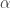, providing insight into the *mixing behavior* of the return being decomposed: if a stock return behaves like its index, then mixing is low with small  (in the limit, 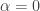 when a stock behaves identical to its index, as no mixing is required); in contrast, the stock return behaves independent from its index on a regular basis, then mixing is high with a large .

Autocorrelation of  and  is worth consideration, as that helps determine whether time indexing is required for . For returns with insignificant autocorrelation (common for *signed* equity returns), the time index is dropped and a single  is estimated. Yet, *conditional dependence* often exists between  and , consistent with previous posts in the [Proxy / Cross Hedging](https://quantivity.wordpress.com/2011/10/02/proxy-cross-hedging/) series (illustrating r-z copula for CRM / QQQ example below):

[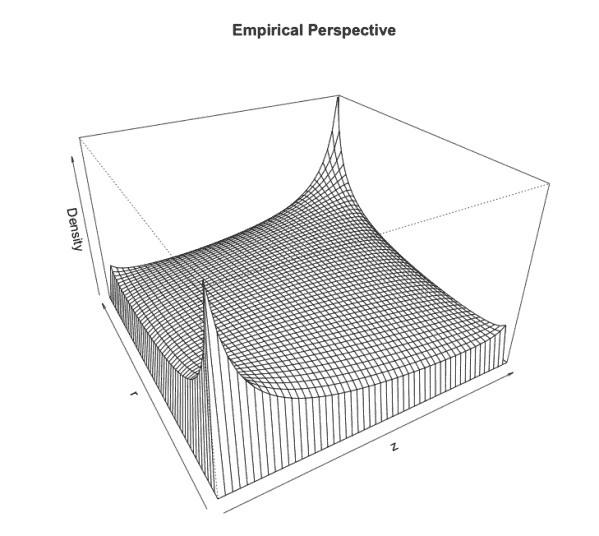](https://quantivity.wordpress.com/wp-content/uploads/2011/12/z-r-empirical-copula.png)

Use of this identity for  transforms the decomposition model into:

   ![r_t = s_t \left[ \alpha_t | (r_t - i_t) | + (1 - \alpha_t) \beta | i_t | \right] ](img/f32c42b7f1f93f3ffdcab23e1872b887.png)

The model is further simplified into a familiar *independent mixture model* by dropping sign  and , and estimating via MLE using density  and return distribution functions :

   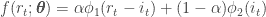

MLE estimation requires assumption of parametric distributions for , of which common choices from the literature are normal, student-t, skew-t, or skew hyperbolic student-t ([Aas and Haff [2006]](http://www.econ.ku.dk/fru/conference/Programme/Sunday/F4/Aas_226.pdf)). Next question is how to estimate the 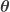 parameters:  and family of  parameters (*e.g.* 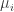 and  if  is assumed to be normal). As  is observed, one way to proceed is via two-step estimation:

1.  Estimate 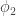 parameters via MLE from 
2.  Jointly estimate  and 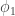 parameters via MLE on the mixture, holding  parameters constant

For both, recall the likelihood , and log likelihood 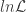, are defined as:

   

   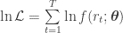

From which MLE of the mixture is maximization of the likelihood over , where log is chosen for numeric stability:

   ![\displaystyle \max_{\boldsymbol{\theta}} \ln \mathcal{L} = \max_{\boldsymbol{\theta}} \sum\limits_{t=1}^T \left( \ln \left[ \alpha (r_t - i_t) + (1 - \alpha) i_t \right] \right)](img/cdf953d7d59bf32767f8f0679d0f2692.png)

This optimization can be performed numerically in R via minimization using `DEoptim` of the negative log likelihood `negLogLikeFun` (negative is due to minimization in `DEoptim` versus maximization of 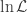). `DEoptim` is chosen due to rapid convergence on non-smooth global optimizations.

For example, continuing the example of CRM / QQQ introduced in the previous posts on [Proxy / Cross Hedging](https://quantivity.wordpress.com/2011/10/02/proxy-cross-hedging/) generates the results:

```

> symbols <- c("CRM", "QQQ")
> endDate <- Sys.Date()
> startDate <- endDate - as.difftime(52*5, unit="weeks")
> quoteType <- "Close"
> p <- do.call(cbind, lapply(symbols, get.hist.quote, start=startDate, end=endDate,  quote=quoteType))
> colnames(p) <- symbols
> doReturnDecomp(p)
normal mix likelihood: -3485.55 phi1 params: 0.0003471366 0.01673634 params 0.2546208 -0.001208877 0.0113988
skew-t mix likelihood: -3566.512 phi1 params: 0.003844969 0.01079941 -0.3252923 2.893228 params 0.2357737 -0.004188977 0.01099266 0.4157174 26.5643
skew-hyp-t likelihood: -3083.700 phi1 params: 0.01051675 0.1485529 -3.945452 10.10836 params 0.8295289 -0.0003636940 0.03071332 -0.5 5

```

These results correspond to the following density functions for the skew-t mixture:

[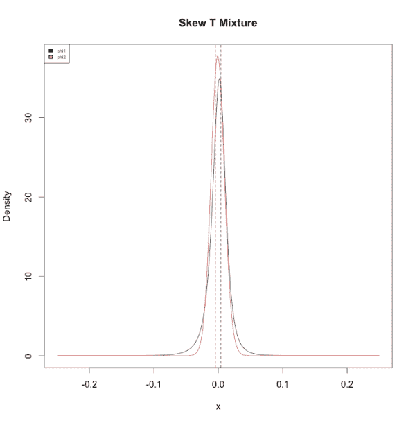](https://quantivity.wordpress.com/wp-content/uploads/2011/12/return-decomp-mixture-densities-skewt2.png)

One interesting observation of these densities is their location parameters are on opposing side of zero:  has positive location, while  has negative location. One interpretation of this is positive returns from CRM disproportionately originate from the idiosyncratic , while negative returns originate from the index . Economically, this is plausible: positive news is often idiosyncratic, while negative news is often market-wide.

Several additional inferences can be drawn from these results:

*   Model selection: likelihood suggests skew-t is the preferred model, indicating long tails and skewness (matching stylized facts)
*   Mixing:  indicating that over 75% of CRM returns are determined by the corresponding QQQ index; remaining 25% are determined by the unobserved  return series
*   Tails: CRM  df = 2.89 which indicates significantly thicker tails than QQQ  df = 26.56 (matching stylized facts for individual stocks versus indices)

Subsequent posts may consider alternative estimation techniques for this model.

* * *

R code for generating two-stage MLE estimation of return decomposition via mixing:

```

library("MASS")
library("stats")
library("DEoptim")
library("sn")
library("SkewHyperbolic")

normalMixtureIndexDecomp <- function(r, i)
{
  # Two-step MLE estimation of return decomposition model, assuming both
  # return distributions are normal.
  #
  # Args:
  #   r: return series being decomposed
  #   i: index series used for decomposition
  #
  # Return value: MLE parameter estimates

  z <- r - i
  id <- fitdistr(i, "normal")$estimate
  negLogLikeFun <- function(p) {
    a <- p[1]; mu1 <- p[2]; s1 <- p[3];
    ll <- (-sum(log(a * dnorm(z,mu1,s1) + (1 - a) * dnorm(i, id[1], id[2]))));
    return (ll); 
  }
  mle <- DEoptim(negLogLikeFun, c(0, -0.5, 0), c(1, .5, .5), control=list(trace=FALSE))

  cat("normal mix likelihood:", last(mle$member$bestvalit), "phi1 params:",id, "params", last(mle$member$bestmemit),"\n")
  mle <- last(mle$member$bestmemit)

  x <- seq(-.25,.25,length.out=500)
  dnorm1 <- dnorm(x, id[1], id[2])
  dnorm2 <- dst(x, mle[2], mle[3])
  plot(x, dnorm1, type='l', ylim=c(0, max(dnorm1,dnorm2)), ylab="Density", main="Normal Mixture")
  lines(x, dnorm2, col='red')
  abline(v=id[1], lty=2)
  abline(v=mle[2], col='red', lty=2)
  legend("topleft",legend=c("phi1", "phi2"), fill=colors, cex=0.5)

  return (mle)
}

mixtureSkewTIndexDecomp <- function(r, i)
{
  # Two-step MLE estimation of return decomposition model, assuming both
  # return distributions are skew-t.
  #
  # Args:
  #   r: return series being decomposed
  #   i: index series used for decomposition
  #
  # Return value: MLE parameter estimates

  z <- r - i
  idp <- st.mle(y=i)$dp
  negLogLikeFun <- function(p) {
    a <- p[1]; mu1 <- p[2]; s1 <- p[3]; s2 <- p[4]; df1 <- p[5]
    ll <- (-sum(log(a * dst(z,location=mu1,scale=s1,shape=s2,df=df1) + (1 - a) * dst(i, dp=idp))));
    return (ll); 
  }
  mle <- DEoptim(negLogLikeFun, c(0, -0.5, 0, 0, 2), c(1, .5, .5, 5, 50), control=list(trace=FALSE))

  cat("skew-t mix likelihood:", last(mle$member$bestvalit), "phi1 params:", idp, "params", last(mle$member$bestmemit),"\n")
  mle <- last(mle$member$bestmemit)

  x <- seq(-.25,.25,length.out=500)
  dst1 <- dst(x, dp=idp)
  dst2 <- dst(x, dp=mle[2:5])
  plot(x, dst1, type='l', ylim=c(0, max(dst1,dst2)), ylab="Density", main="Skew T Mixture")
  lines(x, dst2, col='red')
  abline(v=idp[1], lty=2)
  abline(v=mle[2], col='red', lty=2)
  legend("topleft",legend=c("phi1", "phi2"), fill=colors, cex=0.5)

  return (mle)
}

mixtureSkewHypTIndexDecomp <- function(r, i)
{
  # Two-step MLE estimation of return decomposition model, assuming both
  # return distributions are skew hyperbolic student-t.
  #
  # Args:
  #   r: return series being decomposed
  #   i: index series used for decomposition
  #
  # Return value: MLE parameter estimates

  z <- r - i
  iparam <- skewhypFit(i,plots=FALSE,printOut=FALSE)$param
  negLogLikeFun <- function(p) {
    a <- p[1];
    ll <- (-sum(log(a * dskewhyp(z,param=p[2:5]) + (1 - a) * dskewhyp(i, param=iparam))));
    return (ll); 
  }
  mle <- DEoptim(negLogLikeFun, c(0, -5, 0, -0.5, 0), c(1, 5, .5, -0.5, 5), control=list(trace=FALSE))

  cat("skew-hyp-t likelihood:", last(mle$member$bestvalit), "phi1 params:",iparam,"params", last(mle$member$bestmemit),"\n")
  mle <- last(mle$member$bestmemit)

  x <- seq(-.25,.25,length.out=500)
  dskewhyp1 <- dskewhyp(x, param=iparam)
  dskewhyp2 <- dskewhyp(x, param=mle[2:5])
  plot(x, dskewhyp1, type='l', ylim=c(0, max(dskewhyp1,dskewhyp2)), ylab="Density", main="Skew Hyperbolic Student-T")
  lines(x, dskewhyp2, col='red')
  abline(v=iparam[1], lty=2)
  abline(v=mle[2], col='red', lty=2)
  legend("topleft",legend=c("phi1", "phi2"), fill=colors, cex=0.5)

  return (mle)
}

doReturnDecomp <- function(p)
{
  # Decompose return of two series, using several parametric distributions.
  #
  # Args:
  #   p: p[,1] is return being decomposed; p[,2] is index returns
  #
  # Return value: none

  r <- ROC(p[,1], type="discrete", na.pad=FALSE)
  i <- ROC(p[,2], type="discrete", na.pad=FALSE)

  normalMixtureIndexDecomp(r, i)
  mixtureSkewTIndexDecomp(r,i)
  mixtureSkewHypTIndexDecomp(r,i)
}

```