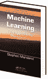

<!--yml
category: 未分类
date: 2024-05-18 13:52:27
-->

# Review: Machine Learning | Quantivity

> 来源：[https://quantivity.wordpress.com/2011/03/27/review-machine-learning/#0001-01-01](https://quantivity.wordpress.com/2011/03/27/review-machine-learning/#0001-01-01)

The following is a review of [Machine Learning: An Algorithmic Perspective](http://books.google.com/books?id=n66O8a4SWGEC) by Marsland.

Machine learning (ML) is one of those topics that elicits widely varying responses. Some folks think it’s rubbish for trading, recalling memories of failed early biologically-inspired AI techniques like [neural nets](http://en.wikipedia.org/wiki/Neural_net). Other folks think it’s the holy grail (it’s not). And yet other folks are uncertain of its applicability, confounded by its multidisciplinary nature and corresponding lack of historic pedagogical coherence.

All of these perspectives are confounded by the fairly sophisticated mathematical tenor of modern ML books (*e.g.* Hastie *et al.* and Bishop; see [How to Learn Algorithmic Trading: Part 2](https://quantivity.wordpress.com/2010/01/12/how-to-learn-algorithmic-trading-part-2/), for more details). This style causes two practical problems:

*   Cognitive burden: fairly heavy cognitive burden to deeply understand the methods. This is a huge issue vis-à-vis trading, as using these methods require understanding their *intuition* and heavily adapting the algorithms to solve specific trading problems (filtering, prediction, signaling, *etc.*)
*   Practical gap: significant gap between theory and working trading code; going from integrals to for-loops, no matter what language, simply takes work. This is magnified as ML often provides the biggest bang for the buck when sequentially combined with other quant building blocks

Given this context, the text provides a refreshing introduction to ML through a *practical algorithmic lens*: simply unlike other texts on ML, really shining at building conceptual intuition and providing intellectual breadcrumbs from idea to code for key ML themes. If you think in programmatic code and prefer lightweight mathematical machinery, this is a strong introduction text to ML.

A few spots in the text are exceptions to the generally strong tenor.

First, use of multi-layer perceptron as a motivating model feels dated (chapter 3). Perhaps this reflects stylistic bias in how to motivate ML: older texts derive motivation from classic AI (*e.g.* [Russell and Norvig](http://aima.cs.berkeley.edu/)), while an increasing number of more recent texts derive motivation from statistical learning (*i.e.* regression, ranking, and classification). Both are valid perspectives, but their precedent insights are quite different.

Second, coverage of MCMC and graphical methods (chapters 14 and 15), are particularly rough spots and suffer from several problems:

*   Topical selection: idiosyncratic sliver of their respective domains, whose comprehension and effective application depends upon understanding the larger context
*   Mathematical sophistication: fairly heavy mathematical intuition and machinery required for these topics are less amendable to the prose and algorithmic style adopted by the text, and thus the provided examples and code do not do equal illustrative justice as in previous chapters
*   Prematurity: both topics currently have active research literatures for which brief summary may perhaps be premature

Consider [Probabilistic Graphical Models](http://pgm.stanford.edu/) by Koller and Friedman as an alternate text for graphical methods, albeit in a totally different prose style than this text.