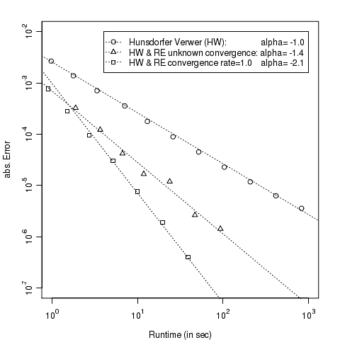

<!--yml
category: 未分类
date: 2024-05-17 23:30:53
-->

# Richardson Extrapolation for American Options – HPC-QuantLib

> 来源：[https://hpcquantlib.wordpress.com/2012/06/10/richardson-extrapolation-for-american-options/#0001-01-01](https://hpcquantlib.wordpress.com/2012/06/10/richardson-extrapolation-for-american-options/#0001-01-01)

Popular finite difference schemes like the one-dimensional Crank-Nicholson scheme or multi dimensional operating splitting methods like the Hundsdorfer-Verwer scheme often achieve second order convergence in  for typical partial differential equations in financial engineering. Unfortunately if these schemes are used together with dynamic programming to price America options the second order convergence is destroyed by the first order convergence of the dynamic programming step.

The Richardson extrapolation is a simple numerical gem to increase the convergence order of a numerical method. Say a numerical method has the following convergence behavior

 .

Please note that this is a more restrictive requirement than to assume that the numerical method is of order *n* because  does not depend on . Now the formula

also has

but the order of convergence of  is  *n+1*. The order does not depend on the particular value of *x* but often *x* is chosen to be two. This simple trick can be extended to the case where *n* is unknown or the Richardson extrapolation can be used *m* times to increase the order of convergence to *n+m* [2].

Lets apply the Richardson extrapolation to the pricing of an American Put under the Heston stochastic differential equation. The corresponding partial differential equation

is solved using the Hundsdorfer-Verwer scheme [1]. The early exercise condition is impressed using dynamic programming after every time step. The parameters of the experiment are

 .

As can be seen in the diagram below even though the Richardson extrapolation is a simple formula it increases the convergence by one order from *1.0* to approx. *2.1*. If the order is not known a priori then the resulting order is still *1.4*.

The source code is available [here](http://hpc-quantlib.de/src/richardson.zip). It depends on the latest QuantLib version from the [SVN trunk](http://sourceforge.net/p/quantlib/code/HEAD/tree/).

[1] Karel in ’t Hout, [ADI finite difference schemes for the Heston model with correlation.](http://win.ua.ac.be/~kihout/ADI_Heston_lecture.pdf)

[2] Eric Hung-Lin Liu, [Fundamental Methods of Numerical Extrapolation with Applications](http://ocw.mit.edu/courses/mathematics/18-304-undergraduate-seminar-in-discrete-mathematics-spring-2006/projects/xtrpltn_liu_xpnd.pdf).