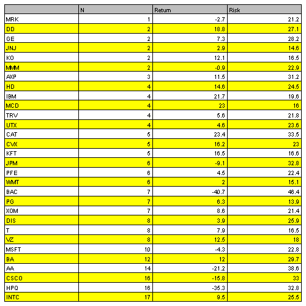
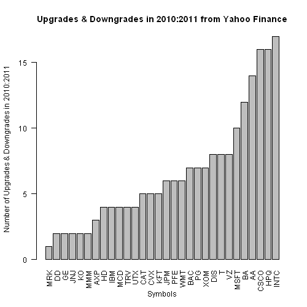
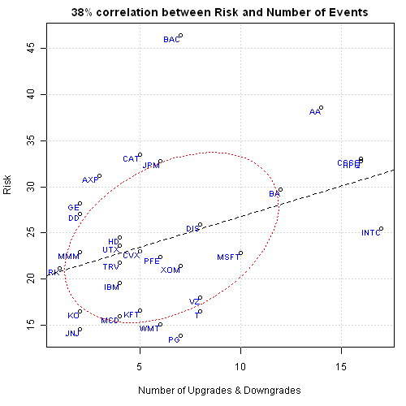
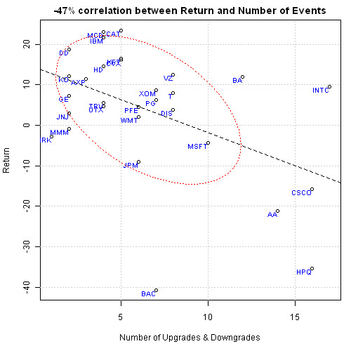

<!--yml
category: 未分类
date: 2024-05-18 14:49:03
-->

# Risk, Return and Analyst Ratings | Systematic Investor

> 来源：[https://systematicinvestor.wordpress.com/2011/10/08/risk-return-and-analyst-ratings/#0001-01-01](https://systematicinvestor.wordpress.com/2011/10/08/risk-return-and-analyst-ratings/#0001-01-01)

Today I want to discuss a connection between Risk, Return and Analyst Ratings. Let’s start with defining our universe of stocks : 30 stocks from [Dow Jones Industrial Average (^DJI)](http://finance.yahoo.com/q/cp?s=%5EDJI+Components) index. For each stock I will compute the number of Upgrades and Downgrades, Risk, and Return in 2010:2011\. I will run a linear regression and compute correlation between the number of Upgrades and Downgrades and Risk and Return.

Let’s implement this plan using R and [Systematic Investor Toolbox](https://github.com/systematicinvestor/SIT).

First, let’s load Systematic Investor Toolbox and [quantmod](http://www.quantmod.com/) package

```

# load Systematic Investor Toolbox
setInternet2(TRUE)
source(gzcon(url('https://github.com/systematicinvestor/SIT/raw/master/sit.gz', 'rb')))

load.packages('quantmod,car')

```

I will get the list of stocks in [Dow Jones Industrial Average (^DJI)](http://finance.yahoo.com/q/cp?s=%5EDJI+Components) index from Yahoo Finance:

```

# download Dow Jones Components
url = 'http://finance.yahoo.com/q/cp?s=^DJI+Components'
txt = join(readLines(url))

# extract table from this page
temp = extract.table.from.webpage(txt, 'Symbol', hasHeader = T)

# Symbols
Symbols = temp[, 'Symbol']

```

I will get the Upgrades & Downgrades History for each stock from [Yahoo Finance](http://finance.yahoo.com/q/ud?s=IBM):

```

# Matrix with number of Upgrades/Downgrades in 2010:2011
up.down.stats = matrix( NA, nrow = len(Symbols), ncol = 3 )
	rownames(up.down.stats) = Symbols
	colnames(up.down.stats) = spl('N,Return,Risk')

# Get Upgrade/Downgrade statistics and compute Risk and Return for each symbol
for( Symbol in Symbols ) {
	cat('Downloading', Symbol, '\n')

	# download Upgrade/Downgrade table
	url = paste('http://finance.yahoo.com/q/ud?s=', Symbol, sep = '')
	txt = join(readLines(url))

	# extract table from this page
	temp = extract.table.from.webpage(txt, 'Research Firm', hasHeader = T)

	# find number of Upgrades/Downgrades in 2010:2011
	event.year = format(as.Date(temp[, 'Date'], '%d-%b-%y'), '%Y')
	up.down.stats[Symbol, 'N'] = sum(event.year == '2010' | event.year == '2011')

	# download price history from Yahoo
	data = getSymbols(Symbol, from = '1980-01-01', auto.assign = FALSE)
	returns = ROC(Cl(data['2010::2011']), type = 'discrete')
		returns = na.omit(returns)

	# compute basic measures of Return and Risk
	up.down.stats[Symbol, 'Return'] = 252 * mean(returns)
	up.down.stats[Symbol, 'Risk'] = sqrt(252) * sd(returns)
}

```

Let’s have a look at the data:

```

# sort up.down.stats by number of events
up.down.stats = up.down.stats[ order(up.down.stats[,'N']), , drop = FALSE]
up.down.stats[, spl('Return,Risk')] = round(100 * up.down.stats[, spl('Return,Risk')], 1)

# plot table
plot.table(up.down.stats)

# barplot of Number of Upgrades & Downgrades in 2010:2011
par(mar = c(5,4,2,1), cex = 0.8)
barplot( up.down.stats[, 'N'],
	xlab = 'Symbols', ylab = 'Number of Upgrades & Downgrades in 2010:2011',
	main = 'Upgrades & Downgrades in 2010:2011 from Yahoo Finance',
	names.arg = rownames(up.down.stats), las = 2 )

```

[](https://systematicinvestor.wordpress.com/wp-content/uploads/2011/10/plot1-small1.png)

[](https://systematicinvestor.wordpress.com/wp-content/uploads/2011/10/plot2-small1.png)

Let’s run a linear regression and compute correlation between the number of Upgrades and Downgrades and Risk and Return:

```

# run linear regression and compute correlation between number of events and Returns / Risk
for( measure in spl('Risk,Return') ) {
	x = up.down.stats[, 'N']
	y = up.down.stats[, measure]

	# linear regression
	fit = lm(y ~ x)
	print(summary(fit))

	par(mar = c(5,4,2,1))
	plot(x, y, xlab = 'Number of of Upgrades & Downgrades', ylab = measure,
		main = paste(plota.format(100 * cor(x,y), 0, '', '%') , 'correlation between', measure, 'and Number of Events'))
		grid()
		text(x, y, rownames(up.down.stats), col = 'blue', adj = c(1,1), cex = 0.8)
		abline(coef = coef(fit), lty=2)

	# compute ellipsoid at 50% confidence level
	d = dataEllipse(x, y, levels = c(0.5), draw = FALSE)
	lines(d, col='red', lty=3)
}

```

[](https://systematicinvestor.wordpress.com/wp-content/uploads/2011/10/plotrisk-small.png)

```
Coefficients:
            Estimate Std. Error t value Pr(>|t|)
(Intercept)  20.1766     2.3879   8.449 3.45e-09 ***
x             0.6589     0.3022   2.180   0.0378 *
---
Signif. codes:  0 '***' 0.001 '**' 0.01 '*' 0.05 '.' 0.1 ' ' 1

Multiple R-squared: 0.1451,     Adjusted R-squared: 0.1146
F-statistic: 4.753 on 1 and 28 DF,  p-value: 0.0378
```

There is a positive correlation between the number of Upgrades & Downgrades and Risk. The beta coefficient in linear regression is positive and significant at 5% confidence.

[](https://systematicinvestor.wordpress.com/wp-content/uploads/2011/10/plotreturn-small.png)

```
Coefficients:
            Estimate Std. Error t value Pr(>|t|)
(Intercept)  14.5098     4.5533   3.187  0.00352 **
x            -1.6238     0.5763  -2.818  0.00877 **
---
Signif. codes:  0 '***' 0.001 '**' 0.01 '*' 0.05 '.' 0.1 ' ' 1

Multiple R-squared: 0.2209,     Adjusted R-squared: 0.1931
F-statistic:  7.94 on 1 and 28 DF,  p-value: 0.008769
```

There is a negative correlation between the number of Upgrades & Downgrades and Returns. The beta coefficient in linear regression is negative and significant at 1% confidence.

One could conclude from these observations that as the number of Upgrades & Downgrades increases the Risk goes up and Return goes down in 2010:2011 period. However, I see a few problems with this analysis:

*   we examined all stocks in the same way; yet companies from different sectors might have naturally occurring different risk/return characteristics
*   we treated all events in the same way; yet Upgrade/Downgrade/Initiated actions may have different influences on company’s stock price

Please tell me what else do you think is wrong with my analysis.