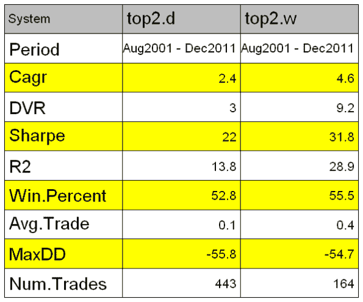
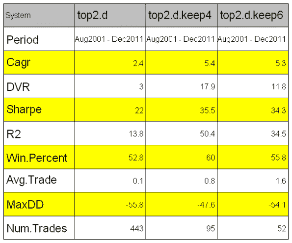
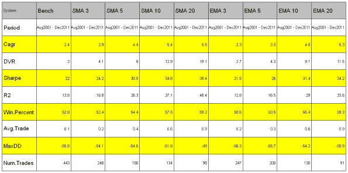
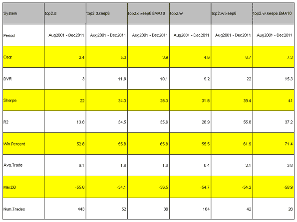

<!--yml
category: 未分类
date: 2024-05-18 14:44:28
-->

# Rotational Trading Strategies: borrowing ideas from Engineering Returns | Systematic Investor

> 来源：[https://systematicinvestor.wordpress.com/2011/12/20/rotational-trading-strategies-borrowing-ideas-from-engineering-returns/#0001-01-01](https://systematicinvestor.wordpress.com/2011/12/20/rotational-trading-strategies-borrowing-ideas-from-engineering-returns/#0001-01-01)

Frank Hassler at [Engineering Returns](http://engineering-returns.com) blog wrote an excellent article [Rotational Trading: how to reduce trades and improve returns](http://engineering-returns.com/2011/07/06/rotational-trading-how-to-reducing-trades-and-improve-returns/). The article presents four methods to reduce trades:

*   Trade less frequently. I.e. weekly instead of daily rebalancing.
*   Different criteria for enter / exit a trade.
*   Smooth the rank over the last couple of bars.
*   Combination of above.

I want show how to implement these ideas using the backtesting library in the [Systematic Investor Toolbox](https://systematicinvestor.wordpress.com/systematic-investor-toolbox/). I will use the 21 ETFs from the [ETF Sector Strategy](http://www.etfscreen.com/sectorstrategy.php) post as the investment universe.

Following code loads historical prices from Yahoo Fiance and compares performance of the daily versus weekly rebalancing using the backtesting library in the [Systematic Investor Toolbox](https://systematicinvestor.wordpress.com/systematic-investor-toolbox/):

```

# Load Systematic Investor Toolbox (SIT)
setInternet2(TRUE)
con = gzcon(url('https://github.com/systematicinvestor/SIT/raw/master/sit.gz', 'rb'))
	source(con)
close(con)

	#*****************************************************************
	# Load historical data
	#****************************************************************** 
	load.packages('quantmod')	
	tickers = spl('XLY,XLP,XLE,XLF,XLV,XLI,XLB,XLK,XLU,IWB,IWD,IWF,IWM,IWN,IWO,IWP,IWR,IWS,IWV,IWW,IWZ')

	data <- new.env()
	getSymbols(tickers, src = 'yahoo', from = '1970-01-01', env = data, auto.assign = T)
		for(i in ls(data)) data[[i]] = adjustOHLC(data[[i]], use.Adjusted=T)		
	bt.prep(data, align='remove.na', dates='1970::2011')

	#*****************************************************************
	# Code Strategies : weekly rebalancing
	#****************************************************************** 
	prices = data$prices  
	n = len(tickers)  

	# find week ends
	week.ends = endpoints(prices, 'weeks')
		week.ends = week.ends[week.ends > 0]		

	# Rank on ROC 200
	position.score = prices / mlag(prices, 200)	
		position.score.ma = position.score		
		buy.rule = T

	# Select Top 2 funds daily
	data$weight[] = NA
		data$weight[] = ntop(position.score, 2)	
		capital = 100000
		data$weight[] = (capital / prices) * bt.exrem(data$weight)				
	top2.d = bt.run(data, type='share', trade.summary=T, capital=capital)

	# Select Top 2 funds weekly
	data$weight[] = NA
		data$weight[week.ends,] = ntop(position.score[week.ends,], 2)	
		capital = 100000
		data$weight[] = (capital / prices) * bt.exrem(data$weight)		
	top2.w = bt.run(data, type='share', trade.summary=T, capital=capital)

	# Plot Strategy Metrics Side by Side
	plotbt.strategy.sidebyside(top2.d, top2.w, perfromance.fn = 'engineering.returns.kpi')	

```

[](https://systematicinvestor.wordpress.com/wp-content/uploads/2011/12/plot1-small4.png)

The number of trades falls down from 443 to 164 as we switch from daily to weekly rebalancing. The additional bonus is the better returns for the weekly rebalancing.

Next, let’s examine different entry/exit rank. We will buy top 2 ETFs and will keep them till their ranks drop below 4 /6.

```

	#*****************************************************************
	# Code Strategies : different entry/exit rank
	#****************************************************************** 

	# Select Top 2 funds, Keep till they are in 4/6 rank
	data$weight[] = NA
		data$weight[] = ntop.keep(position.score, 2, 4)	
		capital = 100000
		data$weight[] = (capital / prices) * bt.exrem(data$weight)		
	top2.d.keep4 = bt.run(data, type='share', trade.summary=T, capital=capital)

	data$weight[] = NA
		data$weight[] = ntop.keep(position.score, 2, 6)	
		capital = 100000
		data$weight[] = (capital / prices) * bt.exrem(data$weight)		
	top2.d.keep6 = bt.run(data, type='share', trade.summary=T, capital=capital)

	# Plot Strategy Metrics Side by Side
	plotbt.strategy.sidebyside(top2.d, top2.d.keep4, top2.d.keep6, perfromance.fn = 'engineering.returns.kpi')

```

[](https://systematicinvestor.wordpress.com/wp-content/uploads/2011/12/plot2-small4.png)

The number of trades falls down from 443 to 95 to 52 as we hold on to our selection for longer periods.

Next, let’s examine rank smoothing. Instead of using the most recent rank, we will use different averages of rank’s recent values.

```

	#*****************************************************************
	# Code Strategies : Rank smoothing
	#****************************************************************** 

	models = list()
	models$Bench = top2.d
	for( avg in spl('SMA,EMA') ) {
		for( i in c(3,5,10,20) ) {		
			position.score.smooth = bt.apply.matrix(position.score.ma, avg, i)	
				position.score.smooth[!buy.rule,] = NA

			data$weight[] = NA
				data$weight[] = ntop(position.score.smooth, 2)	
				capital = 100000
				data$weight[] = (capital / prices) * bt.exrem(data$weight)		
			models[[ paste(avg,i) ]] = bt.run(data, type='share', trade.summary=T, capital=capital)		
		}
	}

	# Plot Strategy Metrics Side by Side
	plotbt.strategy.sidebyside(models, perfromance.fn = 'engineering.returns.kpi')

```

[](https://systematicinvestor.wordpress.com/wp-content/uploads/2011/12/plot3-small4.png)

The number of trades falls down as we increase the length of period used in averaging. There is no big difference in using simple moving average (SMA) versus exponential smoothing average (EMA).

Next, let’s combine different methods to reduce number of trades.

```

	#*****************************************************************
	# Code Strategies : Combination
	#****************************************************************** 

	# Select Top 2 funds daily, Keep till they are 6 rank, Smooth Rank by 10 day EMA
	position.score.smooth = bt.apply.matrix(position.score.ma, 'EMA', 10)	
		position.score.smooth[!buy.rule,] = NA
	data$weight[] = NA
		data$weight[] = ntop.keep(position.score.smooth, 2, 6)	
		capital = 100000
		data$weight[] = (capital / prices) * bt.exrem(data$weight)		
	top2.d.keep6.EMA10 = bt.run(data, type='share', trade.summary=T, capital=capital)

	# Select Top 2 funds weekly, Keep till they are 6 rank
	data$weight[] = NA
		data$weight[week.ends,] = ntop.keep(position.score[week.ends,], 2, 6)	
		capital = 100000
		data$weight[] = (capital / prices) * bt.exrem(data$weight)		
	top2.w.keep6 = bt.run(data, type='share', trade.summary=T, capital=capital)

	# Select Top 2 funds weekly, Keep till they are 6 rank, Smooth Rank by 10 week EMA
	position.score.smooth[] = NA
		position.score.smooth[week.ends,] = bt.apply.matrix(position.score.ma[week.ends,], 'EMA', 10)	
			position.score.smooth[!buy.rule,] = NA

	data$weight[] = NA
		data$weight[week.ends,] = ntop.keep(position.score.smooth[week.ends,], 2, 6)	
		capital = 100000
		data$weight[] = (capital / prices) * bt.exrem(data$weight)		
	top2.w.keep6.EMA10 = bt.run(data, type='share', trade.summary=T, capital=capital)

	# Plot Strategy Metrics Side by Side
	plotbt.strategy.sidebyside(top2.d, top2.d.keep6, top2.d.keep6.EMA10, top2.w, top2.w.keep6, top2.w.keep6.EMA10, perfromance.fn = 'engineering.returns.kpi')

```

[](https://systematicinvestor.wordpress.com/wp-content/uploads/2011/12/plot4-small2.png)

The overall winner is a weekly strategy that buys top 2 ETF’s based on 10 week exponential average rank and keeps them till their ranks drop below 6\. The number of trades falls down from 443 to 28 and performance (CAGR) goes up from 2.4% to 7.3%.

The next step, which you can do as a homework, is to find ways to control the strategy’s drawdowns. One solution is discussed in the [Avoiding severe draw downs](http://engineering-returns.com/2010/07/26/rotational-trading-system/) post.

To view the complete source code for this example, please have a look at the [bt.rotational.trading.trades.test() function in bt.test.r at github](https://github.com/systematicinvestor/SIT/blob/master/R/bt.test.r).