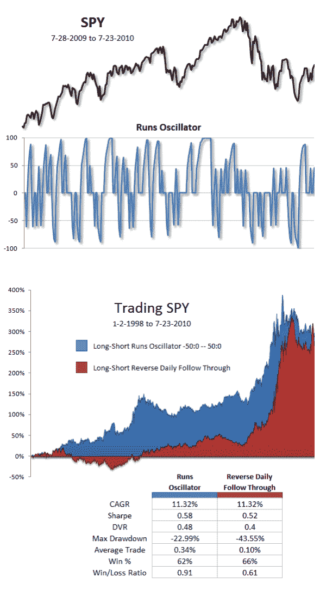

<!--yml
category: 未分类
date: 2024-05-12 18:20:47
-->

# Runs Oscillator | CSSA

> 来源：[https://cssanalytics.wordpress.com/2010/07/26/runs-oscillator/#0001-01-01](https://cssanalytics.wordpress.com/2010/07/26/runs-oscillator/#0001-01-01)

Here is the “runs oscillator” mentioned in the adaptive time machine sequel. This is something we will be looking at towards creating an improved time machine algorithm. The “runs oscillator” is constructed by ranking a down run (if that is the current run) versus all down runs in the prior 252 days. The same is done for up runs. This leaves two oscillators ranging from 0 to 1 for both up and down runs. The runs oscillator is fused together by multiplying the down run oscillator by -100 and the up run oscillator by 100 and summing them together. The final oscillator ranges between -100 and 100, with 100 representing maximum overbought conditions, and -100 being maximum oversold conditions.  In the example below we use median overbought and oversold conditions for countertrend entries (long<-50 and short>50) with an exit on a cross of zero. Essentially we are waiting for a median down run for longs, and a median up run for shorts while looking to exit on an up day for longs and a down day for shorts. We compare this to reverse daily follow through (long 1 down day, short 1 up day). As you will notice, the runs oscillator is far more consistent across time and has higher risk-adjusted returns.

