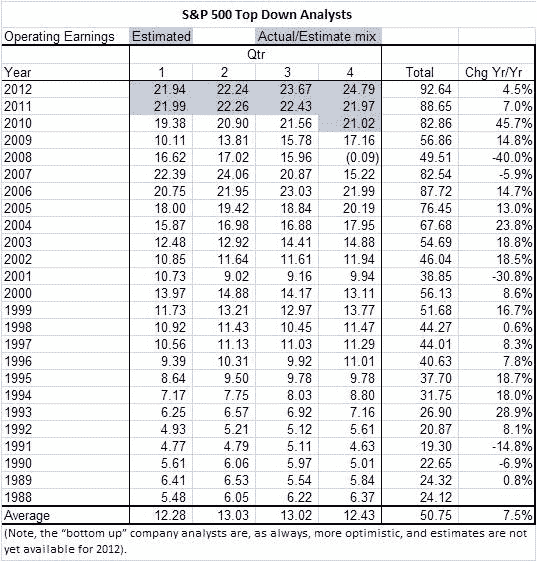
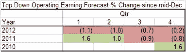

<!--yml
category: 未分类
date: 2024-05-12 18:13:44
-->

# S&P Earnings Forecasts: A Disconnect Between Analyst Projections and Market Behavior | CSSA

> 来源：[https://cssanalytics.wordpress.com/2011/01/19/sp-earnings-forecasts-a-disconnect-between-analyst-projections-and-market-behavior/#0001-01-01](https://cssanalytics.wordpress.com/2011/01/19/sp-earnings-forecasts-a-disconnect-between-analyst-projections-and-market-behavior/#0001-01-01)

by Scott Walker

The markets’ strong price advance from the March ’09 bottom has been propelled by continued forecasted and realized earnings growth.   Each quarter the earnings have come in strong and the upcoming estimates raised, almost non-stop.   However, the latest S&P500 earnings estimates (sourced from[www.standardandpoors.com](http://www.standardandpoors.com/)), show metrics that raise some questions.

Our calculations show a surprisingly weak projected earnings growth for 2012, and further, a recent downward revision in the earnings forecast starting with the back half of 2011.    Are the “top down” analysts being too conservative, or is market getting too bullish?  (Note: top down analysts use a macro approach to estimate the entire market).

The following table shows the historical actual, and estimated (Q4 ’10 is actual/estimated mix) operating earnings per quarter for the S&P500.  2009 and ’10 showed very strong 14.8% & 45.7% earnings growth.  However, 2011 is only projected at 7%, while 2012 is set at just 4.5%.

Since 1988 earnings have grown about +7.5% per year, however, when in growth mode (removing declining years), earnings have averaged +15.2% per year.

Given the strong results, are these analysts upping their forecasts?  Through estimates for Q2 2011, analysts continue to up the forecasts by over 1% per quarter, however, they have actually dropped their forecasts by almost 1% per quarter for the back half of 2011 and 2012.

Could the slow single digit top line sales growth and commodity inflation be weighing against the continued productivity gains?