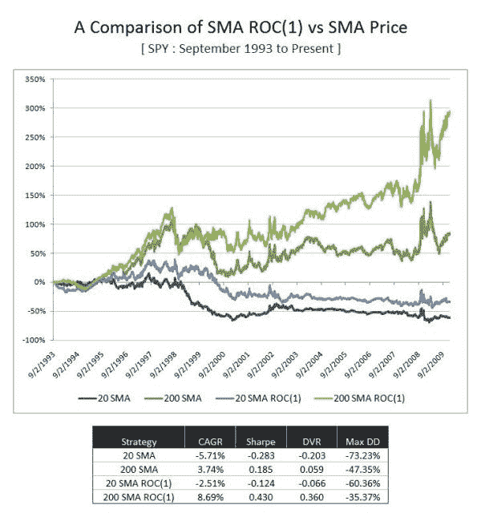

<!--yml
category: 未分类
date: 2024-05-12 18:39:30
-->

# SMA ROC(1): A Better Trend Measurement Than Price-Based Moving Averages | CSSA

> 来源：[https://cssanalytics.wordpress.com/2009/12/21/sma-roc1-a-better-trend-measurement-than-price-based-moving-averages/#0001-01-01](https://cssanalytics.wordpress.com/2009/12/21/sma-roc1-a-better-trend-measurement-than-price-based-moving-averages/#0001-01-01)

***NOTE: The strategies below were traded long/short using yahoo finance data. For sma roc(1) a long signal is triggered when sma roc(1) is greater than zero , and a short signal when it is less than zero.  The SMA strategies were traded using the standard method, long>sma, short<sma.***

Sometimes simple refinements that improve upon inherent flaws in other methods can really make a big difference. One of the primary problems with the venerable SMA or simple moving average of price is that it is distorted by  historical compounding and is slow to respond to price movements. When prices or trends change suddenly this lag and distortion can cause some serious whipsaw problems. Momentum or simple returns are a measure of velocity have the benefit of reacting much faster to price changes. This increased sensitivity and accuracy in capturing price fluctuations is highly valuable. It is also the reason that historical volatility calculations factor in the standard deviation of price returns rather than the standard deviation of prices divided by an average such as bollinger bands. The simplest and most basic application of this concept is to take the SMA of returns or the 1-day ROC (rate of change) instead of the price. The use of this method substantially improves returns and reduces drawdowns. Below is a chart of the 20, and 200 sma of prices versus the sma of ROC(1) on the SPY (S&P500). As they say, the devil is in the details!

