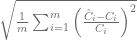
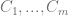
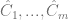
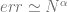
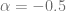
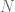
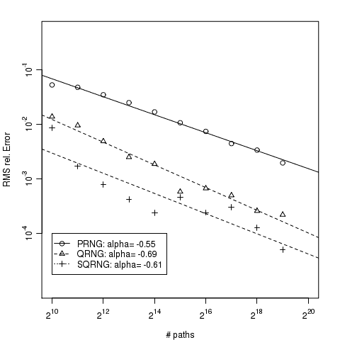

<!--yml
category: 未分类
date: 2024-05-17 23:42:27
-->

# Scrambled Sobol Sequences – HPC-QuantLib

> 来源：[https://hpcquantlib.wordpress.com/2011/05/11/pricing-asian-options-using-scrambled-sobol-sequence/#0001-01-01](https://hpcquantlib.wordpress.com/2011/05/11/pricing-asian-options-using-scrambled-sobol-sequence/#0001-01-01)

The authors of [1][2] presented an efficient way to create scrambled Sobol numbers and have shown that their scrambling algorithm can lead to a significantly higher convergence speed. The upcoming CUDA 4.0 Release provides an implementation of the scrambling algorithm outlined in [2].

The aim is now to compare the order of convergence of a PRNG (Merssenne-Twister),  a QRNG (Sobol) and this scrambled-QRNG for the pricing of a portfolio of geometric Asian options. To number of observation dates of the Asian options in the benchmark portfolio varies between 45 and 120 observation dates. The dimensionality of the pricing problem is considerably large. We’ll use a Brownian bridge to construct the paths. This ensures that the first coordinates of a Sobol sequence are used to sample the most important modes.

The error analysis is not an easy task.  Simply applying another randomized shift is not sufficient as this transformation changes the discrepancy of a point-set (A shifted (t,m,d)-net does not need to be a (t,m,d)-net.). In [3] this problem was overcome by looking on the RMS relative error

of a set of benchmark options with true prices given by  and the Monte-Carlo approximations .

We are in particular interest in ratios between the PRNG, QRNG and scrambled QRNG errors and in the order  of the convergence.  For PRNG we are expecting a convergence of order  with   and  being the number of paths.

As can be seen in the diagram the scrambled Sobol sequence provides the smallest overall error bounds but the convergence order between scrambled and non-scrambled Sobol does not differ significantly. As the implementation comes more or less for free it’s definitely worth to check scrambled Sobol sequences out.

C++ and CUDA code is available [here](http://hpc-quantlib.de/src/scrambled.zip).  It depends on [QuantLib 1.1](http://quantlib.org) and [CUDA 4.0](http://www.nvidia.com/object/cuda_home_new.html). If you want to generate the plot directly out of the C++ program you also need [R](http://www.r-project.org/), [RCPP](http://cran.r-project.org/web/packages/Rcpp/index.html) and [RInside](http://cran.r-project.org/web/packages/RInside/index.html).

[1] J. Dick, [Higher order scrambled digital nets achieve the optimal rate of the root mean square error for smooth integrands](http://arxiv.org/abs/1007.0842). ArXiv, 8 July 2010.

[2] A.B. Owen, [Local antithetic sampling with scrambled nets](http://arxiv.org/pdf/0811.0528). ArXiv, 28 May 2008

[3] P. Glasserman, Monte Carlo Methods in Financial Engineering.  ISBN-0387004513