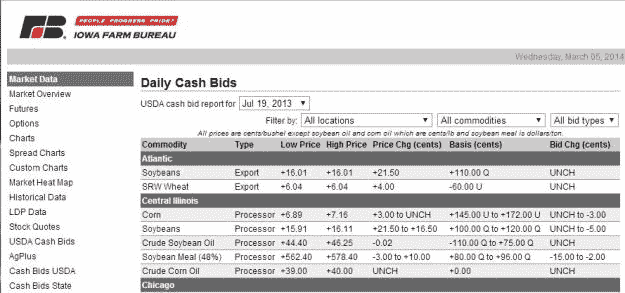

<!--yml
category: 未分类
date: 2024-05-18 08:08:21
-->

# Scraping data from the internet with Python and BeautifulSoup | Quant Corner

> 来源：[https://quantcorner.wordpress.com/2014/03/05/scraping-data-from-the-internet-with-python-and-beautifulsoup/#0001-01-01](https://quantcorner.wordpress.com/2014/03/05/scraping-data-from-the-internet-with-python-and-beautifulsoup/#0001-01-01)

I needed a daily time series of crude soybean oil prices in Central Illinois (yes, I did …). After a bit of search, I found out that the data I needed are available on the [Iowa Farm Bureau](http://www.iowafarmbureau.com "Iowa Farm Bureau") website.

More specifically, there is no time series available but data are accessible playing a bit with the URLs. It was a case for **Python** and **BeautifulSoup!**

The snippet code provided below is straightforward and can easily modified to suit specific needs. There is no optimization or exceptions mechanisms. That just do the work.

[](https://quantcorner.wordpress.com/wp-content/uploads/2014/03/iowa_farm_bureau.jpg)

```

```
##################################################
# Edouard TALLENT @TaGoMa . Tech, March, 2014    #
# Scraping Central Illinois crude soyoil prices  #
# from http://markets.iowafarmbureau.com/        #
# QuantCorner @ https://quantcorner.wordpress.com #
##################################################

# Required headers
import urllib2                          # Read webpages
from bs4 import BeautifulSoup           # bs4 fonctions
import time                             # Time, time elapsed
import re                               # Regex, removing characters

# Arrays that will contain the desired datas
#d = []      # Dates
#l = []      # Lows
#h = []      # Highs

# URLs
start_urls = 4539   # Most recent webpage to start parsing
nb_quotes = 200     # Number of quotes desired

for urls in range (start_urls, start_urls - nb_quotes, -1):
    # Start time
    start_time = time.time()

    # construct the URLs strings
    url = 'http://markets.iowafarmbureau.com/pages/usdacash.php?id=' + str(urls)

    # Read the HTML page content
    page = urllib2.urlopen(url)

    # Create a beautifulsoup object
    soup = BeautifulSoup(page)

    # Search the table to be parsed in the whole HTML code
    tables = soup.findAll('table')
    tab = tables[1]                 # This is the table to be parsed

    # Search the date
    # <option value='4539'>Mar 03, 2014</option>
    date = str(soup.find('option', {'value' : str(urls)}).string)

    # Pick up the content of the desired cells in tab
    # http://www.briancarpio.com/2012/12/02/website-scraping-with-python-and-beautiful-soup/
    '''
    <td>Crude Soybean Oil</td>
    <td>Processor</td>
    <td>+40.01</td>
    <td>+40.36</td>
    <td>    
    '''
    low_tmp = str(tab.findAll('tr')[8].findAll('td')[2].string)     #Low price
    low = re.sub('[+]', '', low_tmp)                                # Remove the '+' sign
    high_tmp = str(tab.findAll('tr')[8].findAll('td')[3].string)    # High price
    high = re.sub('[+]', '', high_tmp)                              # Remoce the '+' sign

    # Stop time
    stop_time = time.time()

    # Print out to the screen
    print date, '\t', low , '\t', high, '(%0.1f s)' % (stop_time - start_time)

    ## Store values parsed in arrays for later use
    #d.append(date)
    #l.append(low)
    #h.append(high)
```

```