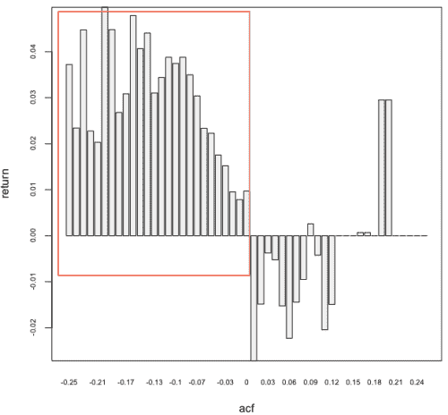
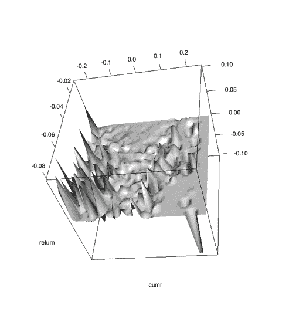

<!--yml
category: 未分类
date: 2024-05-18 15:32:51
-->

# Serial Correlation | Tr8dr

> 来源：[https://tr8dr.wordpress.com/2010/07/04/serial-correlation/#0001-01-01](https://tr8dr.wordpress.com/2010/07/04/serial-correlation/#0001-01-01)

July 4, 2010 · 7:12 pm

One of my strategies uses a ML technique to find patterns in the distribution of returns across a portfolio.  Conditioned on the pattern is a highly skewed marginal distribution for next period returns.   The + skew is important and a very good thing, pointing to much more + returns than negative returns.

I had a theory that for this particular pattern, I would see higher negative serial correlation in the bigger winners.   If true would allow further amplification of winners or better selection within.   Indeed it did work out that more negative serial correlation produced higher next period returns on average.

Further, there was another factor that appeared to be relevant in the mean returns.  Was easy to visualize / examine with the **rgl** package in R:

The is clustering quite visible in 1 corner.   This is good.   I’m sorry, but I can’t go into the background of what this is conditional on.   Thought I’d give a plug for rgl and also note that autocorrelation can be a useful tool in predicting return bias.