<!--yml
category: 未分类
date: 2024-05-18 14:07:33
-->

# Shortwave Trading | Part I | The West Chicago Tower Mystery – Sniper In Mahwah & friends

> 来源：[https://sniperinmahwah.wordpress.com/2018/05/07/shortwave-trading-part-i-the-west-chicago-tower-mystery/#0001-01-01](https://sniperinmahwah.wordpress.com/2018/05/07/shortwave-trading-part-i-the-west-chicago-tower-mystery/#0001-01-01)

Since 2014 this blog has extensively covered the wireless networks built by high-frequency trading (HFT) firms or network providers to reduce latencies between the different exchanges around the world (market makers need fast connectivity to manage risk, news traders also need to be fast, etc.). This epic investigation on microwave, which started with *[HFT in my backyard](https://sniperinmahwah.wordpress.com/2014/09/22/hft-in-my-backyard-part-i/)*, will be fully reported in a book I’m currently writing (in French for now). As I’m quite busy with this writing (and other/more interesting matters about market structure), I didn’t really have the time to check out what I have been hearing about “shortwave” or “high frequency” radio. This is the way high-frequency trading firms may use shortwave radio to directly connect widely-separated locations (in short, traders are willing to use shortwave to cross oceans with less latency than any fiber – like Hibernia).
But recently I got more intel about the situation (and some fun anecdotes). With some help from the US, I found that a firm purchased a field for more than 1$M to build towers and antennas; with some help from the EU, I got hints about Germany; and I dug into UK public records. I even met, last March in Amsterdam, people involved in those projects. Not surprisingly, at least five HFT/market making firms showed up behind the shell companies/names they use to hide. The usual suspects. Above all, I have been contacted recently by someone from Chicago, Bob, who decided to investigate the “shortwave” networks in his backyard. Today I’m pleased to host Bob as a new guest writer on this blog. This first part of the “Shortwave Trading” series is released at the same time Bob is talking about what he found at the [STAC Summit](https://stacresearch.com/spring2018CHI) in Chicago. Next parts will follow soon.

I’m Bob Van Valzah and I’m on a “gardening leave” between jobs working as a Performance Engineer for high-frequency trading firms in Chicago. I recently stumbled onto the first evidence of shortwave trading at a site in West Chicago, Illinois and then used Federal Communications Commission (FCC) database research techniques pioneered by the owner of this blog to find two more sites. My non-disclosure agreements with employers would typically prevent me from talking about this, but my trading-related discoveries are my own while on gardening leave. The results of my research may be of interest here and there, so I offered to do some guest posting on this blog. I’ll have to go quiet again in July when I head back to work.

It might be reasonable to assume that “West Chicago” was just a western part of Chicago, Illinois. In fact, it’s [a city in its own right](https://en.wikipedia.org/wiki/West_Chicago,_Illinois), twenty some miles west of the big city. A typical weekend will find me cycling down a bike path that runs nearby. In March, muddy path conditions caused me to detour through an industrial park in West Chicago where the West Chicago Tower Mystery began. I looked up from the handlebars and saw this tower.

[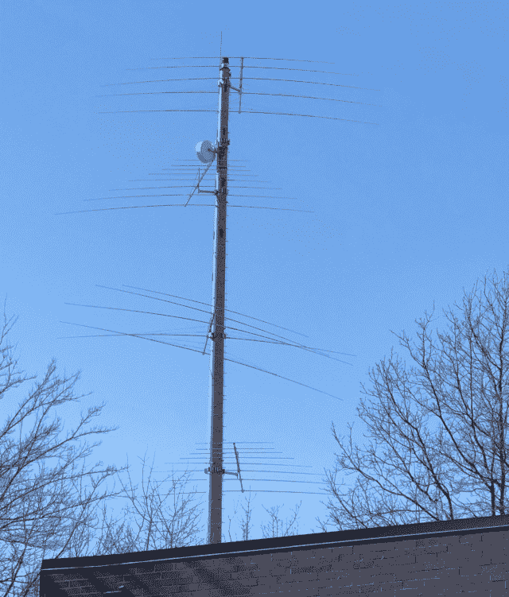](https://sniperinmahwah.wordpress.com/wp-content/uploads/2018/05/westchicagotower-e1525386969469.jpg)

Mysterious West Chicago Tower, March 10, 2018.

I’m an amateur radio operator, or “ham,” (KE9YQ) and those four big antennas look a lot like ones that a ham would use to talk across an ocean. I’ll just call them shortwave antennas here, but practitioners of aluminum feng shui (antenna design) will recognize them as log periodic. There’s also a microwave dish antenna between the top two shortwave antennas. This much I could tell just by looking.

Most of the radio towers you see each day are cell towers. There are 215,000 of them in the US. They differ from other radio towers in that they will almost always have one or more triangular structures with three or more directional antennas on each side of the triangle. A grid of cell towers covers an area with roughly hexagonal cells so that you get a good signal everywhere.

The West Chicago tower had no triangular structure, so I was pretty sure it wasn’t a cell tower. And these antennas were huge compared to regular cell tower antennas. I could literally see them 1/2 mile away. Some cell towers do have microwave dish antennas when it’s hard to bring fiber to a site, but shortwave antennas didn’t seem to go together with microwave in my mind.

**Mystery #1: If this wasn’t a cell tower, what was it?**

With my curiosity up, I pedaled to the base of the tower and took a look around. Like all cell towers, there’s a barbed wire perimeter fence and I could see a power meter where electricity enters the site. The panel allowed for up to four power meters because it’s common for two or more carriers to share a single site. There’s also a master power switch for each carrier so that they can shut off their juice for maintenance without knocking the other carriers off the air.

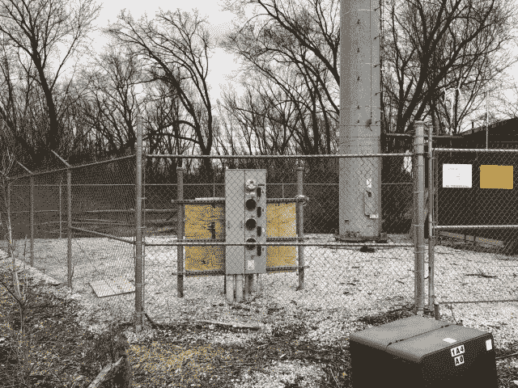

The tower base and perimeter fence.

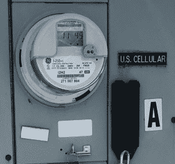

The only power meter for the site.

I walked right up to the fence and zoomed in on the power meter. It said “[U.S. Cellular](https://en.wikipedia.org/wiki/U.S._Cellular).” They are indeed a regional cellular carrier, but they only serve 23 U.S. states and wouldn’t want their signals crossing any oceans.

**Mystery #2: Why would a regional cellular carrier pay for power to cross oceans?**
Riding on a hot day, I may stop for a drink in the shade of a cell tower, so I’ve seen what a lot of cell sites look like. There’s often a small building inside the perimeter fence to hold the equipment that runs the cell site. The ground inside the perimeter fence is typically coarsely crushed rock to prevent weeds from growing.

An odd thing about this “cell site” was that it had a garbage pile inside the fence. Cell sites are unmanned and don’t need much maintenance. Crews who do work there typically leave the site clean and take their garbage with them. There is no trash pickup at sites like this, so it seemed odd that there’d be cans full of lunch wrappers and cardboard boxes. If this was a cell site, it was maintained by much sloppier crews than the ones I’d typically seen.

One box in the garbage pile caught my eye so I zoomed in through the fence and got the best shot of the label I could with my iPhone. I had never heard of the company [Ettus Research](https://www.ettus.com) or the [USRP X300 device](https://www.ettus.com/product/details/X300-KIT). With all the cell sites in the world, you’d think they’d be made from off-the-shelf parts, not stuff cooked up in a research and development lab.

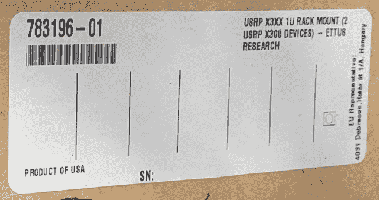

The label on an interesting box in the garbage pile.

**Mystery #3: Why would a cell site need equipment from a research company?**
Most any cell site with a tower will have a sign with a seven-digit number known as the FCC Antenna Structure Registration (ASR) number. If you were a cellular carrier out shopping for a good place to put your antennas, you could use this number to find the height of the tower and get other useful nuggets from the FCC database. I took a picture of the number since I thought it might come in handy when I got home.

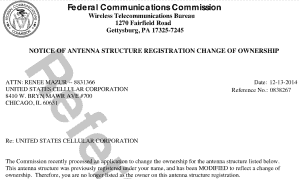

U.S. Cellular sold the tower in 2014.

Back home, I pulled up the FCC ASR database and found that the tower was indeed built by U.S. Cellular in 2009\. Digging deeper, I also found a record that they had sold it in late 2014\. This sort of transaction is pretty common in the business. As subscribers come and go, cellular carriers have to move their cell sites and keep adjusting their antenna heights to maintain good coverage everywhere.

Google Street View is a wonderful tool for looking at the way the world used to be. I found a view of the tower from August 2012 when it had already been picked clean of all cellular antennas (they have resale value!), with only the tell-tale triangular mounting structure remaining at the top of the tower.

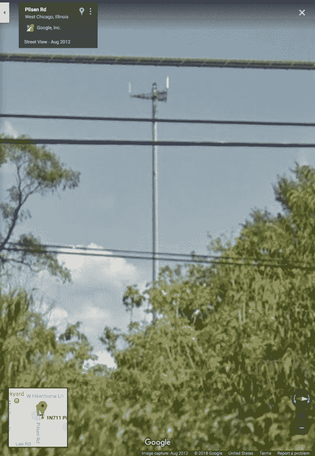

The tower as it looked in August 2012.

So part of the history was becoming clear. The tower was built by U.S. Cellular in 2009, but fell into disuse sometime before 2012\. It was eventually sold in late 2014.

As is common with cell sites these days, the tower site was sold to [Vertical Bridge](http://www.verticalbridge.com), an antenna site management company. Instead of owning antenna sites themselves, it now seems common for carriers to just lease space on towers at antenna sites owned by management companies. So that’s no real clue about current ownership or usage of the tower.

**Mystery #4: Where is the other end of that microwave link?**
Microwave links require a license for operation, so I returned to the FCC databases and looked for licenses associated with that tower. Each license gives the GPS coordinates of both ends of the link and the FCC has a helpful mapping function. It showed a direct link between the West Chicago tower and another tower right by the Chicago Mercantile Exchange! It was still just circumstantial evidence, but this was the first good clue that the West Chicago tower had something to do with trading. It was looking less and less like spooks were using the tower.

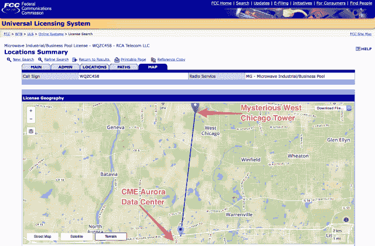

FCC map of microwave connection between CME and West Chicago tower.

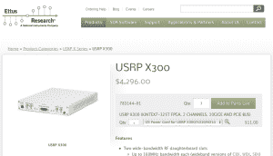

Top-of-the-line software defined radio.

**Mystery #5: What was in that box in the garbage pile?**
Google helpfully explains that Ettus Research is the leading provider of Software Defined Radios (SDR). These are the devices you need to make any kind of custom radio you want. Just change the software and you can send voice, pictures, video, or trading information. The particular model in the box is their top-of-the line, with an FPGA, two 10 gigabit Ethernet ports, and a PCIe bus interface. The pair that was in that box cost nearly $10,000\. You don’t need gear like this at a cell site.

**Mystery #6: What could be interesting across an ocean?**
I’m much better with the technology of trading rather than understanding how to make money with trading. But it seemed like a reasonable guess that prices on the markets at CME would be correlated with activity in European markets – let’s say, in Slough (UK) and Frankfurt (Germany). So I fired up Google Earth and plotted the lines that a radio signal would have to travel between West Chicago and the markets in London and Frankfurt.

[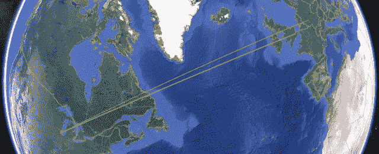](https://sniperinmahwah.wordpress.com/wp-content/uploads/2018/05/westchicagolondonfrankfort.png)

Shortest paths between West Chicago and European markets.

We are so used to seeing flattened projections of earth that it’s easy for a Chicagoan to think of Europe as being east of Chicago. But in fact the shortest way to Europe is northeast, at about a 45º angle.

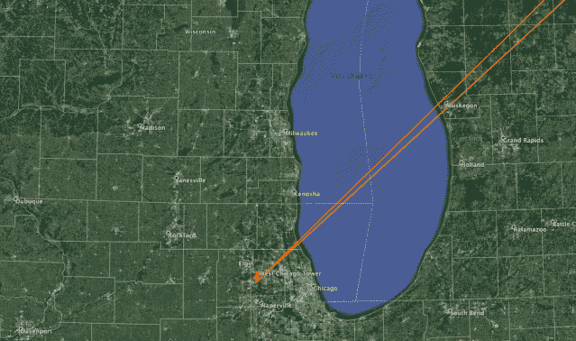

For radio, Europe is northeast of Chicago.

This angle is important because those shortwave antennas on the tower are directional. If you know you want to talk to Europe, why send any of your signal toward Guam? Directional shortwave antennas focus your signal in the direction of the pointy end of the antenna. In the photo of the tower above, I’m standing right under the path where the top antenna is pointing.

At shortwave frequencies, it’s difficult to make antennas with a narrow beam width. London and Frankfurt are only about 5º apart when you’re aiming from Chicago, so one antenna should hit both cities. This raises the question of why the tower needed four shortwave antennas, all pointed in pretty much the same direction.

Some of the antennas on the tower focused their signal well, producing a more powerful signal, but only operate over a narrow range of shortwave frequencies. Others operate over a wide range of frequencies, but can’t produce a strong signal.

[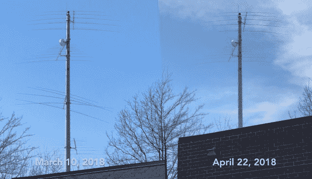](https://sniperinmahwah.wordpress.com/wp-content/uploads/2018/05/marchtoaprilchanges.jpg)

The lower two antennas have been removed from the tower.

It also appeared that the second shortwave antenna up from the bottom had been damaged in a wind storm or perhaps poorly installed because four of its five elements had been knocked significantly out of the horizontal plane. Nonetheless, I was surprised when I visited site a few weeks later and found that the lower two antennas had been removed. So this site is being actively developed in the spring of 2018\. They’re moving antennas around and they haven’t gotten rid of the garbage pile, so there’s still work to do.

Bringing it all together, I’ve discovered that this West Chicago tower has all the ingredients needed to make a low-latency transatlantic market connection. I’ve also found two other sites around Chicago with massive shortwave antennas pointed at Europe and microwave links to CME, so there’s more than one horse in this race. I’ll document these sites in a coming post. Licenses also exist on the east coast. I’ll be looking for them on trip in mid-June. FCC searches have also turned up licenses in Anchorage, Alaska which is on the path from CME to Tokyo [*Sniper’s note:* that reminds me I didn’t check recently what is going on around Go West]. Spotters are already at work looking for antennas around London and Frankfurt.

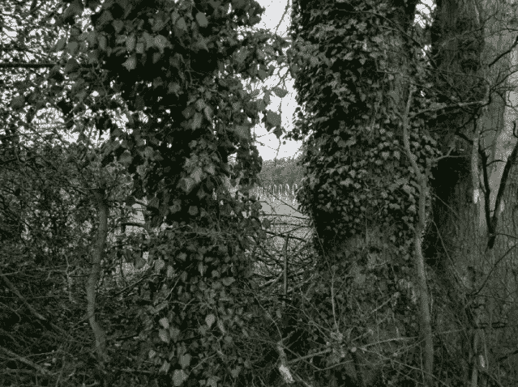

Somewhere around Slough (UK), March 2018

Shortwave is no panacea. It’s unreliable, expensive, and very low bandwidth. Think dialup speeds. But you can’t beat it for latency. I plan to go into more detail on shortwave tradeoffs in a future post. You might be wondering if anybody can receive their signal, perhaps with the possibility of getting an order to market faster. Yes, anybody can receive it, but the sender would be foolish not to encrypt it in a way that can’t be cracked. This is easily done without impacting performance.

A muddy bike path diverted me from my usual route and I happened upon the tower. Being a ham, I recognized the shortwave antennas. I could see the potential, having worked in trading. I’m on gardening leave so I can talk publicly about what I found related to trading – I’ve just assembled the public records, photos, maps, background info, and sprinkled in my analysis, with some inspiration from the way this blog investigated the [microwave networks](https://sniperinmahwah.wordpress.com/2014/09/22/hft-in-my-backyard-part-i/). The next post from me will describe the differences between microwave, shortwave, fiber, and satellite. Stay tuned.

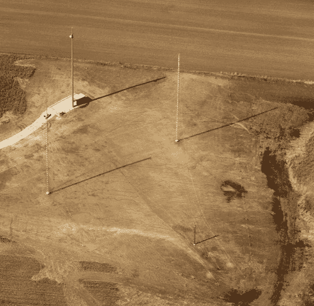

Somewhere in Kane County (US), April 8th, 2018