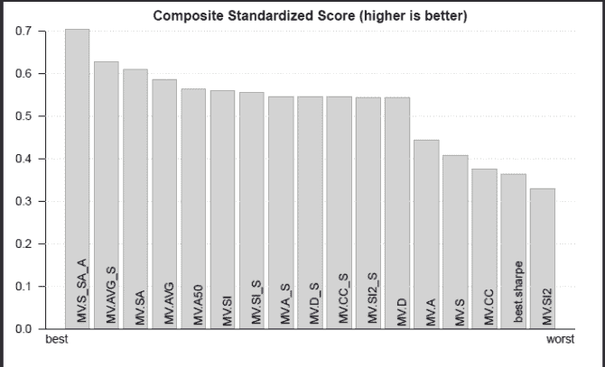

<!--yml
category: 未分类
date: 2024-05-12 17:56:39
-->

# Shrinkage: A Simple Composite Model Performs the Best | CSSA

> 来源：[https://cssanalytics.wordpress.com/2013/10/31/shrinkage-a-simple-composite-model-performs-the-best/#0001-01-01](https://cssanalytics.wordpress.com/2013/10/31/shrinkage-a-simple-composite-model-performs-the-best/#0001-01-01)

In the last two posts we discussed using an [adaptive shrinkage](https://cssanalytics.wordpress.com/2013/10/24/adaptive-shrinkage/ "Adaptive Shrinkage") approach, and also introduced the [average correlation shrinkage model](https://cssanalytics.wordpress.com/2013/10/27/average-correlation-shrinkage-acs/ "Average Correlation Shrinkage (ACS)"). The real question is; what shrinkage method across a wide variety of different models works best? In backtesting across multiple universes from stocks to asset classes and even futures, Michael Kapler of [Systematic Investor](systematicinvestor.wordpress.com) calculated a composite score for each shrinkage model based upon the following criteria: Portfolio Turnover, Sharpe Ratio, Volatility, and Diversification using the [Composite Diversification Indicator](https://cssanalytics.wordpress.com/2012/09/21/minimum-correlation-algorithm-paper-release/ "Minimum Correlation Algorithm Paper Release") (CDI). Lower turnover was preferred, for sharpe ratio obviously higher was better, for volatility lower was better and for promoting diversification higher was considered better. The backtests and code can be found [here](http://www.systematicportfolio.com/adaptive-shrinkage).

The models considered were as follows:

The best performing shrinkage model can be implemented by virtually anyone with a minimum of excel skills: it is the simple average of the sample correlation matrix, the anchored correlation matrix (all history), and the [average correlation shrinkage](https://cssanalytics.wordpress.com/2013/10/27/average-correlation-shrinkage-acs/ "Average Correlation Shrinkage (ACS)") model. This produced the best blend of characteristics that would be desirable for money managers. The logic is simple: the anchored correlation matrix provides a long-term memory of inter-asset relationships, the sample provides a short-term/current memory, and the average correlation shrinkage assumes that the average correlation of an asset to all other assets provides a more stable short-term/current estimate than the sample. This is a good example of how simple implementations can trump sophisticated as long as the concepts are sound. As a generality, this is my preferred approach whenever possible because it is easier to implement in real life, easier to de-bug, and easier to understand and explain. Another interesting result from the rankings is that the ensemble approaches to shrinkage models performed better. Again this makes more sense. The adaptive shrinkage model (best sharpe) performed poorly by comparision–especially when considering turnover as a factor. It is possible that using only a 252-day window, or using only sharpe as an objective criterion were suboptimal. Readers are encouraged to experiment with other approaches. (*we did investigate some methods that showed a lot of promise*)

Finally it is important to recognize that shrinkage is not a magic bullet regardless of which approach was used. The results are better but not worlds apart from using just the sample correlation. There is a practical limit to what can be achieved using a lower variance estimate of the correlation matrix with shrinkage. More accurate predictors for correlations are required to achieve greater gains in performance.