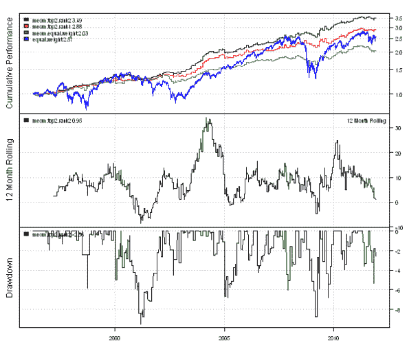
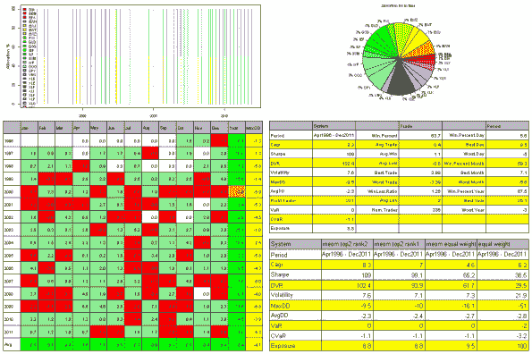
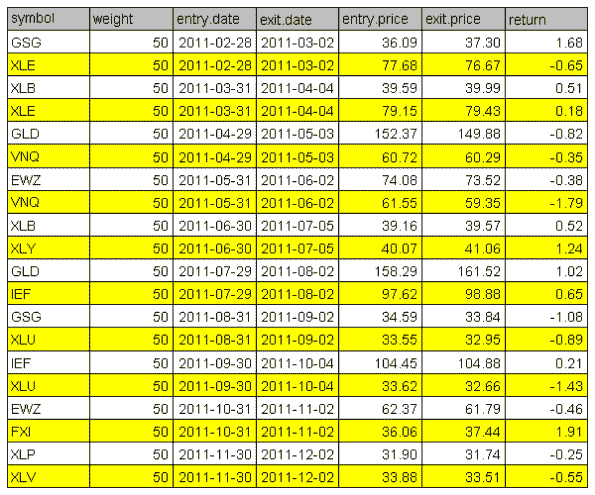
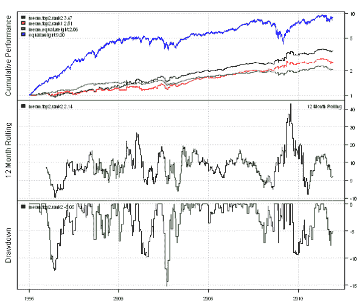
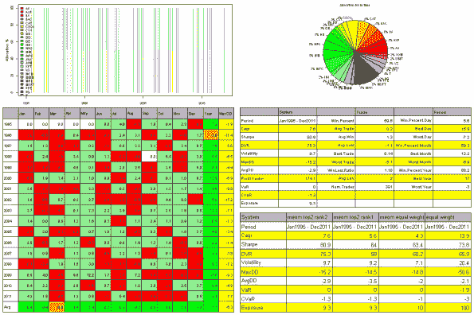
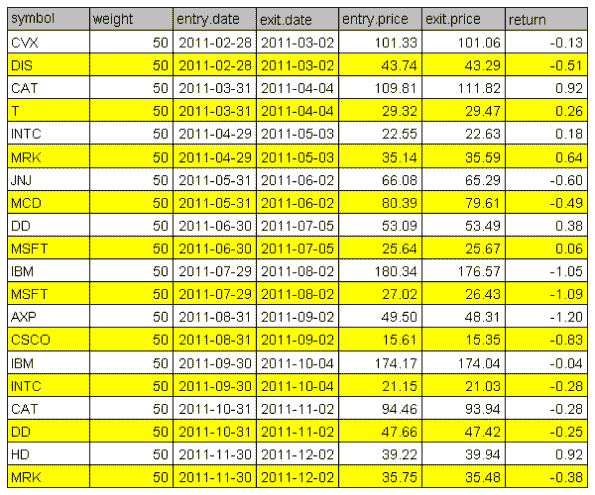

<!--yml
category: 未分类
date: 2024-05-18 14:44:40
-->

# Simple and Profitable | Systematic Investor

> 来源：[https://systematicinvestor.wordpress.com/2011/12/09/simple-and-profitable/#0001-01-01](https://systematicinvestor.wordpress.com/2011/12/09/simple-and-profitable/#0001-01-01)

The end of the month effect was examined by [MarketSci](http://marketsci.wordpress.com) in the [The Last Day of the Month Blahs](http://marketsci.wordpress.com/2010/03/24/the-last-day-of-the-month-blahs/) post. The idea is simple: buy on the last day of the month and sell a few days later. This idea was put into a strategy by Quanting Dutchman in the [Strategy 2 – Monthly End-of-the-Month (MEOM)](http://quantingdutchman.wordpress.com/2010/06/30/strategy-2-monthly-end-of-the-month-meom/) post.

I will follow the outline of the Quanting Dutchman’s strategy and will implement it using the backtesting library in the [Systematic Investor Toolbox](https://systematicinvestor.wordpress.com/systematic-investor-toolbox/).

The strategy invests into the top 2 ETFs that are trading above a medium term moving avarage (WMA89) from the universe of 26 ETF’s: DIA, EEM, EFA, EWH, EWJ, EWT, EWZ, FXI, GLD, GSG, IEF, ILF, IWM, IYR, QQQ, SPY, VNQ, XLB, XLE, XLF, XLI, XLP, XLU, XLV, XLY, XLK. The strategy enters positions on the last day of the month at the close. The strategy exits positions two days later at the close. I will study two ranking schemes to select top two ETFs each month:

*   Rank1 = MA( C/Ref(C,-2), 5 ) * MA( C/Ref(C,-2), 40 )
*   Rank2 = MA( C/Ref(C,-2), 5 ) * Ref( MA( C/Ref(C,-2), 10 ), -5 )

Following code implements this strategy using the backtesting library in the [Systematic Investor Toolbox](https://systematicinvestor.wordpress.com/systematic-investor-toolbox/):

```

# Load Systematic Investor Toolbox (SIT)
setInternet2(TRUE)
con = gzcon(url('https://github.com/systematicinvestor/SIT/raw/master/sit.gz', 'rb'))
	source(con)
close(con)

	#*****************************************************************
	# Load historical data
	#******************************************************************
	load.packages('quantmod')
	tickers = spl('DIA,EEM,EFA,EWH,EWJ,EWT,EWZ,FXI,GLD,GSG,IEF,ILF,IWM,IYR,QQQ,SPY,VNQ,XLB,XLE,XLF,XLI,XLP,XLU,XLV,XLY,XLK')	

	data <- new.env()
	getSymbols(tickers, src = 'yahoo', from = '1995-01-01', env = data, auto.assign = T)
		for(i in ls(data)) data[[i]] = adjustOHLC(data[[i]], use.Adjusted=T)	
	bt.prep(data, align='keep.all', dates='1995::2011')

	#*****************************************************************
	# Code Strategies
	#****************************************************************** 
	prices = data$prices   
	n = ncol(prices)
	nperiods = nrow(prices)

	# Equal Weight
	data$weight[] = ntop(prices, n)
	equal.weight = bt.run(data)	

	# find month ends
	month.ends = endpoints(prices, 'months')
		month.ends = month.ends[month.ends > 0]		
	month.ends2 = iif(month.ends + 2 > nperiods, nperiods, month.ends + 2)

	# Strategy MEOM - Equal Weight
	data$weight[] = NA
		data$weight[month.ends,] = ntop(prices, n)[month.ends,]	
		data$weight[month.ends2,] = 0

		capital = 100000
		data$weight[] = (capital / prices) * data$weight
	meom.equal.weight = bt.run(data, type='share')

	#*****************************************************************
	# Rank1 = MA( C/Ref(C,-2), 5 ) * MA( C/Ref(C,-2), 40 )
	#****************************************************************** 			
	# BuyRule = C > WMA(C, 89)
	buy.rule = prices > bt.apply.matrix(prices, function(x) { WMA(x, 89) } )		
		buy.rule = ifna(buy.rule, F)

	# 2-day returns
	ret2 = ifna(prices / mlag(prices, 2), 0)

	# Rank1 = MA( C/Ref(C,-2), 5 ) * MA( C/Ref(C,-2), 40 )
	position.score = bt.apply.matrix(ret2, SMA, 5) * bt.apply.matrix(ret2, SMA, 40)
		position.score[!buy.rule,] = NA

	# Strategy MEOM - top 2    
	data$weight[] = NA;
		data$weight[month.ends,] = ntop(position.score[month.ends,], 2)		
		data$weight[month.ends2,] = 0		

		capital = 100000
		data$weight[] = (capital / prices) * data$weight
	meom.top2.rank1 = bt.run(data, type='share', trade.summary=T)

	#*****************************************************************
	# Rank2 = MA( C/Ref(C,-2), 5 ) * Ref( MA( C/Ref(C,-2), 10 ), -5 )
	#****************************************************************** 		
	position.score = bt.apply.matrix(ret2, SMA, 5) * mlag( bt.apply.matrix(ret2, SMA, 10), 5)
		position.score[!buy.rule,] = NA

	# Strategy MEOM - top 2    
	data$weight[] = NA;
		data$weight[month.ends,] = ntop(position.score[month.ends,], 2)		
		data$weight[month.ends2,] = 0		

		capital = 100000
		data$weight[] = (capital / prices) * data$weight
	meom.top2.rank2 = bt.run(data, type='share', trade.summary=T)	

	#*****************************************************************
	# Create Report
	#****************************************************************** 
	plotbt.custom.report(meom.top2.rank2, meom.top2.rank1, meom.equal.weight, equal.weight, trade.summary=T)

```

[](https://systematicinvestor.wordpress.com/wp-content/uploads/2011/12/plot1-small1.png)

[](https://systematicinvestor.wordpress.com/wp-content/uploads/2011/12/plot2-small1.png)

[](https://systematicinvestor.wordpress.com/wp-content/uploads/2011/12/plot3-small1.png)

This a great little strategy that is only invested 10% of time. You can improve returns by investing in a fixed income for the rest of the time. Quanting Dutchman tested this idea in [My thoughts on “Go-In-Cash”](http://quantingdutchman.wordpress.com/2010/10/24/my-thoughts-on-go-in-cash/) post.

I also found promising results by using current Dow Jones Components instead of ETFs. To run the End of the Month strategy on current Dow Jones Components substitute:

```

tickers = spl('DIA,EEM,EFA,EWH,EWJ,EWT,EWZ,FXI,GLD,GSG,IEF,ILF,IWM,IYR,QQQ,SPY,VNQ,XLB,XLE,XLF,XLI,XLP,XLU,XLV,XLY,XLK')

```

with

```

tickers = dow.jones.components()

```

in the above code. Here are the summary stats for the End of the Month strategy using current Dow Jones Components.

[](https://systematicinvestor.wordpress.com/wp-content/uploads/2011/12/plot4-small.png)

[](https://systematicinvestor.wordpress.com/wp-content/uploads/2011/12/plot5-small.png)

[](https://systematicinvestor.wordpress.com/wp-content/uploads/2011/12/plot6-small.png)

To view the complete source code for this example, please have a look at the [bt.meom.test() function in bt.test.r at github](https://github.com/systematicinvestor/SIT/blob/master/R/bt.test.r).