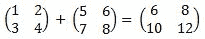
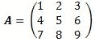

<!--yml
category: 未分类
date: 2024-05-18 08:10:02
-->

# Simple matrix algebra with QuantLib | Quant Corner

> 来源：[https://quantcorner.wordpress.com/2011/02/19/simple-matrix-algebra-with-quantlib/#0001-01-01](https://quantcorner.wordpress.com/2011/02/19/simple-matrix-algebra-with-quantlib/#0001-01-01)

In this post, we shall see some basic operations of matrix algebra, namely addition and multiplication operations, matrix transposition, and finding the inverse matrix. The calculation results we obtain here can be checked by using **Excel**.

Our pieces below of codes start by declaring the matrice sizes, Matrix **M** ( Size **Rows**, Size **Columns**). The matrices are then populated. As an output, we print out on the screen the actual matrices and the calculation results.

### Example 1 : adding two matrices

Do recall that only matrices of the same dimension can be added (subtracted) element by element.

[](https://quantcorner.wordpress.com/wp-content/uploads/2011/02/matrix_addition.jpg)

```
#include<ql\quantlib.hpp>
using namespace QuantLib;

int main(int, char*[]){

	// Matrix declaration and population
	Matrix A(2,2);
	A[0][0] = 1; A[0][1] = 2;
	A[1][0] = 3; A[1][1] = 4;

	Matrix B(2,2);
	B[0][0] = 5; B[0][1] = 6;
	B[1][0] = 7; B[1][1] = 8;

	// Outputting
	std::cout << "Matrix A :" << std::endl << A << std::endl;
	std::cout << "Matrix B :" << std::endl << B << std::endl;
	std::cout << "A + B :" << std::endl << A + B << std::endl;

	return 0;

}
```

### Example 2 : matrix multiplication

### [](https://quantcorner.wordpress.com/wp-content/uploads/2011/02/matrix_multplication1.jpg)

```
#include<ql\quantlib.hpp>
using namespace QuantLib;

int main(int, char*[]){

	// Matrix declaration and population
	Matrix A(2,3);
	A[0][0] = 0; A[0][1] = 1; A[0][2] = -1;
	A[1][0] = 1; A[1][1] = 2; A[1][2] = 0;

	Matrix B(3,4);
	B[0][0] = 1; B[0][1] = 0; B[0][2] = 2; B[0][3] = 1;
	B[1][0] = 0; B[1][1] = 0; B[1][2] = 1; B[1][3] = -1;
	B[2][0] = 2; B[2][1] = -1; B[2][2] = 0; B[2][3] = 2; 

	// Outputting
	std::cout << "Matrix A :" << std::endl << A << std::endl;
	std::cout << "Matrix B :" << std::endl << B << std::endl;
	std::cout << "A x B product :" << std::endl << A * B << std::endl;
	return 0;
}
```

### Example 3 : matrix transposition, inversion, and determinant

Let a standard matrix **A** be. We wish to get the transposition matrix **A’**, the inverted matrix **A^(-1)**, and its determinant **det (A)**.

[](https://quantcorner.wordpress.com/wp-content/uploads/2011/02/standard_matrix.jpg)

```
#include<ql\quantlib.hpp>
using namespace QuantLib;

int main(int, char*[]){

	// Matrix declaration and population
	Matrix A(3,3);
	A[0][0] = 1; A[0][1] = 2; A[0][2] = 3;
	A[1][0] = 4; A[1][1] = 5; A[1][2] = 6;
	A[2][0] = 7; A[2][1] = 8; A[2][2] = 9;

	// Outputting
	std::cout << "Matrix A :" << std::endl << A << std::endl;
	std::cout << "Matrix transpose :" << std::endl << transpose(A) << std::endl;
	std::cout << "Matrix determinant :" << std::endl << determinant(A) << std::endl;
	std::cout << "Matrix inverse :" << std::endl << inverse(A) << std::endl;

	return 0;
}
```