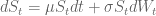
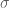
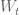
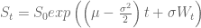

<!--yml
category: 未分类
date: 2024-05-18 14:36:08
-->

# Simulating Multiple Asset Paths in R | Systematic Investor

> 来源：[https://systematicinvestor.wordpress.com/2012/11/06/simulating-multiple-asset-paths-in-r/#0001-01-01](https://systematicinvestor.wordpress.com/2012/11/06/simulating-multiple-asset-paths-in-r/#0001-01-01)

I recently came across the [Optimal Rebalancing Strategy Using Dynamic Programming for Institutional Portfolios by W. Sun, A. Fan, L. Chen, T. Schouwenaars, M. Albota](http://papers.ssrn.com/sol3/papers.cfm?abstract_id=639284) paper that examines the cost of different rebablancing methods. For example, one might use calendar rebalancing: i.e. rebalance every month / quarter / year. Or one might use threshold rebalancing: i.e. rebalance only if asset weights break out from a certain band around the policy mix, say 3%.

To investigate the cost of the different rebalancing methods, authors run 10,000 simulations. Today, I want to show how to simulate asset price paths given the expected returns and covariances. I will assume that prices follow the [Geometric Brownian Motion](http://en.wikipedia.org/wiki/Geometric_Brownian_motion). Also I will show a simple application of Monte Carlo option pricing. In the next post I will evaluate the cost of different rebalancing methods.

Let’s assume that a stock price can be described by the stochastic differential equation:



where  is the expected annual return of the underlying asset,  is the annualized volatility, and  is a Brownian Motion. This stochastic differential equation has the following solution



which I implemented in the asset.paths() function. The asset.paths() function is based on the [Simulating Multiple Asset Paths in MATLAB](http://www.goddardconsulting.ca/matlab-monte-carlo-assetpaths.html) code in Matlab.

```

asset.paths <- function(s0, mu, sigma, 
	nsims = 10000, 
	periods = c(0, 1)	# time periods at which to simulate prices
) 
{
	s0 = as.vector(s0)
	nsteps = len(periods)
	dt = c(periods[1], diff(periods))

	if( len(s0) == 1 ) {
		drift = mu - 0.5 * sigma^2
		if( nsteps == 1 ) {
			s0 * exp(drift * dt + sigma * sqrt(dt) * rnorm(nsims))
		} else {
			temp = matrix(exp(drift * dt + sigma * sqrt(dt) * rnorm(nsteps * nsims)), nc=nsims)
			for(i in 2:nsteps) temp[i,] = temp[i,] * temp[(i-1),]
			s0 * temp
		}
	} else {
		require(MASS)
		drift = mu - 0.5 * diag(sigma)
		n = len(mu)

		if( nsteps == 1 ) {
			s0 * exp(drift * dt + sqrt(dt) * t(mvrnorm(nsims, rep(0, n), sigma)))
		} else {
			temp = array(exp(as.vector(drift %*% t(dt)) + t(sqrt(dt) * mvrnorm(nsteps * nsims, rep(0, n), sigma))), c(n, nsteps, nsims))
			for(i in 2:nsteps) temp[,i,] = temp[,i,] * temp[,(i-1),]
			s0 * temp
		}
	}
}

```

Next let’s visualize some simulation asset paths:

```

###############################################################################
# Load Systematic Investor Toolbox (SIT)
# https://systematicinvestor.wordpress.com/systematic-investor-toolbox/
###############################################################################
setInternet2(TRUE)
con = gzcon(url('http://www.systematicportfolio.com/sit.gz', 'rb'))
    source(con)
close(con)

	#*****************************************************************
	# Plot some price paths
	#******************************************************************  
	S = c(100,105)
	X = 98
	Time = 0.5
	r = 0.05
	sigma = c(0.11,0.16)
	rho = 0.63
	N = 10000

	# Single Asset for 10 years
	periods = 0:10
	prices = asset.paths(S[1], r, sigma[1], N, periods = periods)

	# plot
	matplot(prices[,1:100], type='l', xlab='Years', ylab='Prices',
		main='Selected Price Paths')

	# Multiple Assets for 10 years
	periods = 0:10
	cov.matrix = sigma%*%t(sigma) * matrix(c(1,rho,rho,1),2,2)
	prices = asset.paths(S, c(r,r), cov.matrix, N, periods = periods)

	# plot
	layout(1:2)
	matplot(prices[1,,1:100], type='l', xlab='Years', ylab='Prices',
		main='Selected Price Paths for Asset 1')
	matplot(prices[2,,1:100], type='l', xlab='Years', ylab='Prices',
		main='Selected Price Paths for Asset 2')

```

[](https://systematicinvestor.wordpress.com/wp-content/uploads/2012/11/plot1-small.png)

[](https://systematicinvestor.wordpress.com/wp-content/uploads/2012/11/plot2-small.png)

Next, let’s look at examples of Monte Carlo option pricing using [asset.paths() function in random.r at github](https://github.com/systematicinvestor/SIT/blob/master/R/random.r).

```

	#*****************************************************************
	# Price European Call Option
	#******************************************************************  
	load.packages('fOptions')

	# Black–Scholes
	GBSOption(TypeFlag = "c", S = S[1], X = X, Time = Time, r = r, b = r, sigma = sigma[1])

	# Monte Carlo simulation	
	N = 1000000	
	prices = asset.paths(S[1], r, sigma[1], N, periods = Time)
		future.payoff = pmax(0, prices - X)
		discounted.payoff = future.payoff * exp(-r * Time)
	# option price
	mean(discounted.payoff) 

	#*****************************************************************
	# Price Asian Call Option
	#******************************************************************  
	load.packages('fExoticOptions')

	Time = 1/12

	# Approximation
	TurnbullWakemanAsianApproxOption(TypeFlag = "c", S = S[1], SA = S[1], 
  		X = X, Time = Time, time = Time, tau = 0 , r = r, b = r, sigma = sigma[1])

	# Monte Carlo simulation		
	N = 100000
	periods = seq(0,Time,1/360)
		n = len(periods)
	prices = asset.paths(S[1], r, sigma[1], N, periods = periods)
		future.payoff = pmax(0, colSums(prices)/n - X)
		discounted.payoff = future.payoff * exp(-r * Time)
	# option price
	mean(discounted.payoff) 

	#*****************************************************************
	# Price Basket Option
	#******************************************************************  

	Time = 0.5

	# Approximation
	TwoRiskyAssetsOption(TypeFlag = "cmax", S1 = S[1], S2 = S[2],
		X = X, Time = Time, r = r, b1 = r, b2 = r,
		sigma1 = sigma[1], sigma2 = sigma[2], rho = rho)

	# Monte Carlo simulation		
	N = 100000
	cov.matrix = sigma%*%t(sigma) * matrix(c(1,rho,rho,1),2,2)
	prices = asset.paths(S, c(r,r), sigma = cov.matrix, N, periods = Time)
		future.payoff = pmax(0, apply(prices,2,max) - X)
		discounted.payoff = future.payoff * exp(-r * Time)
	# option price
	mean(discounted.payoff) 

	#*****************************************************************
	# Price Asian Basket Option
	#******************************************************************  

	Time = 1/12

	# Monte Carlo simulation		
	N = 10000
	periods = seq(0,Time,1/360)
		n = len(periods)

	prices = asset.paths(S, c(r,r), sigma = cov.matrix, N, periods = periods)
		future.payoff = pmax(0, colSums(apply(prices,c(2,3),max))/n - X)
		discounted.payoff = future.payoff * exp(-r * Time)
	# option price
	mean(discounted.payoff) 

```

Please note that Monte Carlo option pricing requireies many simulations to converge to the option price. It takes longer as we increase number of simulations or number of time periods or number of assets. On the positive side, it provides a viable alternative to simulating difficult problems that might not be solved analytically.

In the next post I will look at the cost of different rebalancing methods.

To view the complete source code for this example, please have a look at the [asset.paths.test() function in random.r at github](https://github.com/systematicinvestor/SIT/blob/master/R/random.r).