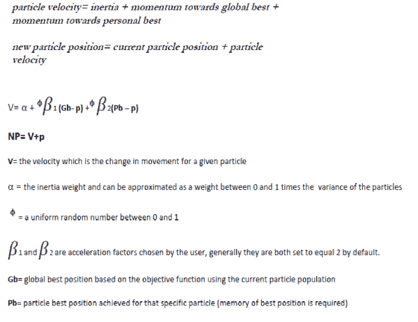
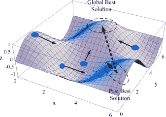

<!--yml
category: 未分类
date: 2024-05-12 17:58:40
-->

# Social Learning Algorithms: Particle Swarm Optimization (PSO) | CSSA

> 来源：[https://cssanalytics.wordpress.com/2013/09/06/social-learning-algorithms-particle-swarm-optimization-pso/#0001-01-01](https://cssanalytics.wordpress.com/2013/09/06/social-learning-algorithms-particle-swarm-optimization-pso/#0001-01-01)

The picture above is not a [Sharknado](http://www.imdb.com/title/tt2724064/). It is a school of fish that are travelling together in a swarm demonstrating the properties of intelligent social behavior. This observation along with other examples in nature helped to inspire the creation of Particle Swarm Optimization (PSO).

PSO is a robust [stochastic optimization method](https://cssanalytics.wordpress.com/2013/08/30/the-mighty-but-humble-micro-genetic-algorithm-mga/ "The Mighty (but humble) Micro-Genetic Algorithm (mGA)") based upon the behavior of swarms observed in nature. The method captures the concept of social intelligence and co-operation.  PSO was developed by a social psychologist- James Kennedy and an engineer-Russell Eberhart in 1995\. The PSO method employs particles that exhibit individual and group behavior when looking for a solution within a search space. These particles also have a memory of where they have been. PSO is ideal for complex optimization problems with continuous variables- like finding portfolio or equation weights. I have created a simplified breakdown of the PSO methodology – which is actually much simpler and less esoteric than it appears. Essentially, PSO uses the familiar concept of momentum to move particles towards a solution.

A graphic depiction of the tension between the global best and the particle best in determining the new particle position is presented below:

PSO is a very simple and useful methodology, and it has the added benefit of being much faster than [Genetic Algorithms](https://cssanalytics.wordpress.com/2013/08/30/the-mighty-but-humble-micro-genetic-algorithm-mga/ "The Mighty (but humble) Micro-Genetic Algorithm (mGA)"). However, its relative superiority is highly dependent on the type of problem. Typically the more continuous the variables are, and the less noisy and more continuous the search space is, the better its performance will be versus Genetic Algorithms–to make a broad and sweeping statement. But like anything else that is practical in the real world, it is best to consider hybrid methodologies that utilize the strengths of each method to create an even more flexible and efficient method.

[ ](https://cssanalytics.files.wordpress.com/2013/09/pso-equations.png)