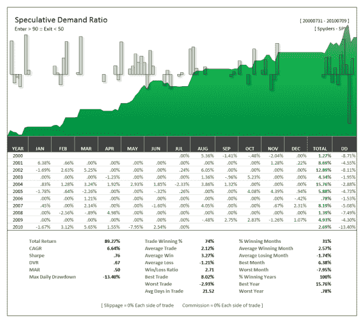
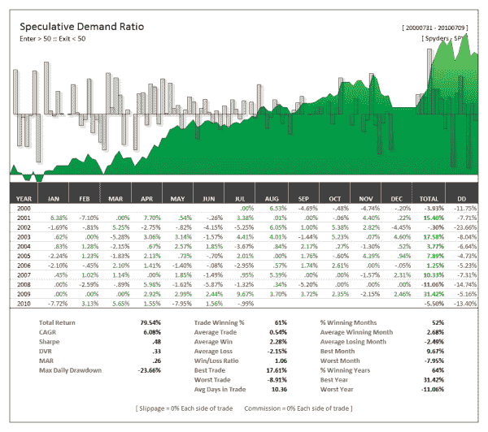

<!--yml
category: 未分类
date: 2024-05-12 18:21:40
-->

# Speculative Demand Ratio: Backtest Results on SPY | CSSA

> 来源：[https://cssanalytics.wordpress.com/2010/07/12/speculative-demand-ratio-2/#0001-01-01](https://cssanalytics.wordpress.com/2010/07/12/speculative-demand-ratio-2/#0001-01-01)

This is a backtest of using the Speculative Demand Ratio on the S&P  500 (SPY) using the 9 sector spyder ETFs to measure risk sentiment. The construction methodology involves taking the 20-day change in 20-day average dollar volume as a proxy for the change in money flow. Then we take the 4 highest sector spyder ETFs by 100-day HV (historical volatility) and take the change in money flow for these 4 versus the lowest 4 by 100-day HV. This is the speculative demand ratio or SDR—which captures the money flow into risky assets within an index versus the less risky assets within the index. The ratio is normalized using a 1-year percentile rank.  As you can see, the SDR is an excellent intermediate-term trend system for trading the S&P500\. Entering long when the SDR is at extreme highs and exiting below the median produces a very high w% as well as a healthy w/l ratio typical of trend-following systems. The average days per trade is roughly 20 days, and the average trade is a very tradeable +2%–easily surviving commissions.

