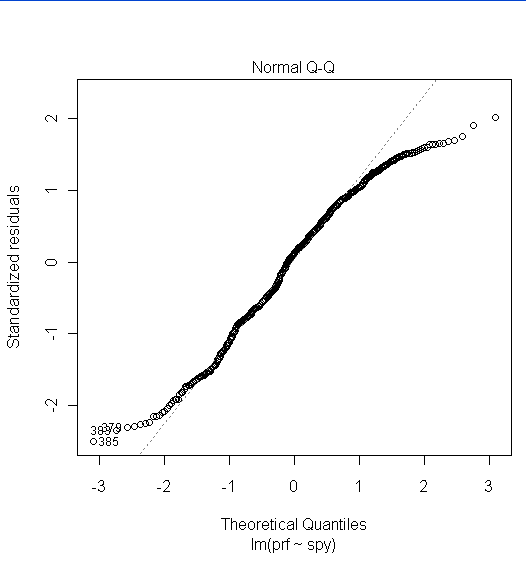
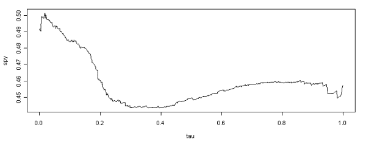

<!--yml
category: 未分类
date: 2024-05-18 13:56:25
-->

# Stability by Quantile | Quantivity

> 来源：[https://quantivity.wordpress.com/2009/08/03/stability-by-quantile/#0001-01-01](https://quantivity.wordpress.com/2009/08/03/stability-by-quantile/#0001-01-01)

Stability is one of the most important factors influencing *consistency* of quantitative trading algorithms. What works in a bull market does not work in a bear market; what works in trending market does not work in range-bound market.

Examples illustrating the importance of stability abound, with the most recent infamous example being discredited [CDS](http://en.wikipedia.org/wiki/Collateralized_debt_obligation) pricing via [copula](http://en.wikipedia.org/wiki/Copula_(statistics)) methods (originated by [Li](http://en.wikipedia.org/wiki/David_X._Li) in his classic article “On Default Correlation: A Copula Function Approach”, [Journal of Fixed Income](http://www.iijournals.com/toc/jfi/current) 9: 43-54). Turns out correlation simply is not a stable measure of coassocation. Other examples from quantitative trading include:

*   Volatility: relationship and switching between market regimes
*   Dispersion: relationship between index volatility and constituent volatilities
*   Sector rotation: relationship among market sector, value vs. growth, and related factors

Stability is often evaluated using techniques from [robust statistics](http://en.wikipedia.org/wiki/Robust_statistics) (applied [dynamical systems](http://en.wikipedia.org/wiki/Dynamical_systems) contributes additional techniques, often more familiar to mathematicians and physicists).

Robust statistics are particularly interesting because their relationship to the [Three Horsemen](https://quantivity.wordpress.com/2009/07/25/bias-stationarity-ergodicity/) (bias, stationarity, and ergodicity):

> Robust statistic is resistant to errors in the results produced by deviations from assumptions.

Traders are intimately familiar with the “long tails” of market returns, reflecting the common observation of positive excess [kurtosis](http://en.wikipedia.org/wiki/Kurtosis) (leptokurtosis, commonly associated with the [Laplace distribution](http://en.wikipedia.org/wiki/Laplace_distribution)) amongst nearly all financial markets: more variance is due to infrequent extreme deviations, as opposed to frequent modestly-sized deviations. Similarly, anyone watching the markets in 2008 – 2009 can easily observe the variance of market returns are not constant over time (formally known as [heteroskedasticity](http://en.wikipedia.org/wiki/Heteroskedasticity)). Yet, despite these universal familiarities, many analysts persist in exclusively using classical non-robust techniques.

Mean versus median (more generally, [quantiles](http://en.wikipedia.org/wiki/Quantile)) is one the root considerations of stability, whether directly or indirectly. This is exemplified by revising the SPY-PRF pairs trade from prior posts. OLS was used by those posts to estimate the cointegrating relationship between SPY and PRF.

From the perspective of trading algorithms, there are two fundamental problems with this approach:

*   Outliers: OLS is known to be highly-sensitive to outliers (which have occurred quite frequently), which is particularly problematic given the purpose of pairs trading is to identify pairs whose outliers exhibit specific desired behavior
*   Level sensitivity: OLS estimates a single parameter value, irrespective of the level

Ignoring level sensitivity is particularly problematic in statistical arbitrage, as it assumes securities co-behave in identical ways irrespective of their values. This assumption is usually bogus in practice, as easily demonstrated by comparing behavior at recent market bottoms (*e.g.* March 2009) versus market tops (*e.g.* October 2007).

Given all these problems, generating consistent trading results demands careful evaluation of stability, answering questions such as: “does the ratio of PRF-SPY depend upon the level of PRF or SPY?” and “If so, what is the range of the ratio under all observed values of PRF and SPY?”. Both are examples of questions which OLS and classic statistics simply cannot answer.

One of the easiest ways to evaluate stability for cointegrating relationships (such as PRF-SPY pairs) is via use of [quantile regression](http://en.wikipedia.org/wiki/Quantile_regression), which is a type of [robust regression](http://en.wikipedia.org/wiki/Robust_regression) (note [least absolute deviation](http://en.wikipedia.org/wiki/Least_absolute_deviations) is the [maximum likelihood](http://en.wikipedia.org/wiki/Maximum_likelihood) estimate for errors with Laplacian distribution, which nicely coincides with long tail distribution violations as discussed above). This can be performed quickly using a bit of R code. Assuming the following data frame setup:

`> prices <- read.table("prf-spy-all.txt", header = TRUE, sep = "\t")
> prf <- prices$PRF
> spy <- prices$SPY`

We estimate OLS:

`> fm <- lm(prf ~ spy)`

Given SPY parameter estimate of 0.4549 and intercept of -7.3561, and the following Normal [Q-Q plot](http://en.wikipedia.org/wiki/Q-Q_plot):

Whose tails obviously differ from normality quite heavily, indicating stability of the pair should be evaluated carefully. Use quantile regression to estimate the same relationship (using the [quantreg](http://cran.r-project.org/web/packages/quantreg/index.html) cran library):

`> quantile <- rq(prf ~ spy, tau = -1, data = prices)`

Which estimates the relationship across all quantiles (tau = -1). Plot of the SPY parameter estimates (*i.e.* hedge ratio), versus quantile (tau) ranging from zero to 1.0:

This means, for example, that the SPY hedge ratio is for the zero quantile is 0.49 (0.0 tau) and 0.45 for the median (0.50 tau). This plot nicely illustrates stability (or lack thereof), and provides graphical answers to our previous pair trading questions:

**Q**: Does the ratio of PRF-SPY depend upon the level of PRF or SPY?
**A**: Yes.

**Q**: If so, what is the range of the ratio under all observed values of PRF and SPY?
**A**: SPY hedge ratio ranges from < 0.45 to > 0.50 over the quantile range, with no clear linear relationship between quantile and hedge ratio.

Translated into trading: PRF/SPY hedge ratio increases to nearly 2:1 (0.50) at the lowest quantiles of PRF price (low $30s, corresponding to 10% quantile). Over all other quantiles ($40-60), the SPY hedge ratio decreases into the range of [0.45, 0.46].

These values are quite different from the 0.4549 estimate from OLS, and illustrate key insight into stability: traders assuming 0.45 estimate as PRF decreased into lower quantiles would increasingly lose money, as their pair residuals continuously diverged away from zero.

Coming full circle back to stability, this analysis implies: the residual mean value for the SPY-PRF pair would have been unstable, if traded over 2007 – 2008\. Thus, *pair traders assuming a stable 0.4549 would likely have lost increasing capital on residual divergence as PRF decreased into the $30 range*.