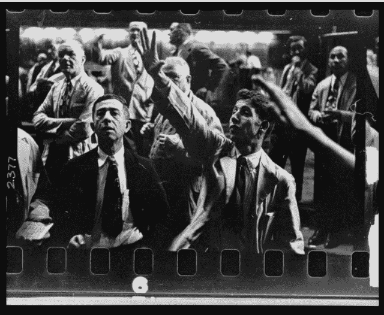

<!--yml
category: 未分类
date: 2024-05-18 14:23:56
-->

# Stanley Kubrick – Sniper In Mahwah & friends

> 来源：[https://sniperinmahwah.wordpress.com/2014/01/09/stanley-kubrick/#0001-01-01](https://sniperinmahwah.wordpress.com/2014/01/09/stanley-kubrick/#0001-01-01)

Prior to becoming a famous filmmaker, Stanley Kubrick was a really good photographer – for magazines like *Life*, etc. The very old photos are really in a Orson Welles mood.

In one of his photo books I have, I found this photography, taken at the Chicago Mercantile Exchange in 1949\. At that time, traders wear wore suits – not the official jackets required by the exchange later.

