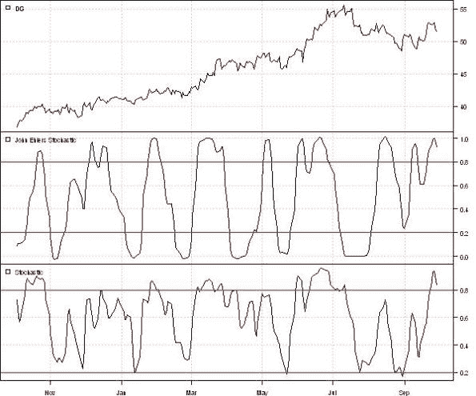
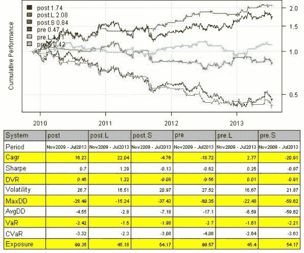
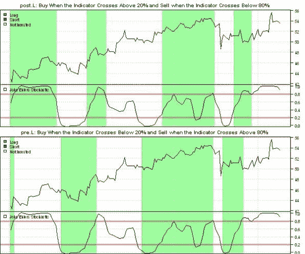

<!--yml
category: 未分类
date: 2024-05-18 14:32:27
-->

# Stochastic Oscillator | Systematic Investor

> 来源：[https://systematicinvestor.wordpress.com/2013/07/19/stochastic-oscillator/#0001-01-01](https://systematicinvestor.wordpress.com/2013/07/19/stochastic-oscillator/#0001-01-01)

I came across the link to the [John Ehlers paper: Predictive Indicators for Effective Trading Strategies](http://www.stockspotter.com/files/PredictiveIndicators.pdf), while reading the [Dekalog Blog](http://dekalogblog.blogspot.ca/2013/07/my-nn-input-tweak.html). John Ehlers offers a different way to smooth prices and incorporate the new filter into the oscillator construction. Fortunately, the EasyLanguage code was also provided and i was able to translate it into R.

Following are some results from the paper and test of John’s stochastic oscillator.

```

############################################################################### 
# Super Smoother filter 2013 John F. Ehlers
# http://www.stockspotter.com/files/PredictiveIndicators.pdf
############################################################################### 
super.smoother.filter <- function(x) {
    a1 = exp( -1.414 * pi / 10.0 )
    b1 = 2.0 * a1 * cos( (1.414*180.0/10.0) * pi / 180.0 )
    c2 = b1
    c3 = -a1 * a1
    c1 = 1.0 - c2 - c3

    x = c1 * (x + mlag(x)) / 2
        x[1] = x[2]

    out = x * NA
        out[] = filter(x, c(c2, c3), method='recursive', init=c(0,0))
    out
}

# Roofing filter 2013 John F. Ehlers
roofing.filter <- function(x) {
    # Highpass filter cyclic components whose periods are shorter than 48 bars
    alpha1 = (cos((0.707*360 / 48) * pi / 180.0 ) + sin((0.707*360 / 48) * pi / 180.0 ) - 1) / cos((0.707*360 / 48) * pi / 180.0 )

    x = (1 - alpha1 / 2)*(1 - alpha1 / 2)*( x - 2*mlag(x) + mlag(x,2))
        x[1] = x[2] = x[3]

    HP = x * NA
    HP[] = filter(x, c(2*(1 - alpha1), - (1 - alpha1)*(1 - alpha1)), method='recursive', init=c(0,0))

    super.smoother.filter(HP)
}

# My Stochastic Indicator 2013 John F. Ehlers
roofing.stochastic.indicator  <- function(x, lookback = 20) {
    Filt = roofing.filter(x)

    HighestC = runMax(Filt, lookback)
        HighestC[1:lookback] = as.double(HighestC[lookback])
    LowestC = runMin(Filt, lookback)
        LowestC[1:lookback] = as.double(LowestC[lookback])
    Stoc = (Filt - LowestC) / (HighestC - LowestC)

    super.smoother.filter(Stoc)
}

```

First let’s plot the John’s stochastic oscillator vs traditional one.

```

###############################################################################
# Load Systematic Investor Toolbox (SIT)
# https://systematicinvestor.wordpress.com/systematic-investor-toolbox/
###############################################################################
setInternet2(TRUE)
con = gzcon(url('http://www.systematicportfolio.com/sit.gz', 'rb'))
    source(con)
close(con)

    #*****************************************************************
    # Load historical data
    #******************************************************************   
    load.packages('quantmod')  

    tickers = spl('DG')
    data = new.env()
    getSymbols(tickers, src = 'yahoo', from = '1970-01-01', env = data, auto.assign = T)   
        for(i in ls(data)) data[[i]] = adjustOHLC(data[[i]], use.Adjusted=T)
    bt.prep(data)

    #*****************************************************************
    # Setup
    #*****************************************************************
    prices = data$prices  

    models = list()

    # John Ehlers Stochastic
    stoch = roofing.stochastic.indicator(prices)

    # 14 Day Stochastic
    stoch14 = bt.apply(data, function(x) stoch(HLC(x),14)[,'slowD'])

    #*****************************************************************
    # Create plots
    #******************************************************************           
    dates = '2011:10::2012:9'

    layout(1:3)

    plota(prices[dates], type='l', plotX=F)
    plota.legend('DG')

    plota(stoch[dates], type='l', plotX=F)
        abline(h = 0.2, col='red')
        abline(h = 0.8, col='red')
    plota.legend('John Ehlers Stochastic')

    plota(stoch14[dates], type='l')
        abline(h = 0.2, col='red')
        abline(h = 0.8, col='red')
    plota.legend('Stochastic')

```

[](https://systematicinvestor.wordpress.com/wp-content/uploads/2013/07/plot11.jpg)

Next let’s code the trading rules as in Figure 6 and 8 in the [John Ehlers paper: Predictive Indicators for Effective Trading Strategies](http://www.stockspotter.com/files/PredictiveIndicators.pdf)

```

    #*****************************************************************
    # Code Strategies
    #*****************************************************************
    # Figure 6: Conventional Wisdom is to Buy When the Indicator Crosses Above 20% and 
    # To Sell Short when the Indicator Crosses below 80%
    data$weight[] = NA
        data$weight[] = iif(cross.up(stoch, 0.2), 1, iif(cross.dn(stoch, 0.8), -1, NA))
    models$post = bt.run.share(data, clean.signal=T, trade.summary=T)

    data$weight[] = NA
        data$weight[] = iif(cross.up(stoch, 0.2), 1, iif(cross.dn(stoch, 0.8), 0, NA))
    models$post.L = bt.run.share(data, clean.signal=T, trade.summary=T)

    data$weight[] = NA
        data$weight[] = iif(cross.up(stoch, 0.2), 0, iif(cross.dn(stoch, 0.8), -1, NA))
    models$post.S = bt.run.share(data, clean.signal=T, trade.summary=T)

    # Figure 8: Predictive Indicators Enable You to Buy When the Indicator Crosses Below 20% and 
    # To Sell Short when the Indicator Crosses Above 80%
    data$weight[] = NA
        data$weight[] = iif(cross.dn(stoch, 0.2), 1, iif(cross.up(stoch, 0.8), -1, NA))
    models$pre = bt.run.share(data, clean.signal=T, trade.summary=T)

    data$weight[] = NA
        data$weight[] = iif(cross.dn(stoch, 0.2), 1, iif(cross.up(stoch, 0.8), 0, NA))
    models$pre.L = bt.run.share(data, clean.signal=T, trade.summary=T)

    data$weight[] = NA
        data$weight[] = iif(cross.dn(stoch, 0.2), 0, iif(cross.up(stoch, 0.8), -1, NA))
    models$pre.S = bt.run.share(data, clean.signal=T, trade.summary=T)

    #*****************************************************************
    # Create Report
    #****************************************************************** 		    
    strategy.performance.snapshoot(models, T)

```

[](https://systematicinvestor.wordpress.com/wp-content/uploads/2013/07/plot21.jpg)
Look’s like most profit comes from the long side.

Finally let’s visualize the timing of the signal for these strategies:

```

john.ehlers.custom.strategy.plot <- function(data, models, name, 
	main = name,
	dates = '::',
	layout = NULL		# flag to indicate if layout is already set	
) {
    # John Ehlers Stochastic
    stoch = roofing.stochastic.indicator(data$prices)

    # highlight logic based on weight
    weight = models[[name]]$weight[dates]
    	col = iif(weight > 0, 'green', iif(weight < 0, 'red', 'white'))
    plota.control$col.x.highlight = col.add.alpha(col, 100)
    	highlight = T

    if(is.null(layout)) layout(1:2)

    plota(data$prices[dates], type='l', x.highlight = highlight, plotX = F, main=main)
    plota.legend('Long,Short,Not Invested','green,red,white')

    plota(stoch[dates], type='l', x.highlight = highlight, plotX = F, ylim=c(0,1))        	
       	col = col.add.alpha('red', 100)
        abline(h = 0.2, col=col, lwd=3)
        abline(h = 0.8, col=col, lwd=3)
    plota.legend('John Ehlers Stochastic')        
}

    layout(1:4, heights=c(2,1,2,1))

    john.ehlers.custom.strategy.plot(data, models, 'post.L', dates = '2013::', layout=T,
        main = 'post.L: Buy When the Indicator Crosses Above 20% and Sell when the Indicator Crosses Below 80%')

    john.ehlers.custom.strategy.plot(data, models, 'pre.L', dates = '2013::', layout=T,
	main = 'pre.L: Buy When the Indicator Crosses Below 20% and Sell when the Indicator Crosses Above 80%')

```

[](https://systematicinvestor.wordpress.com/wp-content/uploads/2013/07/plot31.jpg)

As a homework, I encourage you to compare trading the John’s stochastic oscillator vs traditional one.

To view the complete source code for this example, please have a look at the [john.ehlers.filter.test() function in bt.test.r at github](https://github.com/systematicinvestor/SIT/blob/master/R/bt.test.r).