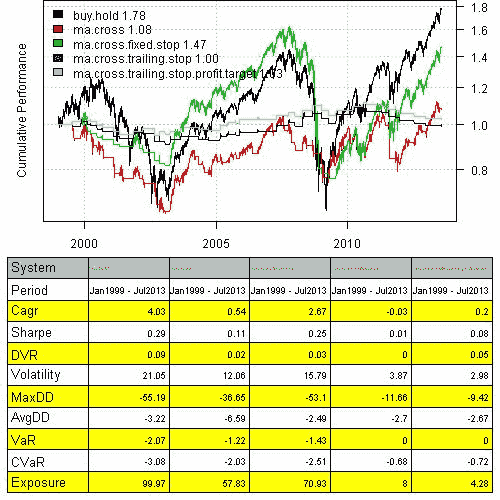
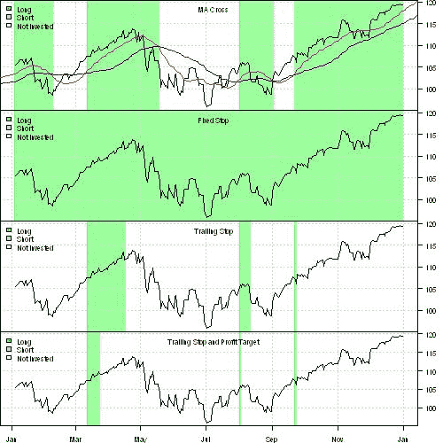

<!--yml
category: 未分类
date: 2024-05-18 14:32:19
-->

# Stop Loss | Systematic Investor

> 来源：[https://systematicinvestor.wordpress.com/2013/07/30/stop-loss/#0001-01-01](https://systematicinvestor.wordpress.com/2013/07/30/stop-loss/#0001-01-01)

Today I want to share and present an example of the flexible [Stop Loss](http://www.investopedia.com/articles/trading/08/trailing-stop-loss.asp) functionality that I added to the [Systematic Investor Toolbox](https://systematicinvestor.wordpress.com/systematic-investor-toolbox/).

Let’s examine a simple [Moving Average Crossover](http://www.investopedia.com/university/movingaverage/movingaverages4.asp) strategy:

*   Buy is triggered once fast moving average crosses above the slow moving average
*   Sell is triggered once fast moving average crosses below the slow moving average

Here is an example using 20 and 50 day moving averages on SPY.

```

###############################################################################
# Load Systematic Investor Toolbox (SIT)
# https://systematicinvestor.wordpress.com/systematic-investor-toolbox/
###############################################################################
setInternet2(TRUE)
con = gzcon(url('http://www.systematicportfolio.com/sit.gz', 'rb'))
    source(con)
close(con)

    #*****************************************************************
    # Load historical data
    #******************************************************************  
    load.packages('quantmod')  

    tickers = spl('SPY')	

    data <- new.env()
        getSymbols(tickers, src = 'yahoo', from = '1970-01-01', env = data, auto.assign = T)
        for(i in ls(data)) data[[i]] = adjustOHLC(data[[i]], use.Adjusted=T)		
    bt.prep(data, align='keep.all', dates='1999::')

    #*****************************************************************
    # Code Strategies
    #****************************************************************** 
    prices = data$prices   

    models = list()

    #*****************************************************************
    # Code Strategies
    #****************************************************************** 
    data$weight[] = NA
        data$weight[] = 1
    models$buy.hold = bt.run.share(data, clean.signal=T)

    #*****************************************************************
    # Code Strategies : MA Cross Over
    #****************************************************************** 
    sma.fast = SMA(prices, 20)
    sma.slow = SMA(prices, 50)

    buy.signal = iif(cross.up(sma.fast, sma.slow), 1, NA)

    data$weight[] = NA
        data$weight[] = iif(cross.up(sma.fast, sma.slow), 1, iif(cross.dn(sma.fast, sma.slow), 0, NA))
    models$ma.cross = bt.run.share(data, clean.signal=T, trade.summary = TRUE)

```

Next, I created the [custom.stop.fn() function in bt.stop.r at github](https://github.com/systematicinvestor/SIT/blob/master/R/bt.stop.r) to handle user defined stop functions. Let’s have a look at 3 different flavors of stops below:

```

    #*****************************************************************
    # User Defined Stops
    #****************************************************************** 
    # fixed stop: exit trade once price falls below % from entry price
    fixed.stop <- function(weight, price, tstart, tend, pstop) {
        index = tstart : tend
        if(weight > 0)
            price[ index ] < (1 - pstop) * price[ tstart ]
        else
            price[ index ] > (1 + pstop) * price[ tstart ]
    }

    # trailing stop: exit trade once price falls below % from max price since start of trade
    trailing.stop <- function(weight, price, tstart, tend, pstop) {
        index = tstart : tend
        if(weight > 0) 
            price[ index ] < (1 - pstop) * cummax(price[ index ])
        else
            price[ index ] > (1 + pstop) * cummin(price[ index ])
    }	

    # trailing stop: exit trade once price either
    # - falls below % from max price since start of trade OR
    # - rises above % from entry price
    trailing.stop.profit.target <- function(weight, price, tstart, tend, pstop, pprofit) {
        index = tstart : tend
        if(weight > 0) {
            temp = price[ index ] < (1 - pstop) * cummax(price[ index ])

            # profit target
            temp = temp | price[ index ] > (1 + pprofit) * price[ tstart ]
        } else {
            temp = price[ index ] > (1 + pstop) * cummin(price[ index ])

            # profit target
            temp = temp | price[ index ] < (1 - pprofit) * price[ tstart ]		
        }
        return( temp )	
    }

```

Each user defined stop function have 4 required inputs:

*   weight – signal or weight indicating position
*   price – price for asset
*   tstart – index(time) when trade was open
*   tend – index(time) when trade is closed

Additionally, you can provide any other required information.

For example, the fixed.stop function above, will exit the trade once price falls below given % (pstop) from entry price or trade is closed. The trailing.stop.profit.target function will exit the trade once either:

*   trailing stop is reached. i.e. price falls below given % (pstop) from max price since start of trade OR
*   profit target is reached. i.e. price rises above given % (pprofit) from entry price

Following is an example of integrating these stop losses into the back-tests. Please note that I only use the Buy rule from the original strategy to open the trades and to close the trades I use the stop loss logic.

```

    #*****************************************************************
    # Exit using fixed stop
    #****************************************************************** 
    data$weight[] = NA
        data$weight[] = custom.stop.fn(coredata(buy.signal), coredata(prices), fixed.stop, 
		pstop = 1/100)
    models$ma.cross.fixed.stop = bt.run.share(data, clean.signal=T, trade.summary = TRUE)

    #*****************************************************************
    # Exit using trailing stop
    #****************************************************************** 
    data$weight[] = NA
    	data$weight[] = custom.stop.fn(coredata(buy.signal), coredata(prices), trailing.stop, 
		pstop = 1/100)
    models$ma.cross.trailing.stop = bt.run.share(data, clean.signal=T, trade.summary = TRUE)

    #*****************************************************************
    # Exit using trailing stop or profit target
    #****************************************************************** 		
    data$weight[] = NA
    	data$weight[] = custom.stop.fn(coredata(buy.signal), coredata(prices), trailing.stop.profit.target, 
		pstop = 1/100, pprofit = 1.5/100)
    models$ma.cross.trailing.stop.profit.target = bt.run.share(data, clean.signal=T, trade.summary = TRUE)

    #*****************************************************************
    # Create Report
    #****************************************************************** 	
    strategy.performance.snapshoot(models, T)

```

[](https://systematicinvestor.wordpress.com/wp-content/uploads/2013/07/plot12.jpg)

Nothing exciting to report. The fixed stop loss is not triggered often and resembles the Buy and Hold. The trailing stops reduce the time strategy is in the market and also reduce returns. The trailing stop with profit target is doing a bit better.

We can see functionality of the stops more clearly in the picture below:

```

    #*****************************************************************
    # Create Plot
    #****************************************************************** 	
    dates = '2010::2010'
    # add moving averages to the strategy plot
    extra.plot.fn <- function() {
	plota.lines(sma.fast, col='red')
	plota.lines(sma.slow, col='blue')
    }

    layout(1:4)
    bt.stop.strategy.plot(data, models$ma.cross, dates = dates, layout=T, main = 'MA Cross', extra.plot.fn = extra.plot.fn, plotX = F)
    bt.stop.strategy.plot(data, models$ma.cross.fixed.stop, dates = dates, layout=T, main = 'Fixed Stop', plotX = F)
    bt.stop.strategy.plot(data, models$ma.cross.trailing.stop, dates = dates, layout=T, main = 'Trailing Stop', plotX = F)
    bt.stop.strategy.plot(data, models$ma.cross.trailing.stop.profit.target, dates = dates, layout=T, main = 'Trailing Stop and Profit Target')	

```

[](https://systematicinvestor.wordpress.com/wp-content/uploads/2013/07/plot22.jpg)

The shaded green area indicates the times when strategy is invested. In the top chart, the strategy is long once fast moving average (red line) is above the slow moving average (blue line).

The next chart (Fixed Stop) is fully invested because market has taken off since we entered the trade and stop, which is % relative to the trade entry price, is never triggered.

The last 2 charts show the trailing stop logic. Strategy is less often invested once we enforce the aggressive profit target.

Have fun with creating your own customized stop loss functions and let me know if you run into problems.

To view the complete source code for this example, please have a look at the [bt.stop.ma.cross.test() function in bt.stop.test.r at github](https://github.com/systematicinvestor/SIT/blob/master/R/bt.stop.test.r).