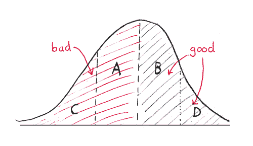
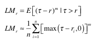
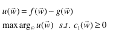
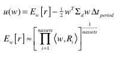
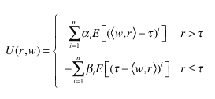
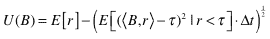

<!--yml
category: 未分类
date: 2024-05-18 15:35:10
-->

# Strategy Allocation | Tr8dr

> 来源：[https://tr8dr.wordpress.com/2010/01/10/strategy-allocation/#0001-01-01](https://tr8dr.wordpress.com/2010/01/10/strategy-allocation/#0001-01-01)

I’m interested in allocating capital across a series of strategies or assets in a way that balances between maximizing return and minimizing drawdown.   I’ve not spent much time thinking about this previously, so this is a work in progress.

**Mean-Variance Approach**
It has long been traditional to use the mean-variance approach for portfolio allocation.    A problem with the mean-variance approach is that it penalizes excess returns on the “right” (positive) side of the distribution in addition to the “left” (negative).   This is one reason why many consider the Sharpe ratio to be a flawed measure with respect to how investors see risk.

The mean-variance approach penalizes for sections **D** and **C** of the distribution.   An investor is generally happy with excess returns (i.e. D), and unhappy with drawdowns in the distribution (namely areas A and C).  We would prefer to accept the reward of the whole right side of the distribution and attempt to minimize the left.

**Lower-Moment Frameworks**
To remedy this we can use an asymmetric measure of variance to focus on the part of the distribution that represents our risk.   The family of such moment functions are called the “Lower Moments”.    Lower moment functions allow us to focus on sections **A** and **C** in the distribution (ie the drawdowns) and not consider the right side as a contribution towards risk.

Lower moment functions are expressed as follows:

The idea, simply, is that the moment (degree m) is computed on the region of the distribution below some threshold (say 0).

For a risk measure, we may want to penalize returns < 0 or prehaps returns < risk free rate.   We would choose τ according to where we want to penalize.

**Application to portfolio** Ok, so the lower-moment looks like a good measure of downside risk.  How do we incorporate it?  Let’s set up the problem:

1.  let **R** represent a matrix of returns
    One row for each period, number of columns = number of assets or strategies.
2.  let **w** represent the vector of weights for each asset / strategy
3.  let **Σd** represent the lower-moment covariance of returns with respect to the set of assets or strategies

Assumptions:

1.  let us assume that past performance is indicative of future performance  (we can relax this later)
2.  let us assume an eliptical (i.e. multivariate normal) distribution for negative  returns
3.  let us assume that the drift grows in proportion to variance x time

Ok, those are pretty aggressive assumptions, but they allow a first look at putting this together.

We need to create a utility function that blends the upside and downside, subject to various constraints.  Here f(w) represents the portion of a convex utility function rewarding positive return, and g(w) a function describing the risk penalty.

Let’s formulate the utility as the expected return for the next period (given the prior returns) and the expected negative return component (our risk) over the period:

The first part of our utility E[r] represents the average observed return and the second part the negative drift (our downside risk).    E[r] can be computed in any number of ways, for instance:

*   as a time weighted average of past returns
*   as a regression model with seasonality
*   from a stochastic model calibrated to past returns

The risk penalty is just ½ E[(τ – <w,r>)^2 | r < τ) · Δt, which approximates the expected downside drift over the period represented by Δt.

Now the above is a bit ad-hoc and I may be double counting the upside and downside with E[r].   I’ll have to think on the implications for mixing a lower moment measure and a full moment measure.

There may be some adjustments to make, but have outlined a first pass at penalizing returns and hopefully arriving at a more balanced weight selection.

**Addendum**
A more generalized approach could be to compose the utility function from a parameterized sum of upper and lower moments (Farinelli and Tibiletti 2002).   I’ve adjusted this a bit to fit my problem:

The number of moments for the lower portion can be different for the upper portion (or simply let the coefficients of some moments be 0).    What I came up with in the prior section is essentially this function for 2 moments with coefficients {1,0} and {0,1/2}.

**Addendum 2**
The utility function should have been (drift in proportion to sqrt), my bad:

