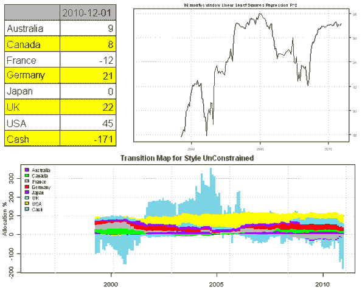
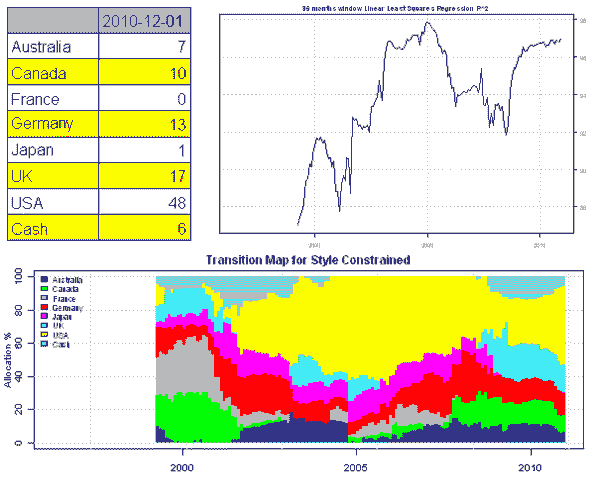
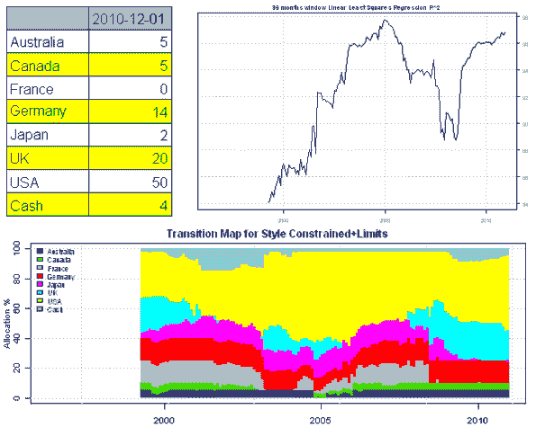
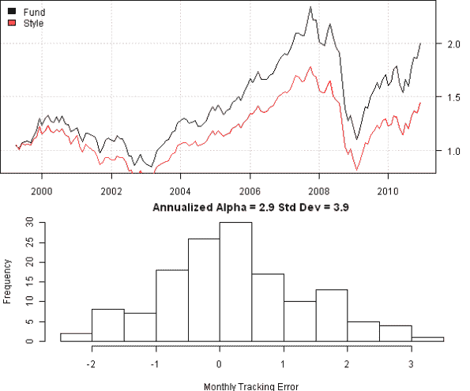

<!--yml
category: 未分类
date: 2024-05-18 14:45:51
-->

# Style Analysis | Systematic Investor

> 来源：[https://systematicinvestor.wordpress.com/2011/11/18/style-analysis/#0001-01-01](https://systematicinvestor.wordpress.com/2011/11/18/style-analysis/#0001-01-01)

During the final stage of asset allocation process we have to decide how to implement our desired allocation. In many cases we will allocate capital to the mutual fund managers who will invest money according to their fund’s mandate. Usually there is no perfect relationship between asset classes and fund managers. To determine the true style of a manager one can examine its historical holdings or perform a Style Analysis. Style Analysis is a procedure that tries to attribute funds performance to the performance of asset classes by running the constrained linear regression. For a detailed review of Style Analysis I recommend following articles:

I want to examine to the style of the [Fidelity Worldwide Fund (FWWFX)](http://fundresearch.fidelity.com/mutual-funds/summary/315910505). First, let’s get the historical fund and asset class prices from [Yahoo Fiance](http://finance.yahoo.com):

```

# load Systematic Investor Toolbox
setInternet2(TRUE)
source(gzcon(url('https://github.com/systematicinvestor/SIT/raw/master/sit.gz', 'rb')))

	#--------------------------------------------------------------------------
	# Get Historical Data
	#--------------------------------------------------------------------------
	load.packages('quantmod')

	# load historical prices from Yahoo Finance
	symbols = spl('FWWFX,EWA,EWC,EWQ,EWG,EWJ,EWU,SPY')		
	symbol.names = spl('Fund,Australia,Canada,France,Germany,Japan,UK,USA')	
	getSymbols(symbols, from = '1980-01-01', auto.assign = TRUE)

	# align dates for all symbols & convert to frequency 
	hist.prices = merge(FWWFX,EWA,EWC,EWQ,EWG,EWJ,EWU,SPY)		
		period.ends = endpoints(hist.prices, 'months')
		hist.prices = Ad(hist.prices)[period.ends, ]

		index(hist.prices) = as.Date(paste('1/', format(index(hist.prices), '%m/%Y'), sep=''), '%d/%m/%Y')
		colnames(hist.prices) = symbol.names

	# remove any missing data	
	hist.prices = na.omit(hist.prices['1990::2010'])

	# compute simple returns	
	hist.returns = na.omit( ROC(hist.prices, type = 'discrete') )

	#load 3-Month Treasury Bill from FRED
	TB3M = quantmod::getSymbols('TB3MS', src='FRED', auto.assign = FALSE)	
	TB3M = processTBill(TB3M, timetomaturity = 1/4)
		index(TB3M) = as.Date(paste('1/', format(index(TB3M), '%m/%Y'), sep=''), '%d/%m/%Y')
		TB3M = ROC(Ad(TB3M), type = 'discrete')
		colnames(TB3M) = 'Cash'

	# add Cash to the asset classes
	hist.returns = na.omit( merge(hist.returns, TB3M) )

```

To determine the Fidelity Worldwide Fund style, I will run a regression of fund returns on the country asset classes over a rolling 36 months window. First, let’s run the regression naively without any constraints:

```

	#--------------------------------------------------------------------------
	# Style Regression over 36 Month window, unconstrained
	#--------------------------------------------------------------------------
	# setup
	ndates = nrow(hist.returns)
	n = ncol(hist.returns)-1
	window.len = 36

	style.weights = hist.returns[, -1]
		style.weights[] = NA
	style.r.squared = hist.returns[, 1]
		style.r.squared[] = NA

	# main loop
	for( i in window.len:ndates ) {
		window.index = (i - window.len + 1) : i

		fit = lm.constraint( hist.returns[window.index, -1], hist.returns[window.index, 1] )	
			style.weights[i,] = fit$coefficients
			style.r.squared[i,] = fit$r.squared
	}

	# plot 
	aa.style.summary.plot('Style UnConstrained', style.weights, style.r.squared, window.len)

```

[](https://systematicinvestor.wordpress.com/wp-content/uploads/2011/11/plot1-small7.png)

The allocations jump up and down in no consistent fashion. The regression also suggests that fund uses leverage (i.e. Cash -171%) which is not the case. To fix these problems, I will introduce following constraints:

*   All style weights are between 0% and 100%.
*   The sum of style weights is equal up to 100%.

```

	#--------------------------------------------------------------------------
	# Style Regression over Window, constrained
	#--------------------------------------------------------------------------
	# setup
	load.packages('quadprog')

	style.weights[] = NA
	style.r.squared[] = NA

	# Setup constraints
	# 0 <= x.i <= 1
	constraints = new.constraints(n, lb = 0, ub = 1)

	# SUM x.i = 1
	constraints = add.constraints(rep(1, n), 1, type = '=', constraints)		

	# main loop
	for( i in window.len:ndates ) {
		window.index = (i - window.len + 1) : i

		fit = lm.constraint( hist.returns[window.index, -1], hist.returns[window.index, 1], constraints )	
			style.weights[i,] = fit$coefficients
			style.r.squared[i,] = fit$r.squared
	}

	# plot	
	aa.style.summary.plot('Style Constrained', style.weights, style.r.squared, window.len)

```

[](https://systematicinvestor.wordpress.com/wp-content/uploads/2011/11/plot2-small6.png)

After introducing the constraints, the allocations are more stable, but the historical allocation to USA (highlighted with yellow) varies from 0% in 2000 to 60% in 2006\. This is very suspicious, and the only way to check if this is true, is to look at the fund memorandum and historical holdings. For now, I will assume that the asset class allocations can vary around the current fund’s allocations. To get the current fund’s allocations, I will examine its current holdings at:

I imposed additional lower and upper bounds constrains:

```

	#--------------------------------------------------------------------------
	# Style Regression  over Window, constrained + limits on allocation
	#--------------------------------------------------------------------------
	# setup
	style.weights[] = NA
	style.r.squared[] = NA

	# Setup constraints
	temp = rep(0, n)
		names(temp) = colnames(hist.returns)[-1]
	lb = temp
	ub = temp
	ub[] = 1

	lb['Australia'] = 0
	ub['Australia'] = 5

	lb['Canada'] = 0
	ub['Canada'] = 5

	lb['France'] = 0
	ub['France'] = 15

	lb['Germany'] = 0
	ub['Germany'] = 15

   	lb['Japan'] = 0
	ub['Japan'] = 15

   	lb['UK'] = 0
	ub['UK'] = 25

   	lb['USA'] = 30
	ub['USA'] = 100

   	lb['Cash'] = 2
	ub['Cash'] = 15

	# 0 <= x.i <= 1
	constraints = new.constraints(n, lb = lb/100, ub = ub/100)

	# SUM x.i = 1
	constraints = add.constraints(rep(1, n), 1, type = '=', constraints)		

	# main loop
	for( i in window.len:ndates ) {
		window.index = (i - window.len + 1) : i

		fit = lm.constraint( hist.returns[window.index, -1], hist.returns[window.index, 1], constraints )	
			style.weights[i,] = fit$coefficients
			style.r.squared[i,] = fit$r.squared
	}

	# plot
	aa.style.summary.plot('Style Constrained+Limits', style.weights, style.r.squared, window.len)

```

[](https://systematicinvestor.wordpress.com/wp-content/uploads/2011/11/plot3-small4.png)

The last style allocation looks more probable. If historical fund’s holdings were readily available we could have examined them to refine the upper and lower boundaries. The last step is to analyze fund’s actual returns vs returns implied by its style matrix.

```

	#--------------------------------------------------------------------------
	# Look at Manager's Tracking Error
	#--------------------------------------------------------------------------
	manager.returns = hist.returns[, 1]
		manager.returns = manager.returns[window.len:ndates,]
	implied.returns = as.xts( rowSums(style.weights * hist.returns[, -1]), index(hist.returns))
		implied.returns = implied.returns[window.len:ndates,]

	tracking.error = manager.returns - implied.returns
	alpha = 12*mean(tracking.error)
	covar.alpha = 12* cov(tracking.error)

	# plot
	layout(1:2)
	plota(cumprod(1+manager.returns), type='l')
		plota.lines(cumprod(1+implied.returns), col='red')
		plota.legend('Fund,Style', 'black,red')

	par(mar = c(4,4,2,1))
	hist(100*tracking.error, xlab='Monthly Tracking Error',
		main= paste('Annualized Alpha =', round(100*alpha,1), 'Std Dev =', round(100*sqrt(covar.alpha),1))
	)

```

[](https://systematicinvestor.wordpress.com/wp-content/uploads/2011/11/plot4-small2.png)

The Fidelity Worldwide Fund outperformed its proxy, implied from the style matrix, consistently over the last decade. The fund’s alpha is 2.9% and standard deviation of alpha is 3.9%. So if you want to invest into Worldwide Fund, the Fidelity Worldwide Fund is not a bad choice.

To view the complete source code for this example, please have a look at the [aa.style.test() function in aa.test.r at github](https://github.com/systematicinvestor/SIT/blob/master/R/aa.test.r).