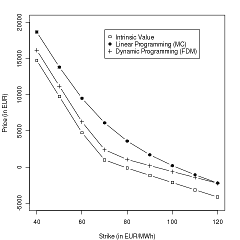

<!--yml
category: 未分类
date: 2024-05-17 23:41:02
-->

# Swing Option: Linear vs. Dynamic Programming II – HPC-QuantLib

> 来源：[https://hpcquantlib.wordpress.com/2011/06/04/swing-option-linear-vs-dynamic-programming-ii/#0001-01-01](https://hpcquantlib.wordpress.com/2011/06/04/swing-option-linear-vs-dynamic-programming-ii/#0001-01-01)

In order to get an improved impression on the differences between Monte-Carlo/linear programming and  finite difference methods/dynamic programming  a more realistic swing option with hourly payoff profile is evaluated based on a German hourly forward curve. The forward curve is taken from the [Kyos example download page](http://www.kyos.com/?content=65). The parameterization of the Kluge model is outlined in [1].

With maturity of twelve weeks the example swing option provides  exercise opportunities. The number of overall exercised swing opportunities is constraint by

.

The size of two dimensions of the finite difference method (dynamic programming) is therefore already been given. 2016 steps are needed in time direction and 500 steps are needed in the “consumed exercises” direction. Together with the two other directions – one for the power price and one dimension for the jump process – and without further simplidsfications this forms a pretty large finite difference problem. The Monte-Carlo based linear programming approach reduces the computational burden but will lead to an upper bound of the swing option price. The diagram below shows the corresponding results.

    

The code is available [here](http://hpc-quantlib.de/src/fwdswing.zip). It depends on the [GNU Linear Programming Kit](http://www.gnu.org/software/glpk/), the [Boost Thread](http://www.boost.org) library for parallelization and at the time of writing on the latest [QuantLib](http://www.quantlib.org) version from the [SVN trunk](http://sourceforge.net/p/quantlib/code/HEAD/tree/). If you want to generate the plot directly out of the C++ program you also need [R](http://www.r-project.org/), [RCPP](http://cran.r-project.org/web/packages/Rcpp/index.html) and [RInside](http://cran.r-project.org/web/packages/RInside/index.html). To utilize all CPU cores please use the -DNTHREADS=(number of CPU cores)  compiler switch. In addition to run the program you have to download the forward curve German power from the [Kyos web page](http://www.kyos.com/?content=65) and convert it into a text file EEX_2010-2013.txt of the folliwing format

4-Oct-2010 36.73 32.09 27.32 23.22 25.71 35.60 47.32 …

5-Oct-2010 38.12 31.12 22.76 25.65 27.87 34.60 50.01 …

[1] T. Kluge, [Pricing Swing Options and other Electricity Derivatives](http://eprints.maths.ox.ac.uk/246/1/kluge.pdf)