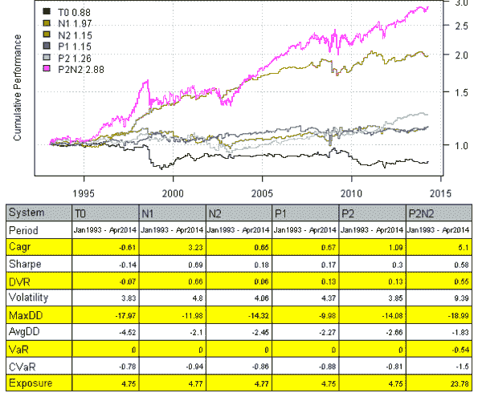
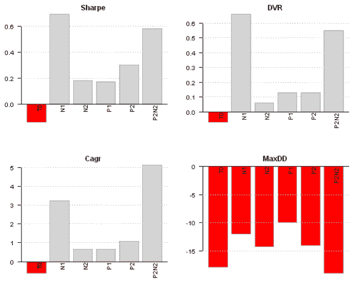
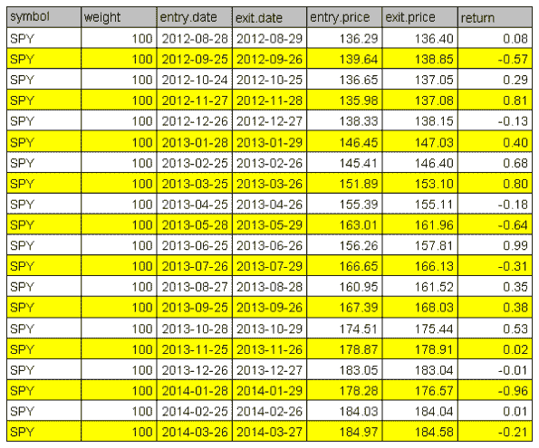

<!--yml
category: 未分类
date: 2024-05-18 14:49:21
-->

# Systematic Investor | Systematic Investor Blog

> 来源：[https://systematicinvestor.wordpress.com#0001-01-01](https://systematicinvestor.wordpress.com#0001-01-01)

Calendar Strategy is a very simple strategy that buys an sells at the predetermined days, known in advance. Today I want to show how we can easily investigate performance at and around Month End days.

First let’s load historical prices for SPY from Yahoo Fiance and compute SPY perfromance at the month-ends. I.e. strategy will open long position at the close on the 30th and sell position at the close on the 31st.

```

###############################################################################
# Load Systematic Investor Toolbox (SIT)
# https://systematicinvestor.wordpress.com/systematic-investor-toolbox/
###############################################################################
setInternet2(TRUE)
con = gzcon(url('http://www.systematicportfolio.com/sit.gz', 'rb'))
    source(con)
close(con)
	#*****************************************************************
	# Load historical data
	#****************************************************************** 
	load.packages('quantmod')

	tickers = spl('SPY')

	data <- new.env()
	getSymbols.extra(tickers, src = 'yahoo', from = '1980-01-01', env = data, set.symbolnames = T, auto.assign = T)
		for(i in data$symbolnames) data[[i]] = adjustOHLC(data[[i]], use.Adjusted=T)
	bt.prep(data, align='keep.all', fill.gaps = T)

	#*****************************************************************
	# Setup
	#*****************************************************************
	prices = data$prices
		n = ncol(prices)

	models = list()

	period.ends = date.month.ends(data$dates, F)

	#*****************************************************************
	# Strategy
	#*****************************************************************
	key.date = NA * prices
		key.date[period.ends] = T

	universe = prices > 0
	signal = key.date

	data$weight[] = NA
		data$weight[] = ifna(universe & key.date, F)
	models$T0 = bt.run.share(data, do.lag = 0, trade.summary=T, clean.signal=T) 

```

Please note that above, in the bt.run.share call, I set do.lag parameter equal to zero (the default value for the do.lag parameter is one). The reason for default setting equal to one is due to signal (decision to trade) is derived using all information available today, so the position can only be implement next day. I.e.

```
portfolio.returns = lag(signal, do.lag) * returns = lag(signal, 1) * returns
```

However, in case of the calendar strategy there is no need to lag signal because the trade day is known in advance. I.e.

```
portfolio.returns = lag(signal, do.lag) * returns = signal * returns
```

Next, I created two functions to help with signal creation and strategy testing:

```

	calendar.strategy <- function(data, signal, universe = data$prices > 0) {
		data$weight[] = NA
			data$weight[] = ifna(universe & signal, F)
		bt.run.share(data, do.lag = 0, trade.summary=T, clean.signal=T)  	
	}

	calendar.signal <- function(key.date, offsets = 0) {
		signal = mlag(key.date, offsets[1])
		for(i in offsets) signal = signal | mlag(key.date, i)
		signal
	}

	# Trade on key.date
	models$T0 = calendar.strategy(data, key.date)

	# Trade next day after key.date
	models$N1 = calendar.strategy(data, mlag(key.date,1))
	# Trade two days next(after) key.date
	models$N2 = calendar.strategy(data, mlag(key.date,2))

	# Trade a day prior to key.date
	models$P1 = calendar.strategy(data, mlag(key.date,-1))
	# Trade two days prior to key.date
	models$P2 = calendar.strategy(data, mlag(key.date,-2))

	# Trade: open 2 days before the key.date and close 2 days after the key.date
	signal = key.date | mlag(key.date,-1) | mlag(key.date,-2) | mlag(key.date,1) | mlag(key.date,2)
	models$P2N2 = calendar.strategy(data, signal)

	# same, but using helper function above	
	models$P2N2 = calendar.strategy(data, calendar.signal(key.date, -2:2))

	strategy.performance.snapshoot(models, T)

	strategy.performance.snapshoot(models, control=list(comparison=T), sort.performance=F)

```

Above, T0 is a calendar strategy that buys on 30th and sells on 31st. I.e. position is only held on a month end day. P1 and P2 are two strategies that buy a day prior and two days prior correspondingly. N1 and N2 are two strategies that buy a day after and two days after correspondingly.

[](https://systematicinvestor.wordpress.com/wp-content/uploads/2014/04/plot11.png)

[](https://systematicinvestor.wordpress.com/wp-content/uploads/2014/04/plot21.png)

The N1 strategy, buy on 31st and sell on the 1st next month seems to be working best for SPY.

Finally, let’s look at the actual trades:

```

	last.trades <- function(model, n=20, make.plot=T, return.table=F) {
		ntrades = min(n, nrow(model$trade.summary$trades))		
		trades = last(model$trade.summary$trades, ntrades)
		if(make.plot) {
			layout(1)
			plot.table(trades)
		}	
		if(return.table) trades	
	}

	last.trades(models$P2)

```

[](https://systematicinvestor.wordpress.com/wp-content/uploads/2014/04/plot3.png)

The P2 strategy enters position at the close 3 days before the month end and exits positions at the close 2 days before the month end. I.e. the performance is due to returns only 2 days before the month end.

With this post I wanted to show how easily we can study calendar strategy performance using the [Systematic Investor Toolbox](https://systematicinvestor.wordpress.com/systematic-investor-toolbox/).

Next, I will demonstrate calendar strategy applications to variety of important dates.

To view the complete source code for this example, please have a look at the [bt.calendar.strategy.month.end.test() function in bt.test.r at github](https://github.com/systematicinvestor/SIT/blob/master/R/bt.test.r).