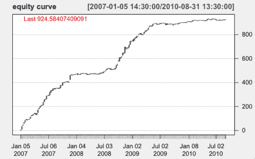
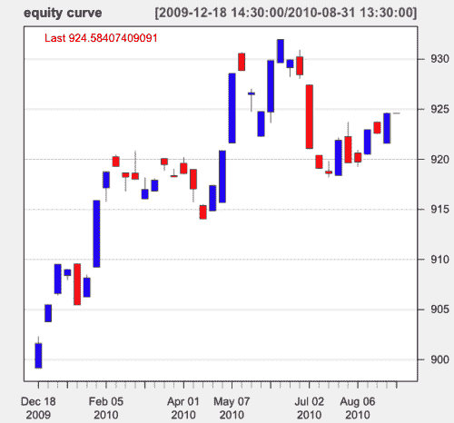
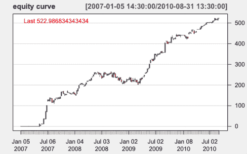
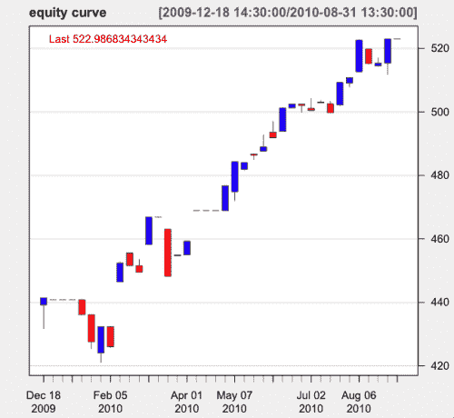

<!--yml
category: 未分类
date: 2024-05-18 15:31:58
-->

# Tale of 2 Strategies | Tr8dr

> 来源：[https://tr8dr.wordpress.com/2010/09/09/tale-of-2-strategies/#0001-01-01](https://tr8dr.wordpress.com/2010/09/09/tale-of-2-strategies/#0001-01-01)

September 9, 2010 · 10:42 am

As mentioned in the previous post, the market of the current year has been harder for some mean-reversion (and probably trend following) strategies.     I have a family of non-parametric adaptive MR strategies for baskets of equities.

I had been trading a strategy this year (on and off)  that declined in growth substantially from prior years due to the changes in the market.  Here is the 3 year cumulative return (note that this is not reinvested return, rather trading a fixed amount of capital):

The strategy profitability has grown much more slowly since late 2009\.   Here is a blowup of the YTD where you can see that it has done about 20% YTD:

The strategy appears to be more appropriate for trending markets rather than the sideways market we’ve been in.   I have another MR strategy with less spectacular 3 year returns, but appears to fit this market better with fairly smooth returns YTD and more rugged returns in the higher volatility regions (2008) in the past:

A blowup of the YTD trajectory shows a 80% gain YTD:

The volatility at the beginning of the year was high with this strategy.   The question becomes when to switch from one strategy to another or how to adjust allocation weights on the strategies, trading both.