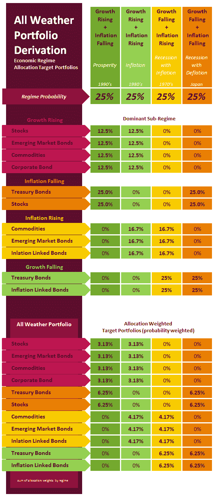
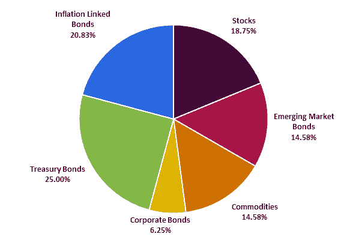

<!--yml
category: 未分类
date: 2024-05-12 18:03:42
-->

# The “All-Weather” Portfolio Derivation | CSSA

> 来源：[https://cssanalytics.wordpress.com/2012/11/07/the-all-weather-portfolio-derivation/#0001-01-01](https://cssanalytics.wordpress.com/2012/11/07/the-all-weather-portfolio-derivation/#0001-01-01)

The **All-Weather Portfolio** was introduced by **Ray Dalio**– the founder of [Bridgewater](http://www.bwater.com/home/research--press.aspx) -which is arguably the largest and most successful hedge fund in the world. His landmark concept was to create a portfolio that would have roughly equal risk in four different economic regimes: 1) rising growth 2) falling growth 3) rising inflation  and 4) falling inflation. His other major concept was to leverage up each asset to have the same risk so that returns could come from multiple different sources, and not rely on an equity-centric environment. Of course, it is more accurate to think of each of these as sub-regimes since the change in growth is often accompanied by some change in inflation. Thus, in this adaptation the four major regimes are exactly the same as in the [Permanent Portfolio](https://cssanalytics.wordpress.com/2012/11/01/permanent-portfolio-derivation-and-historical-performance/) , *the only difference is the type of assets included in each regime*. By structuring a portfolio to be balanced across economic regimes, the performance and volatility is more stable over time. The inspiration for this post, and a good explanation of the All-Weather Portfolio can be found [here](http://seekingalpha.com/article/878251-bridgewater-s-all-weather-portfolio-vs-harry-browne-s-permanent-portfolio).

**The “All-Weather Portfolio”**

