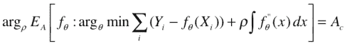
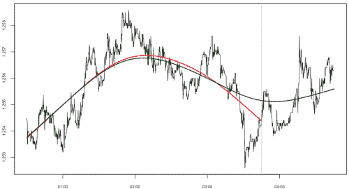

<!--yml
category: 未分类
date: 2024-05-18 15:37:50
-->

# The “Mean”, take 2 | Tr8dr

> 来源：[https://tr8dr.wordpress.com/2009/11/04/the-mean-take-2/#0001-01-01](https://tr8dr.wordpress.com/2009/11/04/the-mean-take-2/#0001-01-01)

November 4, 2009 · 1:01 pm

Thinking about the prior post, am not satisfied with the approach in that it does not quantify properties of the mean and price relative to the mean in a way that is explicit.

Let’s examine various properties the system should represent:

1.  Integral of Y[t] – μ[t] should be close to 0
    This implies that the mean’s course is balanced between time/distance spent below the mean and above the mean.
2.  average max amplitude should meet a target amplitude
    We want a predictable mean reversion process.   One approach to this is ensuring that the mean is such that it allows for some average max deviation.   We will be working with an evolving  distribution of amplitudes to modify the behavior of the mean.
3.  Should be smooth and continuous with exception of jumps
    That is we minimize the integral of μ”(t)^2 in some ratio with other constraints.   Alternatively we could require a AR(p) process to provide continuity with prior μ(t) observations.

**A-posteriori Approach**
This is a relatively simple problem to solve after-the-fact, where we find a regressor f(t) that meets the above requirements.   The tricky aspect is in the observation of minima and maxima of the price difference in a way that we can integrate into a system of equations.

Assuming we have the regressor f(t), and a function that evaluates the average amplitude over the regressor Ea (f), we can express as:

The problem with this is that though it is optimal for the data set over which it is evaluated it is unlikely to be optimal relative to future values of Yi.  Observe how the regressors differ (the red with the original data series and the green relative to an additional hour of data):

The initial regressor (red) is no longer optimal given another hr of data.  The green regressor now represents the optimum.   This analysis points in the direction of determining an “online” estimate of the mean which works probabilistically.

**Online Approach**
I do not yet have a concrete solution in mind, so what follows is a train of thought:

*   use an evolving stochastic cubic system with constraints to guide coefficient processes (what constraints from above and how)
*   alternatively model the mean on an autoregressive process with innovations in proportion to a running variance estimate.   Equating variance and level-duration arrive at a formulation for the amount of “innovation” and therefore deviation from the mean allowed.
*   Another variant of the above approach is to adjust the AR coefficients to respond to changes in volatility.

I’ll update as the ideas mature …