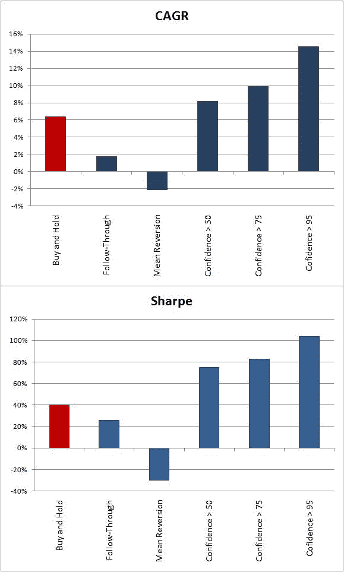

<!--yml
category: 未分类
date: 2024-05-12 18:48:23
-->

# The Adaptive Time Machine: The Importance of Statistical Filters | CSSA

> 来源：[https://cssanalytics.wordpress.com/2009/09/16/the-adaptive-time-machine-the-importance-of-statistical-filters/#0001-01-01](https://cssanalytics.wordpress.com/2009/09/16/the-adaptive-time-machine-the-importance-of-statistical-filters/#0001-01-01)

**Note:** *to the sophisticated quant crowd, bootstrap tests using White’s Reality check are more approriate measures of confidence to avoid data-mining bias ie random re-sampling, and de-trending the data by subtracting S&P500 returns are done in practice.*

Returning to our little experiment [https://cssanalytics.wordpress.com/2009/09/14/busting-the-efficient-markets-hypothesis-the-adaptive-market-time-machine/](https://cssanalytics.wordpress.com/2009/09/14/busting-the-efficient-markets-hypothesis-the-adaptive-market-time-machine/) and the methodology [https://cssanalytics.wordpress.com/2009/09/15/creating-the-adaptive-time-machine/](https://cssanalytics.wordpress.com/2009/09/15/creating-the-adaptive-time-machine/), recall that there are 50 strategies that our machine can choose from. It can buy or sell on any combination of up or down runs. The question is, which strategies should we focus on? Those who understand the time series of market returns understand that there is a fair amount of randomness that needs to be filtered for to avoid trading noise. One such method to filter strategies is the T-statistic [http://en.wikipedia.org/wiki/T-statistic](http://en.wikipedia.org/wiki/T-statistic) . The basics of the T-stat or T-score is that it helps you derive a % confidence that a strategy has a mean that  is statistically different from zero. This is a good start, as strategies with low levels of confidence are far more likely to be random effects. Typically scientists use 95% as a benchmark for the confidence required to differentiate chance from a systematic effect. Now there are wrinkles in applying this metric to time series data, but that is beyond the scope of this article. Quants like my compadre Michael Stokes at MarketSci [http://marketsci.wordpress.com/](http://marketsci.wordpress.com/) and my expert trader friend Frank at Trading the Odds [http://www.tradingtheodds.com/](http://www.tradingtheodds.com/) both make frequent use of this statistic and the concept of confidence each in their own way.

To conduct our first test, we selected S&P500 data going back to 1955\. First we tested buy and hold and then the baseline strategies traded with either a mean-reversion bias (ie buy on down runs sell on up runs), or a standard follow-through or trend bias. We then created three filters using the t-stat: 1) minimum 50% confidence 2) minimum 75% confidence and 3) minimum 95% confidence. The strategies were then traded in the appropriate direction indicate by the t-test–ie if the t-stat was negative we traded the strategy short and if it was positive we traded it long. Notice that this method is “bias-free” because we don’t care which way the strategies are traded. Confidence figures were calculated using a combination of a 3-year and 1-year time window. Note that even with 95% confidence we ended up trading 7 strategies simultaneously on average, whereas with 75% confidence we traded 24, and 32 for 50% confidence. This is in contrast to selecting the “best method.” It also helps to verify the robustness of the filter. Lets look at how this filter performs vs the various benchmarks:

Note that each level of confidence outperforms the other, and the equity curve is very smooth and adapts across a variety of regimes. The annual return and sharpe ratio are much better than buy and hold for 50%, 75%, and 95% confidence. This makes sense, as even 50% confidence will contain strategies that are 95% confidence plus. As a deep thought, the market is essentially a composite equity curve of thousands of strategies, with many being executed on the basis of judgement rather than statistics. Thus the random component of the market is actually fairly high, and avoiding low confidence strategies helps easily beat buy and hold. All strategies also handily beat either a mean reversion or follow through bias. This shows how adaptive this simple algorithm is, learning from what is working and reallocating capital. In the next series of posts we will look at other methods of selecting strategies and improving performance even more.