<!--yml
category: 未分类
date: 2024-05-17 23:26:53
-->

# The CLV Model with a Square Root Kernel Process – HPC-QuantLib

> 来源：[https://hpcquantlib.wordpress.com/2016/11/02/the-clv-model-with-a-square-root-kernel-process/#0001-01-01](https://hpcquantlib.wordpress.com/2016/11/02/the-clv-model-with-a-square-root-kernel-process/#0001-01-01)

The kernel process of the Collocating Local Volatility (CLV) model [1] defines the forward skew dynamics of the model. Although the Ornstein-Uhlenbeck process has some nice analytical features it offers sometimes too little control over the forward skew dynamics. The square root process

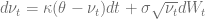

is a promising kernel to get more control over the forward skew. First, exact sampling is pretty easy for the square root process. The probability density function of  given  is

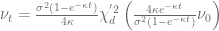

where 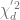 denotes the noncentral chi-squared distribution with

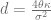

degrees of freedom and the noncentrality parameter

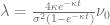

The boost library provides an efficient and accurate implementation of the inverse of the cumulative noncentral chi-squared distribution function, which can be used for an exact Monte-Carlo sampling scheme.

The optimal collocation points are given by the Gaussian quadrature points, which are defined by the zeros of the corresponding orthogonal polynomials. The orthogonal polynomials are defined by a recurrence relation and the collocation points are given by the eigenvalues of a symmetric, tri-diagonal matrix with the diagonal 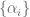 and the minor diagonal 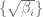. Again these vectors are defined by a recurrence relation [2]


The first n moments 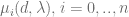 of the noncentral chi-squared distribution can be calculated using Mathematica and exported as plain C code in order to be integrated into QuantLib.

```
m[n_] := CForm[ Expectation[X^n, X \[Distributed]
NoncentralChiSquareDistribution[d, lambda]] // Simplify]

```

Solving the recurrence relation is often ill-conditioned when using double precision. Therefore the resulting equations will be solved using the Boost.Multiprecision package with the cpp_dec_float back-end (header only and dependency free). The results have been tested accordingly to the proposal in [3]. For any reasonable number of collocation points a precision of up to 100 digits seems to be sufficient. On the other side the computation even with 100 digits is really fast. The eigenvalue calculation is carried out using standard double precision.

The implementation of the calibration routine follows the same way as for the Ornstein-Uhlenbeck kernel process. Again the calibration is pretty fast and accurate compared with other structured models even though it involves multiple precision arithmetic.

**Example: Forward volatility skew**

*   Market prices are given by a Heston model with

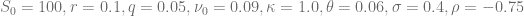.

*   SquareRoot-CLV kernel process parameters are given by

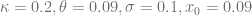

The diagram below shows the implied volatility of an forward starting European option with moneyness varying from 0.5 to 2 and maturity date six month after the reset date.

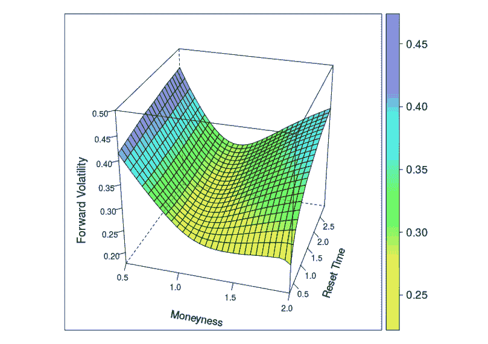

Same plot but with the following parameters of the square root kernel process

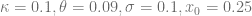


Source code is available [here](http://hpc-quantlib.de/src/squarerootclvmodel.zip). The code is in an early state and needs some more testing/clean-up before a pull request can be made out of it. Next step will be to calibrate such a CIR-CLV model to the forward skew dynamics of an Heston Stochastic Local Volatility model.

[1] A. Grzelak, 2016, [The CLV Framework – A Fresh Look at Efficient Pricing with Smile](http://papers.ssrn.com/sol3/papers.cfm?abstract_id=2747541)

[2] M. Morandi Cecchi and M. Redivo Zaglia, [Computing the coefficients](http://ac.els-cdn.com/0377042793901522/1-s2.0-0377042793901522-main.pdf?_tid=643d5dca-a05d-11e6-9a56-00000aab0f27&acdnat=1478023545_cf7c87cba4cc9e37a136e68a2564d411) [of a recurrence formula for numerical integration by moments and](http://ac.els-cdn.com/0377042793901522/1-s2.0-0377042793901522-main.pdf?_tid=643d5dca-a05d-11e6-9a56-00000aab0f27&acdnat=1478023545_cf7c87cba4cc9e37a136e68a2564d411) [modified moments.](http://ac.els-cdn.com/0377042793901522/1-s2.0-0377042793901522-main.pdf?_tid=643d5dca-a05d-11e6-9a56-00000aab0f27&acdnat=1478023545_cf7c87cba4cc9e37a136e68a2564d411)

[3] Walter Gautschi, [How and How not to check Gaussian Quadrature Formulae.](https://www.cs.purdue.edu/homes/wxg/selected_works/section_08/084.pdf)