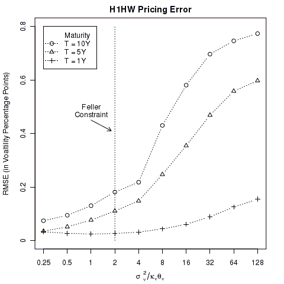

<!--yml
category: 未分类
date: 2024-05-17 23:31:11
-->

# The Hybrid Heston-Hull-White Model in the H1HW Approximation – HPC-QuantLib

> 来源：[https://hpcquantlib.wordpress.com/2012/08/17/the-hybrid-heston-hull-white-model-in-the-h1hw-approximation/#0001-01-01](https://hpcquantlib.wordpress.com/2012/08/17/the-hybrid-heston-hull-white-model-in-the-h1hw-approximation/#0001-01-01)

In his PhD thesis [1] Lech Grzelak studies several hybrid equity interest rate models. Among others the thesis presents the H1HW approximation of the hybrid Heston-Hull-White model:

This model is tailor-made to analyse the impact of stochastic interest rates on structured equity notes like e.g. auto-callables. The corresponding partial differential equation

![\begin{array}{rcl} 0 &=& \frac{\partial u}{\partial t} + \frac{1}{2}S^2\nu \frac{\partial^2 u}{\partial S^2}+ \frac{1}{2}\sigma_\nu^2\nu\frac{\partial^2u}{\partial \nu^2}+ \frac{1}{2}\sigma_r^2\frac{\partial^2 u}{\partial r^2} + \rho_{S\nu}\sigma_\nu S\nu\frac{\partial^2u}{\partial S\partial\nu} + \rho_{Sr}\sigma_r S\sqrt\nu \frac{\partial^2 u}{\partial S\partial r} \nonumber\\ &+& (r-q)S\frac{\partial u}{\partial S}+ \kappa_v(\theta_v-\nu)\frac{\partial u}{\partial \nu}+ \kappa_r(\theta_{r,t}-r)\frac{\partial u}{\partial r} -ru \nonumber \end{array} ](img/65b5f976ac97a5585117017854522f0b.png)

does not fit into into the affine diffusion process framework and therefore has no closed form solution based on the characteristic function like the Heston model.

The H1HW approximation replaces the term  in the correlation interaction by its expectation value . Semi closed form solutions for  exist, if  is a CIR type process. The corresponding hybrid model is affine and a pricing engine for plain vanilla options can easily be implemented in QL based on the characteristic function framework.

The diagram below shows the root-mean-square error for vanilla european options with strikes equal to 40%, 80%, 100%, 120% and 180%. The parameters of the process are given by

The vol-of-vol  is set so that the Feller parameter  varies between 0.25 and 128\. The reference prices are calculated using the finite difference Heston-Hull-White engine.

The results of the H1HW approximation look very well if the Feller constraint  is fulfilled but has problems in high  scenarios. The integration of the characteristic function of the H1HW approximation becomes unstable if . The example code is available [here](http://hpc-quantlib.de/src/h1hw.zip) and depends on the latest QL version based from the [SVN trunk.](http://sourceforge.net/p/quantlib/code/HEAD/tree/)

[1] Lech A. Grzelak: [Equity and Foreign Exchange Hybrid Models for Pricing Long-Maturity Financial Derivatives](a8e1a007-bd89-481a-aee3-0e22f15ade6b/PhDThesis_main.pdf)