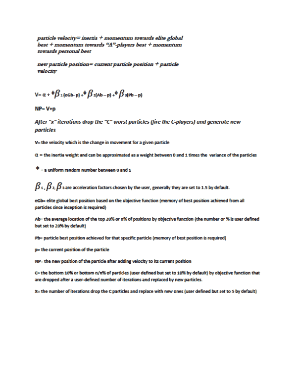

<!--yml
category: 未分类
date: 2024-05-12 17:58:23
-->

# The Jack Welch PSO Algorithm (JW-PSO) | CSSA

> 来源：[https://cssanalytics.wordpress.com/2013/09/12/the-jack-welch-pso-algorithm-jw-pso/#0001-01-01](https://cssanalytics.wordpress.com/2013/09/12/the-jack-welch-pso-algorithm-jw-pso/#0001-01-01)

Jack Welch is a corporate icon, and arguably one of the greatest CEO’s of all time. One of the unique ideas he employed was a method (the 20-70-10 system) to optimize his workforce based upon identifying three different segments- the top 20% or the high value employees, the middle 70% that were mediocre but vital to the operation and the bottom 10% that were considered to be unproductive. In a previous post I talked about the “[Jack Welch Portfolio Algorithm](https://cssanalytics.wordpress.com/2011/10/13/the-jack-welch-portfolio-algorithm/ "The “Jack Welch” Portfolio Algorithm")” concept in greater detail, and it is worthwhile reading to get some additional background on the subject. The 20-70-10 system has some interesting components that inspired me to create a new hybrid heuristic optimization algorithm.

Recently, I introduced readers to  [Particle Swarm Optimization](https://cssanalytics.wordpress.com/2013/09/06/social-learning-algorithms-particle-swarm-optimization-pso/ "Social Learning Algorithms: Particle Swarm Optimization (PSO)") (PSO)and [Micro Genetic Algorithms](https://cssanalytics.wordpress.com/2013/08/30/the-mighty-but-humble-micro-genetic-algorithm-mga/ "The Mighty (but humble) Micro-Genetic Algorithm (mGA)") (mGA). For a very interesting and detailed analysis of these approaches, I suggest readers look at a newcomer to the blogroll- [Butler’s Math](http://butlersmath.wordpress.com/2013/09/07/a-quick-analysis-of-heuristic-optimization-by-stochastic-genetic-algorithms-and-particle-swarm/). Andrew Butler is a mathematician with a background in optimization and he does an interesting comparison of how these algorithms perform in solving different mathematical functions. PSO happens to be a very practical and intuitive algorithm for solving portfolio problems and different equations for financial modelling. The major drawbacks to using PSO is that it can be slow to converge (relative to a deterministic or gradient optimizer) and also it can get more easily trapped in local optima than Genetic Algorithms (GA) which tends to do a better job of searching the optimization space. In traditional parlance, GA is better at exploration but PSO is better at exploitation, and both methods employ a lot of iterations- and hence are slow to run on a computer versus gradient solvers. PSO starts with a fixed number of particles that are randomly generated. This initial swarm is used to move particles together to find the optimum. Unfortunately, like chaos theory, PSO is sensitive to initial conditions- the location of the initial particles can affect the probability of finding the optimum and also the speed to reach a solution.  I suggested that hybrid algorithms be considered specifically to address the weaknesses of different algorithms . In this case Jack’s 20-70-10 system presents some good ideas for improving upon the original PSO concept.

In **JW-PSO**, the first key change on the original algorithm is to “fire” the 10% of the worst performing particles or the “C-players.” These particles are replaced with brand new particles. This change has two benefits: 1) it enables potentially superior exploration by allowing new particles to search the space and 2) it enables potentially superior exploitation and faster convergence by re-allocating resources away from potentially useless areas of the search space. The second key change is to move particles towards the “A-players” that are the top 20% in terms of the objective function. This also helps exploitation and potentially faster convergence by shifting particles towards the potentially more fruitful areas of the search space. The last change is to make the global best an “elite” global best that borrows the concept of elitism from mGA. The elite global best is the best position found so far since inception in terms of the objective function rather than the best within the swarm of particles at the current moment. This helps to ensure that the optimal position is not lost through successive iterations- causing the particles to waste computational resources. The new equations for the **JW-PSO** are presented below:

I would encourage readers to experiment with this concept and to think of new and novel ways to extend hybrid PSO algorithms to make them more practical and efficient.