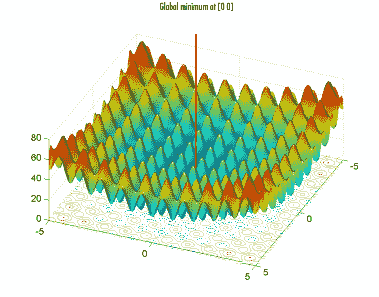
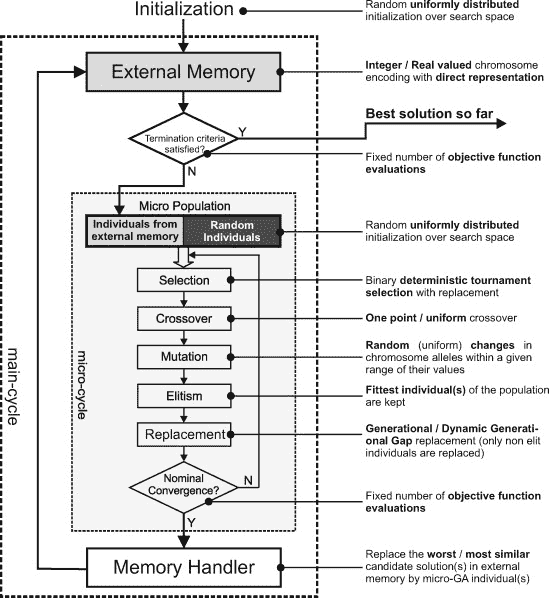

<!--yml
category: 未分类
date: 2024-05-12 17:59:17
-->

# The Mighty (but humble) Micro-Genetic Algorithm (mGA) | CSSA

> 来源：[https://cssanalytics.wordpress.com/2013/08/30/the-mighty-but-humble-micro-genetic-algorithm-mga/#0001-01-01](https://cssanalytics.wordpress.com/2013/08/30/the-mighty-but-humble-micro-genetic-algorithm-mga/#0001-01-01)

***A Gentle Introduction to Optimization***

The field of optimization has evolved significantly over the past few decades. Several new theoretical, algorithmic, and computational methods for optimization have been proposed to solve complex problems in diverse fields such as finance, engineering and molecular biology. In finance, optimization is required to solve portfolio problems, model/predict time series data, create trading systems, and for implementing trade execution.

Optimization methods can be divided into two primary categories; **deterministic** and **heuristic** approaches. Both methods are essential for quantitative finance applications. **Deterministic** optimization is a highly mathematical and gradient-based form of optimization that is most suitable for well-defined problems that contain a smooth and continuous search space. Some examples of deterministic optimization would be conjugate gradient, simplex, gradient descent, quadratic- programming (used for Markowitz-type portfolio problems),non-linear solvers, and quasi-Newton or Newton methods. These methods are greedy and highly efficient, and if used for the appropriate application they are guaranteed to find the global optimum. Deterministic methods are analogous to Formula One race cars: they are very fast and precise and will find the finish line as long as they are used on a race track in good weather conditions. You wouldn’t want to drive them through the forest without a map. Below is an example of the ideal type of optimization search space- a [convex function](http://en.wikipedia.org/wiki/Convex_function):

**Heuristic** approaches in contrast are either **algorithmic** (ie a closed-form computation that approximates a feasible solution such as the “[Minimum Correlation Algorithm](https://cssanalytics.wordpress.com/2012/09/12/minimum-correlation-algorithm-mca/ "Minimum Correlation Algorithm (MCA)")”) or **stochastic** (rely on clever manipulations of random number generation to find a solution) and can be used for highly complex problems without the need for expert knowledge. Traditional examples of heuristic methods would be Monte Carlo (MC), particle-swarm optimization (PSO), genetic algorithms (GA), simulated annealing (SA), and differential evolution.  The class of algorithmic heuristic approaches are typically domain specific (or even specific purpose) and less generalizable than stochastic methods. Most scientists and engineers find heuristic methods to be more flexible and efficient than deterministic approaches for complex real-world problems, but finding the global optimum cannot be guaranteed. However, in a typical large-scale application a true exhaustive search is either not possible or practical from a computation standpoint. Heuristic methods are like a team of Hummers that can communicate or compete with one another to find the end goal. This provides greater chances of success through complex and unknown terrain that is often encountered when dealing with noisy time series data. An example of a search space that is only tractable with a heuristic approach (typically a GA) is the [Rastrigin function](http://en.wikipedia.org/wiki/Rastrigin_function):

***The Swiss Army Knife: The Micro-Genetic Algorithm (mGA)***

The [Micro Genetic Algorithm](http://proceedings.spiedigitallibrary.org/proceeding.aspx?articleid=1262014) is a very simple but powerful approach that can solve the most complex problems with greater speed than most pure (non-hybrid) heuristic methods. Virtually any problem in finance can be solved using this method  as a building block. mGA is much faster than traditional [Genetic Algorithms](http://en.wikipedia.org/wiki/Genetic_algorithm) (SGA) and produces superior solutions without the need for estimating several additional parameter inputs such as the mutation rate. mGA are also ideal for parallel processing and can dramatically reduce both programming and processing time as well as memory requirements. In the next post, I will  break down the steps to create an mGA application in more detail. For now here is a flow chart of how the mGA works:

