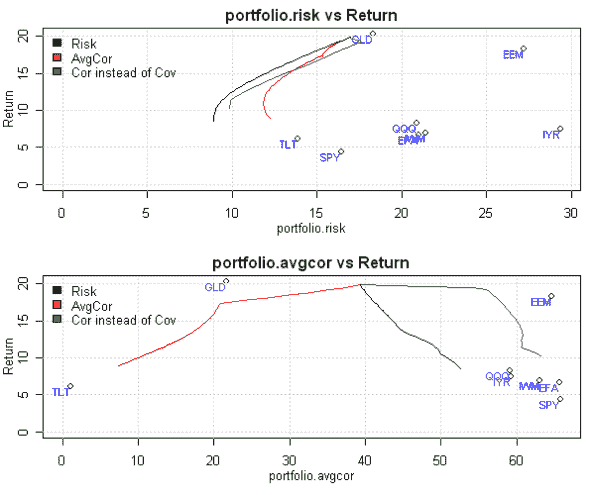
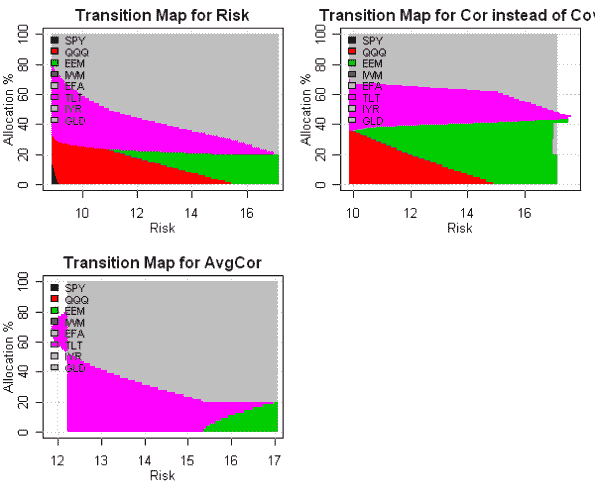
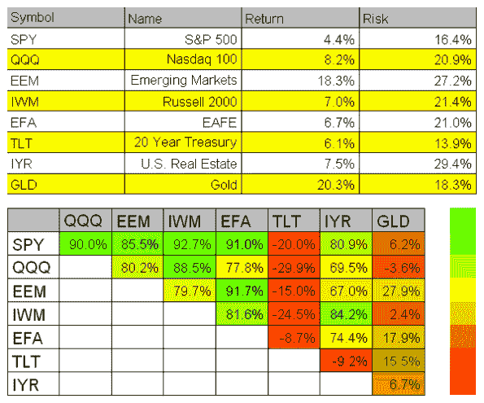

<!--yml
category: 未分类
date: 2024-05-18 14:48:38
-->

# The Most Diversified or The Least Correlated Efficient Frontier | Systematic Investor

> 来源：[https://systematicinvestor.wordpress.com/2011/10/27/the-most-diversified-or-the-least-correlated-efficient-frontier/#0001-01-01](https://systematicinvestor.wordpress.com/2011/10/27/the-most-diversified-or-the-least-correlated-efficient-frontier/#0001-01-01)

The [“Minimum Correlation Algorithm”](http://cssanalytics.wordpress.com/2011/08/09/forecast-free-algorithms-a-new-benchmark-for-tactical-strategies/) is a term I stumbled at the [CSS Analytics blog](http://cssanalytics.wordpress.com). This is an Interesting Risk Measure that in my interpretation means: minimizing Average Portfolio Correlation with each Asset Class for a given level of return.

One might try to use Correlation instead of Covariance matrix in mean-variance optimization, but this approach, as I will show below, will not produce the least correlated portfolios.

The Average Portfolio Correlation with each Asset Class:


This formula can be easily coded in R:

```

portfolio.sigma = sqrt( t(weight) %*% assets.cov %*% weight )
mean( ( weight %*% assets.cov ) / ( assets.sigma * portfolio.sigma ) )

# Alternatively
portfolio.returns = weight %*% t(assets.hist.returns)	
mean(cor(assets.hist.returns, portfolio.returns)) 

```

I’m not aware of the method to transform this formula in to the linear programming, so I will use a Nonlinear programming solver, [Rdonlp2](http://arumat.net/Rdonlp2/tutorial.html), which is based on donlp2 routine developed and copyright by [Prof. Dr. Peter Spellucci](http://www.mathematik.tu-darmstadt.de/fbereiche/numerik/staff/spellucci/spellucci.html). Following code might not properly execute on your computer because Rdonlp2 is only available for R version 2.9 or below.

```

	#--------------------------------------------------------------------------
	# Create Efficient Frontier
	#--------------------------------------------------------------------------
	ia = aa.test.create.ia()
	n = ia$n		

	# 0 <= x.i <= 0.8 
	constraints = new.constraints(n, lb = 0, ub = 0.8)

	# SUM x.i = 1
	constraints = add.constraints(rep(1, n), 1, type = '=', constraints)		

	# create efficient frontier(s)
	ef.risk = portopt(ia, constraints, 50, 'Risk')
	ef.cor.insteadof.cov = portopt(ia, constraints, 50, 'Cor instead of Cov', min.cor.insteadof.cov.portfolio)
	ef.avgcor = portopt(ia, constraints, 50, 'AvgCor', min.avgcor.portfolio)

	# Plot multiple Efficient Frontiers	
	layout(1:2)
	plot.ef(ia, list(ef.risk, ef.avgcor, ef.cor.insteadof.cov), portfolio.risk, F)	
	plot.ef(ia, list(ef.risk, ef.avgcor, ef.cor.insteadof.cov), portfolio.avgcor, F)	

	# Plot multiple Transition Maps	
	layout( matrix(1:4, nrow = 2) )
	plot.transition.map(ef.risk)
	plot.transition.map(ef.avgcor)
	plot.transition.map(ef.cor.insteadof.cov)

	# visualize input assumptions
	plot.ia(ia)

```

[](https://systematicinvestor.wordpress.com/wp-content/uploads/2011/10/plot1-small8.png)

Using Correlation instead of Covariance matrix in mean-variance optimization is a very bad idea to produce the least correlated portfolios. The ‘Cor instead of Cov’ efficient frontier actually increases average portfolio correlation compared to the standard ‘Risk’ efficient frontier.

[](https://systematicinvestor.wordpress.com/wp-content/uploads/2011/10/plot2-small8.png)

The portfolio composition of the Average Correlation efficient frontier is split between gold (GLD) and bonds (TLT) at the lower risk levels. This is not surprising because both gold and bonds have positive expected returns and low correlation to the other assets.

[](https://systematicinvestor.wordpress.com/wp-content/uploads/2011/10/plot3-small5.png)

To view the complete source code for this example, please have a look at the [aa.avg.cor.test() function in aa.test.r at github](https://github.com/systematicinvestor/SIT/blob/master/R/aa.test.r).

Following is the complete source code for minimizing Average Portfolio Correlation with each Asset Class function:

```

min.avgcor.portfolio <- function
(
	ia,			# input assumptions
	constraints		# constraints
)
{
	require(Rdonlp2)

	cov = ia$cov[1:ia$n, 1:ia$n]
	s = sqrt(diag(cov))

	# avgcor
	fn <- function(x){
		sd_x = sqrt( t(x) %*% cov %*% x )
		mean( ( x %*% cov ) / ( s * sd_x ) )
	}

	# control structure
	cntl <- donlp2.control(silent = T, iterma =10000, nstep = 100, epsx = 1e-10)	

	# lower/upper bounds
	par.l = constraints$lb
	par.u = constraints$ub

	# intial guess
	p = rep(1,n)
	if(!is.null(constraints$x0)) p = constraints$x0

	# linear constraints
	A = t(constraints$A)
	lin.l = constraints$b
	lin.u = constraints$b
	lin.u[ -c(1:constraints$meq) ] = +Inf

	# find solution
	sol = donlp2(p, fn, 
			par.lower=par.l, par.upper=par.u, 
			A=A, lin.u=lin.u, lin.l=lin.l, 
			control=cntl)
	x = sol$par

	return( x )
}

```