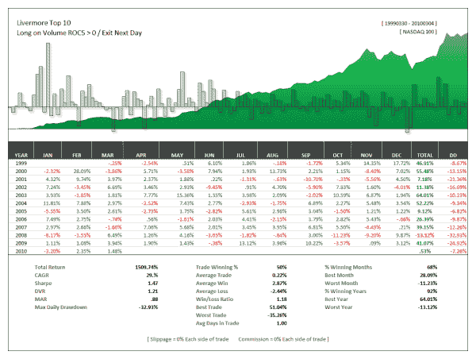

<!--yml
category: 未分类
date: 2024-05-12 18:34:40
-->

# The Power of Volume With High Momentum Stocks | CSSA

> 来源：[https://cssanalytics.wordpress.com/2010/03/09/the-power-of-volume-with-high-momentum-stocks/#0001-01-01](https://cssanalytics.wordpress.com/2010/03/09/the-power-of-volume-with-high-momentum-stocks/#0001-01-01)

The following chart shows the impact of using only the 5-day volume change or ROC of volume to trade the  Livermore Top 10 unhedged.  As you can see, the returns and risk-adjusted returns are very impressive for such a simple condition–exceeding the returns from buying using other simple conditions such as up/down days or buying on 5-day ROC<0.  I have not had much time to do thorough research, but it appears so far that consistent with practitioner theory–volume is a big key to timing high momentum stocks.