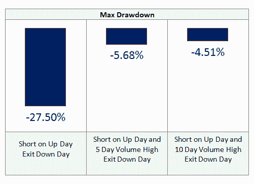

<!--yml
category: 未分类
date: 2024-05-12 18:13:15
-->

# The Recent Importance of Volume Exhaustion For Short-Bias Daily Mean-Reversion | CSSA

> 来源：[https://cssanalytics.wordpress.com/2011/01/27/the-recent-importance-of-volume-exhaustion-for-short-bias-daily-mean-reversion/#0001-01-01](https://cssanalytics.wordpress.com/2011/01/27/the-recent-importance-of-volume-exhaustion-for-short-bias-daily-mean-reversion/#0001-01-01)

CSS recently entered into a  partnership with CSI Market Data [https://csidata2.com/cgi-bin/ua_order_form.pl?referrer=CY](https://csidata2.com/cgi-bin/ua_order_form.pl?referrer=CY) which I would highly recommend as a source of high quality, accurate market data. Some of the individual data packages cover virtually every tradeable instrument–whether this is a major market index,stock,  future or even mutual funds. More importantly, the better packages have de-listed data, which is very important to the serious trading system developer. Since we have experience using CSI data, we can testify that it is very high quality and easy to import into a database. At the price point offered for most packages, it is really a strong value in comparison to other options– considering the sheer breadth of markets covered.

I thought as an interesting post, I would isolate one of the more important factors to consider within a binary daily mean-reversion strategy on the short side. In this case,  all short-selling strategies have had difficulty in the last few years during the POMO and Quantitative Easing. Not surprisingly, injecting money into the stock market through explicit government intervention has caused the market to have more persistent trends of the upward variety in recent years. Most notably, short-term binary mean-reversion — but specifically the short side (go short on up days, exit on down days)– has fallen apart.  Curiously, one of the filters that seems to improve entries considerably is the concept of volume exhaustion: when volume reaches a short-term high over the past week or two weeks on short-term market strength, it is likely that buying is close to some peak, and hence is exhausted. Below displays the trade statistics since 2007 trading the SPY and using SPY volume for the baseline strategy versus two different  volume exhaustion strategies. As you can see, the edges are significantly improved (though all have had difficulty recently) using short-term volume peaks as a filter. Most importantly, drawdowns are substantially lower—thus considerably lowering the risk of entry. This is something to keep an eye on in the next year to two years.

