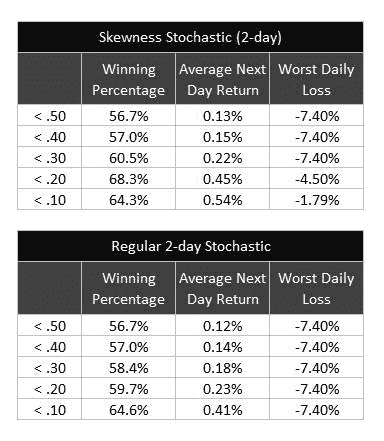

<!--yml
category: 未分类
date: 2024-05-12 18:24:17
-->

# The Skewness Stochastic | CSSA

> 来源：[https://cssanalytics.wordpress.com/2010/06/07/the-skewness-stochastic/#0001-01-01](https://cssanalytics.wordpress.com/2010/06/07/the-skewness-stochastic/#0001-01-01)

My initial inclination was to write a long and perhaps boring article on distributions. Later this week we will be returning to the all-important subject of equity curve management–and this topic will guide much of the theory.  Unfortunately I am well aware that traders tend to ignore long theoretical tomes because they are so focused on the “bottom line.”  Backtests and pretty charts are no doubt more interesting in a world of twitter and 20-second attention spans. However, understanding a few key ideas will save you hours of random backtesting and help improve your systems dramatically. While I would like to broaden the scope of this blog, I felt that an indicator provides a more tangible/practical example of how to apply general knowledge.

Skewness and kurtosis are statistical measurements of the shape of the distribution of returns or prices.  Today we will look at one of these terms. Skewness is a way of looking at where the average of the distribution is positioned relative to the median  in standardized terms. In effect it tells us how the magnitude of observations is distributed in relation to frequency. If the average is greater than the median, then basically the distribution is weighted to the right hand side and to create unnecessary confusion this is referred to as negative skew (despite the fact that most people would think it was positive skew intuitively). Conversely if the average is less than the median then the distribution is weighted to the left hand side and this is known as positive skew. Basically we want to see a negatively skewed distribution since mathematically this will mean that we have a greater than 50% chance of a given return, with the average return being higher than most of the observed returns.

How do we merge this concept to make an indicator more accurate? Well as the current conditions remind us all, mean-reversion indicators function more reliably on the long side in either up-trends, or in stable but volatile conditions.  The problem is that the moving averages of price are too long to be reliable for short-term indicators. What we really want is something that can tell us if the odds are shifting in our favor–especially on the long side where most of the risk-adjusted returns in the market are made. It makes sense to therefore look at whether the short-term price history exhibits negative skewness. For this version, I used the sample skewness function in excel denoted as =SKEW(). I will save the calculations for a follow up post or a link to a spreadsheet. This example compares a standard 2-day (H,L,C) stochastic to the 2-day skewness stochastic at various levels on the SPY over the last 2000 bars. As you can clearly see, the skewness stochastic has substantially higher accuracy/reliability and lower downside risk. More to follow……….

