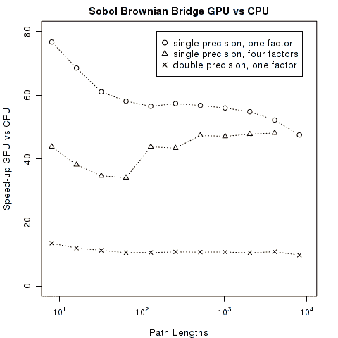

<!--yml
category: 未分类
date: 2024-05-17 23:41:25
-->

# The Sobol Brownian Bridge Generator on a GPU – HPC-QuantLib

> 来源：[https://hpcquantlib.wordpress.com/2012/09/23/the-sobol-brownian-bridge-on-a-gpu/#0001-01-01](https://hpcquantlib.wordpress.com/2012/09/23/the-sobol-brownian-bridge-on-a-gpu/#0001-01-01)

The biggest mistake that can be made with quasi random numbers is to just use them in the same way as one uses pseudo random numbers. The real advantage of quasi Monte-Carlo shows up only after

samples, where  is the number of dimensions of the problem. If one is using significantly less samples then it becomes very likely that the results are totally wrong. Therefore a dimensional reduction of the problem is often the first step when applying quasi Monte-Carlo methods.

The Brownian bridge is tailor-made to reduce the number of significant dimensions of a Monte-Carlo integration of a stochastic differential equation  In his recent text-book [1] Mark Joshi shows how to use Brownian bridges efficiently for quasi Monte-Carlo pricing and he also outlines the QuantLib implementation. It has been shown in [3] that the overall statistical error of a structured equity portfolio has been reduced by a factor of three when switching from a pseudo random number generator to a Sobol Brownian bridge generator, which in turn means a speed-up factor of nine leaving the Monte Carlo error unchanged.

An efficient implementation of a Sobol Brownian bridge generator is therefore a standard building block for quasi Monte-Carlo option pricing. A [CUDA 4.2](http://www.nvidia.com/object/cuda_home_new.html) implementation for nVIDIA GPUs based on [QuantLib 1.2](http://quantlib.org) is available [here](http://hpc-quantlib.de/src/gpubrownianbridge.zip). The interface and usage are closely related to QuantLib’s Sobol Brownian bridge generator for CPUs. The memory layout of the results on the GPU is CURAND_ORDERING_QUASI_DEFAULT. The zip file also contains a validation program, which checks that both versions of the Sobol Brownian bridge are generating the same results.

As the diagram above shows, the GPU (GTX 560) out-performance the CPU (i3@3.0GHz) on average by a factor of 50 for single precision and by a factor of 12 for double precision.

[1] Mark Joshi, [More Mathematical Finance](http://www.markjoshi.com/more/) [2] Sebasien Gurrieri, [An Analysis of Sobol Sequence and the Brownian Bridge](http://papers.ssrn.com/sol3/papers.cfm?abstract_id=1951886)
[3] Andre Bernemann, Raplh Schreyer, Klaus Spanderen, [Accelerating Exotic Option Pricing and Model Calibration Using GPUs](http://papers.ssrn.com/sol3/papers.cfm?abstract_id=1753596)