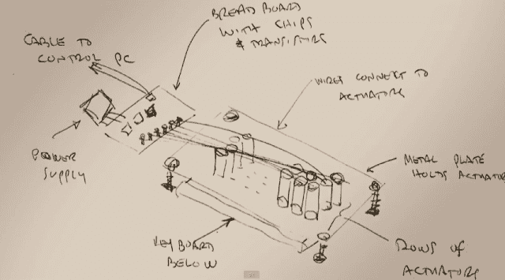
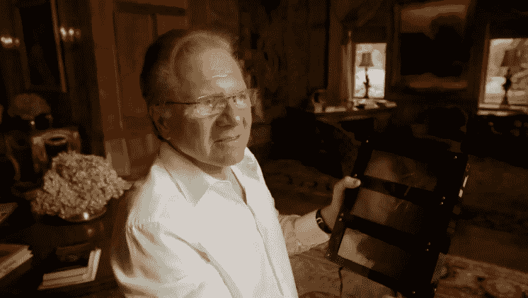

<!--yml
category: 未分类
date: 2024-05-18 14:25:08
-->

# The Wall Street Code – Sniper In Mahwah & friends

> 来源：[https://sniperinmahwah.wordpress.com/2013/11/05/the-wall-street-code/#0001-01-01](https://sniperinmahwah.wordpress.com/2013/11/05/the-wall-street-code/#0001-01-01)

*The Wall Street Code* a été diffusé hier soir en néerlandais sur la chaîne des Pays-Bas VRPO, et est désormais disponible en anglais la chaîne YouTube [VPROinternational](http://www.youtube.com/user/VPROinternational). Il s’agit du troisième documentaire réalisé par Marije Meerman sur les marchés financiers après [*Quants: The Alchemists of Wall Street*](http://www.youtube.com/watch?v=ed2FWNWwE3I&list=TLn7jfXRfAVIZ8nrBj53QgwMvhf5bk_szf) en 2010, et [*Money & Speed: Inside the Black Box*](http://www.youtube.com/watch?v=aq1Ln1UCoEU&feature=c4-overview-vl&list=PLuECoz9_QThTrGMI-POfgAa8femPjh0_-) en 2012. *The Wall Street Code* est en quelque sorte la suite de* Money & Speed *puisqu’il y est principalement question des transactions à haute fréquences et des codes algorithmiques qui permettent à certains ordres boursiers « de passer devant les autres, ce qui leur permet de revendre plus cher aux investisseurs traditionnels un titre acheté quelques microsondes auparavant en ayant doublé ces investisseurs dans le carnet d’ordre ».

*The Wall Street Code *aligne une brochette d’intervenants d’autant plus intéressants que jusqu’à présent ils furent assez rares à l’écran (si l’on exclut Eric Hunsader de [Nanex](http://www.nanex.net), déjà présent dans *Money & Speed*). On y trouve donc le vétéran Thomas Peterffy, filmé dans son manoir du Connecticut, qui revient sur son fameux cyborg construit pour taper sur le terminal du Nasdaq à la fin des années 1980, dont on aperçoit brièvement le plan dans le documentaire:

© VPRO, extrait de “The Wall Street Code”

Le moment le plus vivifiant est sans doute lorsque Peterffy sort sa fameuse tablette tactile – dont je parle dans *[*6*](http://www.zones-sensibles.org/index.php?mod=auteurs&a=06) – construite pour l’American Stock Exchange en 1983\. C’est la première fois que l’on voit à l’écran cet ancêtre de l’iPad :*

*

© VPRO, extrait de “The Wall Street Code”

« *Other people used their minds* », rigole Peterffy avec son accent hongrois en exhibant sa machine. Il réitère également son attachement à l’équité du marché et à l’importance de partager le code pour que tous les intervenants puissent sur un même pied d’égalité – tout l’inverse de ce que fait aujourd’hui Goldman Sachs, dont l’affaire Sergey Aleykinov a [révélé](http://www.vanityfair.com/business/2013/09/michael-lewis-goldman-sachs-programmer) que la banque puise dans des codes *open source* qu’elle modifie tout en s’appropriant les droits de ces modifications, ce qui est évidemment contraire à l’éthique de l’*open source*.

(Hasard ou non ? Juste avant la diffusion du documentaire, le blog ici présent a reçu pour la première fois une visite d’Interactive Brokers LLC.…

… qui se trouve être la société de Thomas Petterfy).

De Goldman Sachs il en fut un peu question puisque *The Wall Street Code* interview longuement Haim Bodek, un ancien trader-développeur dont Scott Patterson du *Wall Street Journal* (lui-même interviewé dans le documentaire) a raconté l’histoire dans *Dark Pools* (Bodek, aujourd’hui remonté contre les traders à hautes fréquences, publie des [articles](http://haimbodek.com/research.html) particulièrement intéressants sur la transformation des ordres boursiers). Les images finales de Bodek et ses camarades programmeurs, qui ont monté un *hedge fund*, font un peu penser à l’ambiance d’Island… mais 20 ans plus tard.

Haim Bodek avait également travaillé pour Blair Hull, un autre vétéran (de Chicago) des transactions à hautes fréquences dans les années 1980, dont la compagnie Hull Trading Company fut plus tard achetée par Goldman Sachs pour 480 millions de dollars (Goldman voulait initialement racheter la société de Thomas Peterffy mais celui-ci avait refusé). Je détaille dans [*5*](http://www.zones-sensibles.org/index.php?mod=auteurs&a=08) la carrière de Blair Hull, qui a commencé à Las Vegas avant de se poursuivre avec brio au Chicago Mercantile Exchange dans les années 1980\. Hull livre dans *The Wall Street Code* quelques détails intéressants sur cette époque et insiste (avec justesse) sur le fait que la complexité des marchés électroniques provient notamment des règles imposées par les régulateurs.

L’un des moments les plus forts du film est sans doute lorsque Dave Lauer (un ancien de Goldman et de Citadel) évoque le *flash crash* du 6 mai 2010 et le fait que les courbes, littéralement, sortirent des écrans de contrôle ce jour-là. Il est aussi évidemment question des courroies de transmission de l’information à haute fréquence, notamment entre Chicago (Nanex fait une petite visite de l’extérieur du *data center* d’Aurora) et le New Jersey, où le Nasdaq est installé à Carteret :

© VPRO, extrait de “The Wall Street Code”

Comme souvent avec les hautes fréquences, il est difficile d’être à l’heure en terme de temps de transmission : les 4,2 millisecondes évoquées dans le film sont aujourd’hui caduques puisqu’on a appris [hier](http://www.hftreview.com/pg/blog/mike/read/127139/market-data-at-the-speed-of-light) que le temps de parcours entre le CME/CBOT et le Nasdaq, grâce aux bons soins de McKayBrothers & Quincy Data, est désormais de 4,09 millisecondes (soit 0,14 millisecondes de plus que la vitesse de la lumière dans le vide), de rack à rack (c’est-à-dire d’algorithme à algorithme).

Chacun jugera de la qualité de *The Wall Street Code, *qui ne couvre qu’une petite partie (et totalement à charge) des enjeux liés aux hautes fréquences, le plus intéressant étant probablement les propos de Bodek au sujet de la complexité des ordres boursiers induite par les machines (j’y reviendrai prochainement), complexité qui aurait pu être davantage mise en avant (en terme d’espace-temps). Il est sans doute utile de voir le documentaire précédent, *Money & Speed,* avant de se plonger dans *The Wall Street Code*. Notons pour finir que trois documentaires touchant aux transactions à haute fréquence sont actuellement en cours de production en France.*