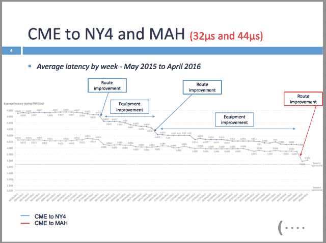
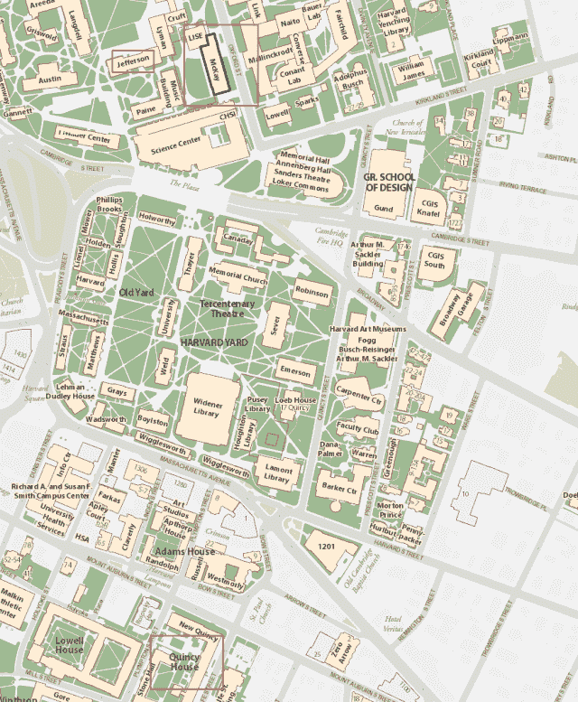

<!--yml
category: 未分类
date: 2024-05-18 14:10:29
-->

# The brothers get a taste of Gouda – Sniper In Mahwah & friends

> 来源：[https://sniperinmahwah.wordpress.com/2016/09/01/the-brothers-get-a-taste-of-gouda/#0001-01-01](https://sniperinmahwah.wordpress.com/2016/09/01/the-brothers-get-a-taste-of-gouda/#0001-01-01)

Rumors have been circulating for a while. In five minutes, at 14:00:00:00:000 exactly, these rumors will be confirmed by an official press release: [McKay Brothers](http://www.mckay-brothers.com), the well know international low-latency provider for high-frequency trading firms, receives investment from Dutch market-making firm International Marketmakers Combination, aka IMC. One of the McKay’s mottos, “*Not affiliated with any trading firm or exchange*”, will have to be removed.

The press releases will state:

> Under the terms of the agreement IMC will take a minority stake in McKay, providing capital for the further improvement of McKay’s networks serving the latency sensitive trading community. Financial terms of the agreement were not disclosed.
> 
> Key elements are:
> 
> • IMC makes a capital investment and acquires an equity stake
> • McKay maintains its independence under co-founders Stéphane Tyč and Bob Meade
> • McKay commits further investment to reduce latency to the physical limit in its key long haul routes
> • McKay continues to operate under its core business principles which include offering a level playing field and equal access to the lowest latency service for subscribers

The terms of the agreement are not disclosed and no details are provided but it seems that IMC purchased less than 30% of both McKay Brothers and their parent company Quincy Data. “*That’s great news for all of the trading firms that use our networks and for the industry as a whole*”, says McKay CEO Stéphane Tyč, while the Global Head of Technology at IMC, Arno de Quaasteniet, states that “*as a strong, independent supplier, McKay plays a crucial role in ensuring equal and fair market access to liquidity providers. These are principles IMC shares*”.

This is an interesting move. First, we may assume that IMC has been (and still is) a client of McKay Brothers. As far as I know  IMC is the only Amsterdam-based trading firm that did not build a proprietary microwave network (at least in Europe), unlike Optiver and Flow Traders, the two other Dutch HFT/market-making companies. Secondly, one may ask: why McKay Brothers needed investment from a HFT firm? And why IMC? It seems like various HFT firms offered to buy McKay Brothers but the company declined. On the other hand, we may assume that the firm needed investments to improve their networks (*i.e.* “*reducing latency to the physical limit*”). Even if it’s said that McKay has the fastest network between Chicago and New Jersey, speed race is an endless war.In June 2016, Stéphane Tyč explained in [Chicago](http://www.mckay-brothers.com/exchanges-vs-networks/) that route improvements are critical to save a few microseconds, as shown in the picture below – it took four years to achieve the “route improvement” in red:

Average latencies between Chicago (CME) and New Jersey (Secaucus and Mahwah)

I don’t know how much McKay paid for the tower they acquired to save *17 microseconds* between Chicago and Mahwah (the “route improvement”). That’s probably less than the €5,000,000 Jump Trading spent to purchase a tower in [Houtem](https://sniperinmahwah.wordpress.com/2014/09/25/hft-in-my-backyard-ii/) (Belgium), and less than what Vigilant and/or New Line Networks will spend in Richborough (if they can build these [controversial](https://sniperinmahwah.wordpress.com/2016/01/26/hft-in-the-banana-land/) very high towers). But everything is expensive and the cash flow of IMC will probably help McKay/Quincy. According to [Amterdamtrader](http://www.amsterdamtrader.com/2016/04/decent-profits-for-imc.html), the net profit of IMC was €185 million in 2015 (€20 million more than 2014). With all that money McKay will have the resources to acquire other towers – if needed. (If McKay builds a London-Stockholm route that would be amazing to have dishes put on old windmills.)

© Amsterdamtrader

Now I bet McKay will have to tell the customers of their networks that they will never give IMC a speed advantage. “*IMC will have no access to client information and no latency advantage”,* Stéphane says. 

So, one of the biggest market makers in the world (active in over 100 exchanges and employing 600 people) has stakes in one of the best low-latency networks provider in the world. It seems that the (young) HFT microwave industry is changing these days. For years you had private networks (built by proprietary firms like Vigilant/DRW, Jump, etc.) on one hand, and networks providers (McKay, Custom Connect, Perseus, etc.) on the other hands. In 2015, trading firms Jump Trading and KCG created a joint venture, New Line Networks, to “*sell network bandwidth to industry participants and third party vendors*”, meaning that they now compete with McKay and the other providers. Earlier this week Bloomberg [reported](http://www.bloomberg.com/news/articles/2016-08-29/traders-said-to-discuss-data-superhighway-from-chicago-to-japan) that at least three rival trading firms (Citadel, Jump and Virtu) “*are in talks to jointly build a Chicago-to-Japan communications link*”, including a microwave route between Chicago and the U.S. west coast – a project dubbed “Go West”. Competition in the very low-latency area is no longer a war between proprietary trading firms and networks providers – it’s a little bit more complex now. Anyway, good luck to the brothers. Accidentally I’ll be in Amsterdam tomorrow; I’ll meet several people involved in the HFT industry and I guess what we are going to talk. 

The Harvard University Campus from which the McKay, Quincy and Jefferson names come. Jefferson Microwave LLC was the first network McKay International built in the US in 2012.