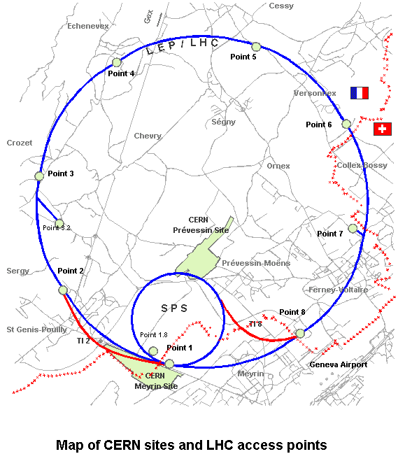
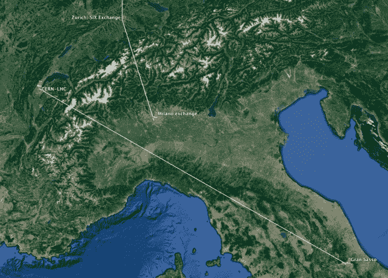
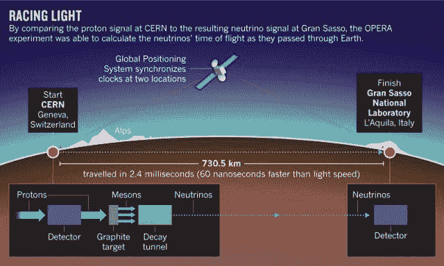
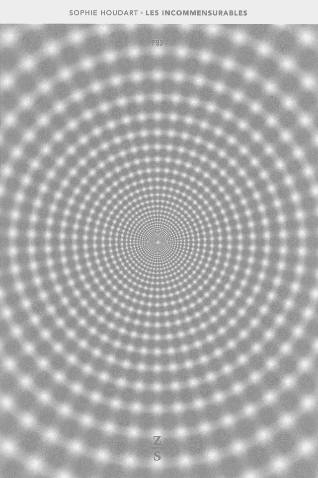

<!--yml
category: 未分类
date: 2024-05-18 14:14:03
-->

# The goddam particle – Sniper In Mahwah & friends

> 来源：[https://sniperinmahwah.wordpress.com/2015/08/04/the-goddam-particule/#0001-01-01](https://sniperinmahwah.wordpress.com/2015/08/04/the-goddam-particule/#0001-01-01)

Apart from studying market microstructure, I am also a book publisher and the next item my [book company](http://www.zones-sensibles.org) will publish in September is an ethnographic study of the Large Hadron Collider (LHC), built by the European Organization for Nuclear Research ([CERN](http://home.web.cern.ch)), which is now the largest particle physics laboratory in the world. Founded in 1952 by eleven european states, the CERN launched the first collider in 1957 (Synchro-Cyclotron); the second one, Proton Synchrotron, was inaugurated by Niels Bohr himself in 1960; the Super Proton Synchrotron was launched in 1971; now the longest collider is the Large Hadron Collider, launched in 2008 thanks to the work of over 10,000 scientists and engineers from over 100 countries – a circumference of 27 kilometers, between (mainly) France and Swiss, 175 meters under the ground. This Large Hadron Collider is probably one of the greatest scientific achievements in the history of humankind.

The book, written by an anthropologist, Sophie Houdart, who follows the works of epistemologist Peter Galison, explains how all the CERN collaborators had (and still have) to deal with a lot of different issues, and some are quite amazing – since the LHC was built between two different countries, it has to deal with two different kind of regulations. Here is an old photography reproduced in the book, published in a Swiss newspaper in 1953 when the scientists were doing an exploratory mission in the countryside, where cows were peacefully grazing grass. One of the first works the scientists had to do, at that time, was to reassure the farmers about the particles (“no, they won’t kill your cows”) – the book also details [Luis Sancho](http://www.lhcdefence.org)‘s attempt to close down the CERN because Sancho was convinced the collider would create black holes that would destroy the Earth.

Today, the Large Hadron Collider, as a particle accelerator, is used to collide hadrons in the tunnel at 99,9999% of the light speed (faster than the [microwaves](https://sniperinmahwah.wordpress.com/2014/09/22/hft-in-my-backyard-part-i/) now used by high-frequency traders to carry data from point to point). The goals of the LHC was to prove some theoretical predictions made by physicists about the particle physics; above all, the collider was designed to find (no not) the existence of the theorized [Higgs boson](https://en.wikipedia.org/wiki/Higgs_boson). That was made in 2012, and in 2013 Peter Higgs won the Nobel Prize in Physics (shared with François Englert) “for the theoretical discovery of a mechanism that contributes to our understanding of the origin of mass of subatomic particles” (by the way: Higgs never described the boson as “*the particle of God*”; he just said, one day, the boson was “*a goddam particle*” since it was hard to find). One of the very interesting points of the book is it shows how a small geographical area around Geneva is so “close” to the very first times of the universe, the co-called “Big Bang”. When I was editing the book, I was amused to see that scientists working at the LHC have to face issues known by the people working in the high-frequency trading industry – for instance, the hadrons travel so fast that physicists need to be very very careful about the time-stamps of their experiments.

But the real connection between the Large Hadron Collider and High-Frequency Trading are neutrinos. Apart colliding hadrons in the LHC tunnel, the CERN also tested (between 2006 and 2012) the way neutrinos can travel across the Earth. Neutrinos are light charged particles and can  penetrate rocks. From the Geneva site, the CERN sent neutrinos to the Gran Sasso National Laboratory, in Italy, a project named OPERA (the technical details are [there](http://home.web.cern.ch/about/accelerators/cern-neutrinos-gran-sasso)):

At some point, in September 2011, something really strange happened: neutrinos sent from Geneva arrived in Gran Sasso 60 nanoseconds *[faster that light speed](http://www.nature.com/news/2011/110922/full/news.2011.554.html)*.

*What the f… was going on?* How was it possible for particles to beat light speed? What happened to Einstein’s theory of relativity? Of course, when the outcomes of the experiment were released, the high-frequency trading world [looked](http://www.forbes.com/sites/brucedorminey/2012/04/30/neutrinos-to-give-high-frequency-traders-the-millisecond-edge/) at the neutrinos. But (of course) there was a problem. The first CERN statement about the speed of neutrinos was released in September 2011, and in February 2012 an official [update](http://press.web.cern.ch/press-releases/2011/09/opera-experiment-reports-anomaly-flight-time-neutrinos-cern-gran-sasso) explained that this speed was overvalued: “*The first possible effect concerns an oscillator used to provide the time-stamps for GPS synchronizations. It could have led to an overestimate of the neutrino’s time of flight. The second concerns the optical fibre connector that brings the external GPS signal to the OPERA master clock, which may not have been functioning correctly when the measurements were taken*.” In a word: it was a problem of clock synchronisation between Geneva and Gran Sasso, and that is exactly what the high-frequency trading industry has to face now: clock synchronisation between different exchanges geographically dispersed around the world.

I will return to this point (clock synchronisation) in my next post about “The Nature of Time” in the HFT world. I truly understand why HFts have expressed interest in neutrinos: the fastest technology available to link different exchanges is microwave, but microwave need towers/dishes above the ground, and the world is a sphere, so you have to deal with the curve of the Earth, and because of the curve HFTs are losing time. Too bad. Mother Nature is not helping.

—

PS: I tried to design a book cover that could reflect what happens in the Large Hadron Collider, where particles are bumping into each other. There is a lot of movement in there. I came up with this optical illusion – a type of tunnel. If you look at the center of the cover, you should see some white points moving lightly.

