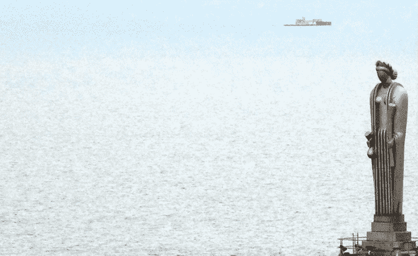
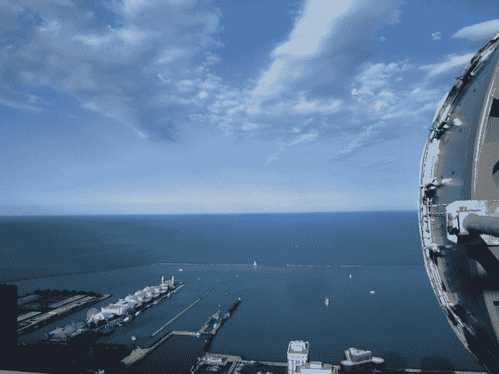
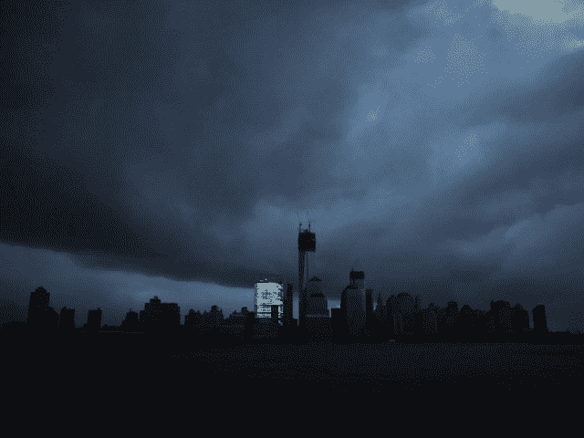

<!--yml
category: 未分类
date: 2024-05-18 14:16:31
-->

# The monstrous sphinx – Sniper In Mahwah & friends

> 来源：[https://sniperinmahwah.wordpress.com/2015/01/31/the-monstrous-sphinx/#0001-01-01](https://sniperinmahwah.wordpress.com/2015/01/31/the-monstrous-sphinx/#0001-01-01)

In [Part I](https://sniperinmahwah.wordpress.com/2014/09/22/hft-in-my-backyard-part-i/) of “HFT in my backyard” series I briefly talked about the second building of the Chicago Board of Trade (CBOT), erected in 1885 after the first one was destroyed by the Great Chicago Fire of 1871\. The 1885 building was around at Jackson and LaSalle, but was replaced by the current CME Group building, erected in 1930, on West Jackson Boulevard. This 1930 “tower” was said to be a true “*cathedral of capitalism*” by the CBOT board, which put the statue of Ceres, the Roman goddess of grain, right at the top of the cathedral – for a very long time the statue was the highest point in the Chicago skyline.

The photo above shows the faceless goddess with the back turned to Lake Michigan. My investigation on microwave led me to think that the new gods above the “*cathedrals of capitalism*” may be dishes. Even if there is no dish at the top of the CME Group building (the “floors” are now in Aurora), I find this other photography interesting:

This is a dish owned by [McKay Brothers](http://www.mckay-brothers.com)/Quincy Data (the photo comes from the McKay website), put on the Aon building, which is the third tallest building in Chicago. The dish points to Lake Michigan as the signal have to cross the lake (this is a long and complex link because of the propagation of microwaves over water). The new gods still need to dominate the skyline of Chicago.

Even if the 1885 building of the CBOT was a ten stories house, it was the tallest building in the city. Above all, it was the first commercial structure to have electric lighting. In his 1903 novel, *The Pit*, Franck Norris gives a vivid description of the illuminated building: “*The lighted office buildings, the murk of rain, the haze of light in the heavens, and raised against it the pile of the Board of Trade Building, black, grave, monolithic, crouching on its foundations, like a monstrous sphinx with blind eyes, silent, grave,—crouching there without a sound, without sign of life under the night and the drifting veil of rain.”*

Now see this photography:

“*The picture above is one of the more striking images to emerge from the Hurricane Sandy disaster. Snapped by a Reuters photographer, it shows the Manhattan skyline plunged into darkness by mass power outages, as inflicted by the tropical storm. Yet there is one building in the shot that remains defiant, lights still blazing in almost every window. That building is located at 200 West Street, and is the headquarters of investment bank Goldman Sachs*” [writes](http://www.inquisitr.com/381743/hurricane-sandy-rages-but-the-lights-stay-on-at-goldman-sachs/) Inquisitr. There is something symbolic here. Go(l)dman Sachs CEO Lloyd Blankfein once said the bank “*is doing god’s work*”. I don’t know who is that God Blankfein talked about (the Christian God? the Jewish God?), but this striking photography tells us something. For a long period “*cathedrals of capitalism*” were financial markets; now, cathedrals are headquarters of investment banks. Times have changed. The “*lighted office buildings*” Franck Norris talked about are those of the new gods. Ceres has seen its day but the monstrous sphinx is still there, illuminating a city plunged into the dark, doing god’s work.