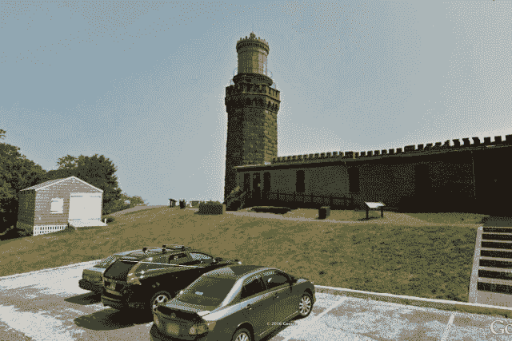
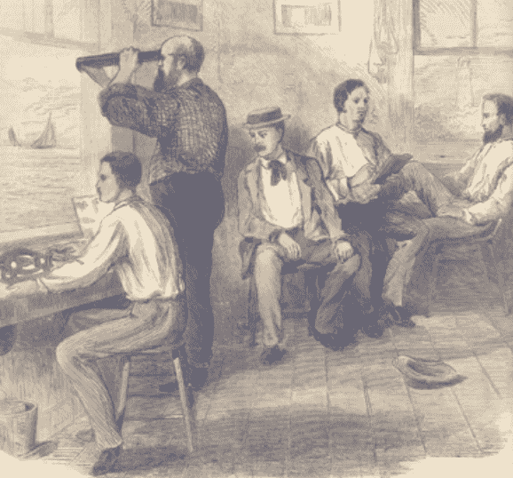
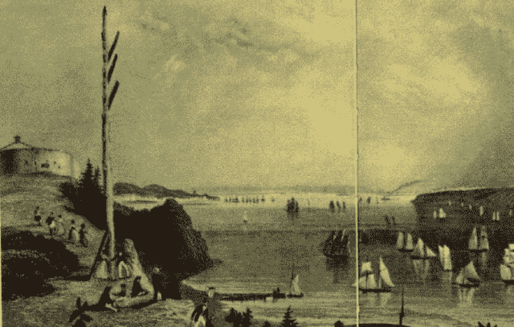
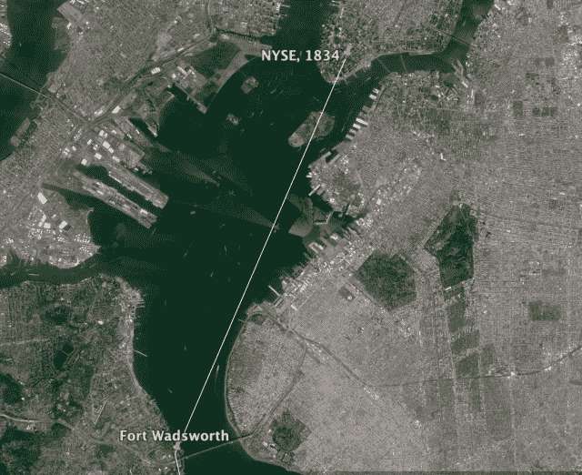
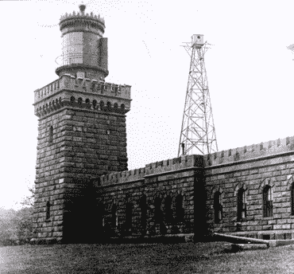

<!--yml
category: 未分类
date: 2024-05-18 14:11:06
-->

# The unknown wireless network going to Wall Street – Sniper In Mahwah & friends

> 来源：[https://sniperinmahwah.wordpress.com/2016/06/13/the-unknown-wireless-network-going-to-wall-street/#0001-01-01](https://sniperinmahwah.wordpress.com/2016/06/13/the-unknown-wireless-network-going-to-wall-street/#0001-01-01)

No, it’s not a scoop. I didn’t find a new wireless [microwave or laser or whatever] network around Wall Street. In 2016, “Wall Street” means New Jersey as most of the Wall Street exchanges has moved into data centers far from the old New York Stock Exchange building. The NYSE’s matching engine is in Mahwah; BATS and Direct Edge’s matching engines in Secaucus; and Nasdaq’s matching engine in Carteret. This area is now known as “The Equity Triangle”. This Equity Triangle is quite interesting; thanks to millimeter waves and laser networks, prices are moving fast – very very fast, we talk about microseconds here. For instance it only takes *94 microseconds* for data to be sent from Carteret to Secaucus, and given that it takes only ~1 microsecond for a co-located trader at one exchange to get news of a fill (order confirmation), each microsecond counts. We are in a very latency-sensitive area. An ongoing study on this Equity Triangle tends to show that because Secaucus is situated centrally between Carteret and Mahwah, trading at BATS/DE seems to drive price formation in the triangle. More to come about that.

The Equity Triangle, 2016

The controversy around the “speed race” has been revived in recent years as new kind of technologies (microwaves, laser) are now used by high-frequency traders to get information (market data) at “the speed of light”; for some this “speed race” is seen as “socially wasteful”, but others argue that those new technologies allow a better (and faster) arbitrage between price differences (particularly in the Equity Triangle as – for instance – Apple share prices may be different in Mahwah, Secaucus and Carteret). The recent projects of HFT firms Vigilant Global and New Line Networks (KCG + Jump Trading) in Richborough, UK, where both the companies seek to build two microwave towers as high as the Eiffel Tower, are more controversial than ever (check out my “[HFT in the Banana Land](https://sniperinmahwah.wordpress.com/2016/01/26/hft-in-the-banana-land/)” series). But wireless networks being faster than fibre, microwaves seem to be the “new normal” if you want to trade fast between major stock exchanges (the microwave race is nearly over here in Europe, the new horizons are in Asia and India now). Wireless networks linking exchanges are here to stay, and it appears they are older than we may think. By chance, a few days ago I discovered the first wireless network that transmitted informations to Wall Street. It was not around 2010 (when the first microwave communication system was set up between Chicago and New Jersey) but in… 1827\. Almost two centuries ago.

In 1827, the Merchants Exchange Company of New York (NYSE before it was named NYSE) received a permission from the Tresury Department to deploy an [optic telegraph](https://books.google.be/books?id=9tnz8HPyCmMC&dq=sandy+hook+havesink+semaphore+telegraph&hl=fr&source=gbs_navlinks_s) from Navesink to Manhattan, using semaphores (as did the well-known Claude Chappe optic telegraph in Europe). The starting point of the network was at the Twin Lights Tower in Navesink, where a semaphore tower was added near the lighthouse. 

The Navesink Twin Lights Towers © Google

One of the Navesink lighthouse, 2014 © Google

From the Navesink 70-feet high lighthouse located on the hill (a second lighthouse was erected mater), an agent was able to monitor the boats entering the Lower Bay using a telescopic devices. The agent could identify the name, size, signal flags, etc., of the boats, and that information was important for the Wall Street traders. If a ship laden with commodities was not in a good shape and lost some of its goods, this valuable information was awaited with impatience around Wall Street; the sooner information reached the Exchange, the sooner commodities prices changed.

Agents in the Navesink monitoring boats with telescopes (around 1838).

Data coming from the agents was “coded” into semaphore flags on the tower erected near the lighthouse:

The Navesink lighthouse and the semaphore tower. Illustration from Frank Leslie’s “Illustrated Newspaper”, September 20, 1856

In this [book](http://walnutts.com/2014/02/staten-island-semaphore-station-optical-telegraph-signal-book-just-how-did-they-communicate/) we can find details about the way data was coded (unfortunately I was unable to find a copy but it seems that a single data – a letter – was a 10-bit encoded message, 9 bits more than the very first optic network – Troy-Mycenae – I wrote about [before](https://sniperinmahwah.wordpress.com/2015/01/14/hft-in-my-backyard-v/)).

Then data was sent to another tower that was built set around the Sandy Hook lighthouse:

From Sandy Hook information was sent to Fort Wadsworth, in Staten Island:

Here is an old illustration of the semaphore tower in Staten Island:

The Staten Island semaphore tower in 1838, “apparently the first illustration of telecommunications in the United States”. (From “Semaphore to Satellite”, a report published by the International Telecommunication Union in 1965.)

The last path was between Fort Wadsworth and the New York Stock Exchange in Manhattan:

The full wireless network going to Wall Street from Navesink looked like this:

It was a 35,9-kilometer network (22,3 miles), roughly the distance between Secaucus and Mahwah, and it took 60 seconds for a message to arrive to the roof of the NYSE Manhattan from Navesink – an eternity compared to the HFT latencies (roughly calculated, if the network was set up in 2016 with microwaves dishes, a signal would travel in 120 μs between Navesink and Manhattan, that is 0.00012 seconds – but note that the old optic network was not really optimized as it’s far from the straight line between the two points).

As usual, a new technology came up, in 1853\. That year the Morse code arrived around the Twin Lights and the semaphore device (but not the tower) was replaced by an electric telegraph – “new technology” meant “a faster network” as the electric wires were incredibly fastest than the prehistoric optic network. We will have to wait till the 21th century to be back on wireless (microwaves), and the irony is that the first demonstration Guglielmo Marconi did in the US in 1899 to prove the efficiency of radio networks, using Tesla’s oscillators, occurred on the Navesink hill: Marconi choose the Twin Lights location “*because of the height. The hill here at Navesink had an excellent unobstructed view of the race course, and the early wireless were what they call line-of-sight radio waves. If the two ends couldn’t see the other, electronically they couldn’t communicate. So they needed to put the antenna on a high hill that had a direct visual line with the boat that Marconi was on*” (read the full story [here](http://www.nytimes.com/2000/04/16/nyregion/on-the-map-a-lighthouse-that-was-a-beacon-for-wireless-communication.html)). Interesting to see that the technology “invented” by Marconi  (information transmission through waves – the new normal in the HFT world) was tested exactly where the first wireless network dedicated to market data was set up with semaphores, six decades earlier.

Guglielmo Marconi’s radio antenna in Navesink, 1899.

Last amazing detail: when this first wireless market data network was built  between Navesink and Wall Street in 1829, the New York Stock Exchange was not located on 55 Wall Street (its current unofficial address – the official one is now 1700 MacArthur Boulevard in Mahwah) but on 40 Wall Street. Back then the NYSE members rented a place for 200$ a month to trade, but the building was destroyed by the Great Fire of New York in 1835.

Now, guess what is on 40 Wall Street? A tower. When this tower was erected in 1930 it was the tallest building in the world… for a month – typically the kind of building HFT microwave providers love. But as the US exchanges are now in New Jersey (or around Chicago), there is no need for high towers in Manhattan. The old New York Stock Exchange building on 40 Wall Street, where the first wireless market data network was set up, has been replaced by a business tower. And who owns the building? Donald Trump. Times have changed.

The Trump Tower on 40 Wall Street, where the NYSE was located in 1829.