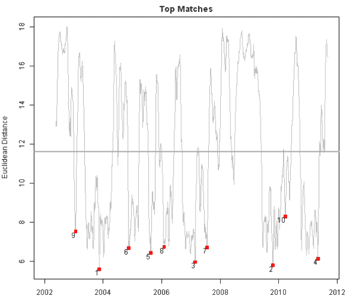
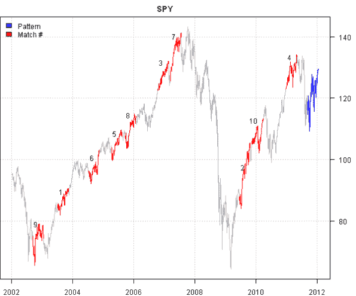
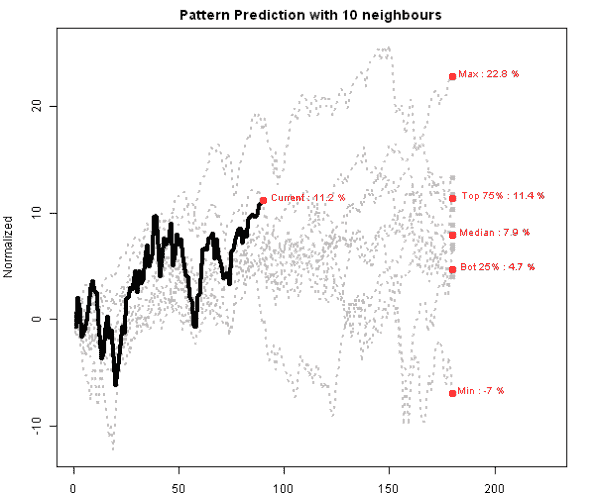

<!--yml
category: 未分类
date: 2024-05-18 14:43:40
-->

# Time Series Matching | Systematic Investor

> 来源：[https://systematicinvestor.wordpress.com/2012/01/13/time-series-matching/#0001-01-01](https://systematicinvestor.wordpress.com/2012/01/13/time-series-matching/#0001-01-01)

THIS IS NOT INVESTMENT ADVICE. The information is provided for informational purposes only.

[If it looks like a duck, swims like a duck, and quacks like a duck, then it probably is a duck.](http://en.wikipedia.org/wiki/Duck_test)

Do you want to know what S&P 500 will do in the next week, month, quarter? One way to make an educated guess is to find historical periods similar to the current market environment, and examine what happened. I will call this process time series matching, but you could find a similar techniques referred as technical patterns and fractals. To get some flavor about fractals, following are two articles I read recently about fractals:

I recommend reading following article about the time series matching to understand different approaches:

I will use a simple method outlined in the [How to Accelerate Model Deployment using Rook by Jean-Robert Avettand-Fenoel](http://www.londonr.org/Sep%2011%20LondonR_AvettandJR.pdf) article to find time series matches that are similar to the most recent 90 days of SPY.

Following code loads historical prices from Yahoo Fiance, setups the problem and computes Euclidean distance for the historical rolling window using the [Systematic Investor Toolbox](https://systematicinvestor.wordpress.com/systematic-investor-toolbox/):

```

###############################################################################
# Load Systematic Investor Toolbox (SIT)
###############################################################################
con = gzcon(url('http://www.systematicportfolio.com/sit.gz', 'rb'))
    source(con)
close(con)

	#*****************************************************************
	# Load historical data
	#****************************************************************** 
	load.packages('quantmod')	
	tickers = 'SPY'

	data = getSymbols(tickers, src = 'yahoo', from = '1950-01-01', auto.assign = F)

	#*****************************************************************
	# Setup search
	#****************************************************************** 
	data = last(data, 252*10)
	reference = coredata(Cl(data))
		n = len(reference)
		query = reference[(n-90+1):n]	
		reference = reference[1:(n-90)]

		n.query = len(query)
		n.reference = len(reference)

	#*****************************************************************
	# Compute Distances
	#****************************************************************** 		
	dist = rep(NA, n.reference)
	query.normalized = (query - mean(query)) / sd(query)

	for( i in n.query : n.reference ) {
		window = reference[ (i - n.query + 1) : i]
		window.normalized = (window - mean(window)) / sd(window)
		dist[i] = stats:::dist(rbind(query.normalized, window.normalized))
	}

```

Next, let’s select the best 10 matches to the ‘query’ pattern in the SPY history:

```

	#*****************************************************************
	# Find Matches
	#****************************************************************** 			
	min.index = c()
	n.match = 10

	# only look at the minimums 
	temp = dist
		temp[ temp > mean(dist, na.rm=T) ] = NA

	# remove n.query, points to the left/right of the minimums
	for(i in 1:n.match) {
		if(any(!is.na(temp))) {
			index = which.min(temp)
			min.index[i] = index
			temp[max(0,index - 2*n.query) : min(n.reference,(index + n.query))] = NA
		}
	}
	n.match = len(min.index)

	#*****************************************************************
	# Plot Matches
	#****************************************************************** 		
	dates = index(data)[1:len(dist)]

	par(mar=c(2, 4, 2, 2))
	plot(dates, dist, type='l',col='gray', main='Top Matches', ylab='Euclidean Distance', xlab='')
		abline(h = mean(dist, na.rm=T), col='darkgray', lwd=2)
		points(dates[min.index], dist[min.index], pch=22, col='red', bg='red')
		text(dates[min.index], dist[min.index], 1:n.match, adj=c(1,1), col='black',xpd=TRUE)

	plota(data, type='l', col='gray', main=tickers)
		plota.lines(last(data,90), col='blue')
		for(i in 1:n.match) {
		plota.lines(data[(min.index[i]-n.query + 1):min.index[i]], col='red')
		}
		text(index(data)[min.index - n.query/2], reference[min.index - n.query/2], 1:n.match, 
			adj=c(1,-1), col='black',xpd=TRUE)
		plota.legend('Pattern,Match #','blue,red')

```

[](https://systematicinvestor.wordpress.com/wp-content/uploads/2012/01/plot1-small1.png)

[](https://systematicinvestor.wordpress.com/wp-content/uploads/2012/01/plot2-small1.png)

Next, let’s overlay all matches with the ‘query’ pattern and examine their historical performance after the match took place:

```

	#*****************************************************************
	# Overlay all Matches
	#****************************************************************** 		
	matches = matrix(NA, nr=(n.match+1), nc=3*n.query)
	temp = c(rep(NA, n.query), reference, query)
	for(i in 1:n.match) {
		matches[i,] = temp[ (min.index[i] - n.query + 1):(min.index[i] + 2*n.query) ]	
	}

	# add the 'query' pattern
	matches[(n.match+1),] = temp[ (len(temp) - 2*n.query + 1):(len(temp) + n.query) ]		

	# normalize
	for(i in 1:(n.match+1)) {
		matches[i,] = matches[i,] / matches[i,n.query]
	}

	#*****************************************************************
	# Plot all Matches
	#****************************************************************** 				
	temp = 100 * ( t(matches[,-c(1:n.query)]) - 1)

	par(mar=c(2, 4, 2, 2))
	matplot(temp, type='l',col='gray',lwd=2, lty='dotted', xlim=c(1,2.5*n.query),
		main = paste('Pattern Prediction with', n.match, 'neighbours'),ylab='Normalized', xlab='')
		lines(temp[,(n.match+1)], col='black',lwd=4)

	points(rep(2*n.query,n.match), temp[2*n.query,1:n.match], pch=21, lwd=2, col='gray', bg='gray')

	bt.plot.dot.label <- function(x, data, xfun, col='red') {
		for(j in 1:len(xfun)) {
			y = match.fun(xfun[[j]])(data)
			points(x, y, pch=21, lwd=4, col=col, bg=col)
			text(x, y, paste(names(xfun)[j], ':', round(y,1),'%'),
				adj=c(-0.1,0), cex = 0.8, col=col,xpd=TRUE)			
		}
	}

	bt.plot.dot.label(2*n.query, temp[2*n.query,1:n.match], 
		list(Min=min,Max=max,Median=median,'Bot 25%'=function(x) quantile(x,0.25),'Top 75%'=function(x) quantile(x,0.75)))
	bt.plot.dot.label(n.query, temp[n.query,(n.match+1)], list(Current=min))

```

[](https://systematicinvestor.wordpress.com/wp-content/uploads/2012/01/plot3-small1.png)

Next, let’s summarize all matches performance in a table:

```

	#*****************************************************************
	# Table with predictions
	#****************************************************************** 		
	temp = matrix( double(), nr=(n.match+4), 6)
		rownames(temp) = c(1:n.match, spl('Current,Min,Average,Max'))
		colnames(temp) = spl('Start,End,Return,Week,Month,Quarter')

	# compute returns
	temp[1:(n.match+1),'Return'] = matches[,2*n.query]/ matches[,n.query]
	temp[1:(n.match+1),'Week'] = matches[,(2*n.query+5)]/ matches[,2*n.query]
	temp[1:(n.match+1),'Month'] = matches[,(2*n.query+20)]/ matches[,2*n.query]
	temp[1:(n.match+1),'Quarter'] = matches[,(2*n.query+60)]/ matches[,2*n.query]

	# compute average returns
	index = spl('Return,Week,Month,Quarter')
	temp['Min', index] = apply(temp[1:(n.match+1),index],2,min,na.rm=T)
	temp['Average', index] = apply(temp[1:(n.match+1),index],2,mean,na.rm=T)
	temp['Max', index] = apply(temp[1:(n.match+1),index],2,max,na.rm=T)

	# format
	temp[] = plota.format(100*(temp-1),1,'','%')

	# enter dates
	temp['Current', 'Start'] = format(index(last(data,90)[1]), '%d %b %Y')
	temp['Current', 'End'] = format(index(last(data,1)[1]), '%d %b %Y')
	for(i in 1:n.match) {
		temp[i, 'Start'] = format(index(data[min.index[i] - n.query + 1]), '%d %b %Y')
		temp[i, 'End'] = format(index(data[min.index[i]]), '%d %b %Y')	
	}

	# plot table
	plot.table(temp, smain='Match #')

```

[](https://systematicinvestor.wordpress.com/wp-content/uploads/2012/01/plot4-small.png)

The Time Series Matching analysis can be used to make an educated guess what S&P 500 will do in the next week, month, quarter. This educated guess is based on historical data and there is no guarantees that history will repeat itself.

In the next post I will examine other distance measures for Time Series Matching and I will show an example of [Dynamic time warping](http://en.wikipedia.org/wiki/Dynamic_time_warping).

To view the complete source code for this example, please have a look at the [bt.matching.test() function in bt.test.r at github](https://github.com/systematicinvestor/SIT/blob/master/R/bt.test.r).