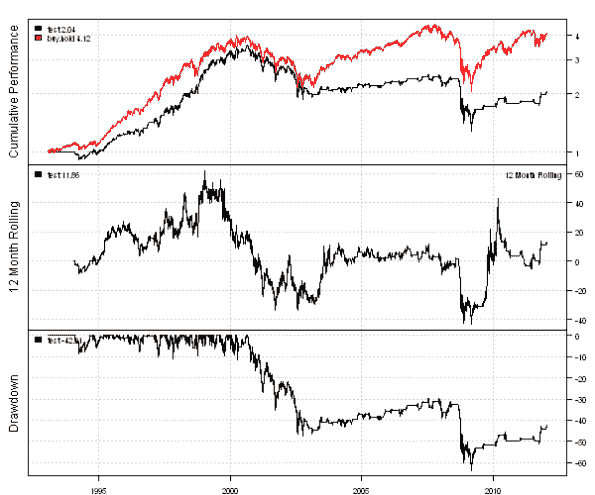

<!--yml
category: 未分类
date: 2024-05-18 14:43:31
-->

# Time Series Matching strategy backtest | Systematic Investor

> 来源：[https://systematicinvestor.wordpress.com/2012/01/17/time-series-matching-strategy-backtest/#0001-01-01](https://systematicinvestor.wordpress.com/2012/01/17/time-series-matching-strategy-backtest/#0001-01-01)

This is a quick post to address comments raised in the [Time Series Matching](https://systematicinvestor.wordpress.com/2012/01/13/time-series-matching/) post. I will show a very simple example of backtesting a Time Series Matching strategy using a distance weighted prediction. I have to warn you, the strategy’s performance is worse then the Buy and Hold.

I used the code from [Time Series Matching](https://systematicinvestor.wordpress.com/2012/01/13/time-series-matching/) post and re-arranged it into 3 functions:
bt.matching.find – finds historical matches similar to the given query (pattern).
bt.matching.overlay – creates matrix that overlays all matches one on top of each other.
bt.matching.overlay.table – creates and plots matches summary table.

I will use historical prices for [^GSPC](http://finance.yahoo.com/q?s=%5Egspc) to extend [SPY](http://finance.yahoo.com/q?s=spy) time series. I will create a monthly backtest, that trades at the end of the month, staring January 1994\. Each month, I will look back for the best historical matches similar to the last 90 days in the last 10 years of history.

I will compute a distance weighted average prediction for the next month and will go long if prediction is positive, otherwise stay in cash. This is a very simple backtest and the strategy’s performance is worse then the Buy and Hold.

Following code loads historical prices from Yahoo Fiance and setups Time Series Matching strategy backtest using the [Systematic Investor Toolbox](https://systematicinvestor.wordpress.com/systematic-investor-toolbox/):

```

###############################################################################
# Load Systematic Investor Toolbox (SIT)
###############################################################################
con = gzcon(url('http://www.systematicportfolio.com/sit.gz', 'rb'))
    source(con)
close(con)

	#*****************************************************************
	# Load historical data
	#****************************************************************** 
	load.packages('quantmod')	
	tickers = spl('SPY,^GSPC')

	data <- new.env()
	getSymbols(tickers, src = 'yahoo', from = '1950-01-01', env = data, auto.assign = T)
	bt.prep(data, align='keep.all')

	# combine SPY and ^GSPC
	scale = as.double( data$prices$SPY['1993:01:29'] / data$prices$GSPC['1993:01:29'] )
	hist = c(scale * data$prices$GSPC['::1993:01:28'], data$prices$SPY['1993:01:29::'])

	#*****************************************************************
	# Backtest setup:
	# Starting January 1994, each month search for the 10 best matches 
	# similar to the last 90 days in the last 10 years of history data
	#
	# Invest next month if distance weighted prediction is positive
	# otherwise stay in cash
	#****************************************************************** 
	month.ends = endpoints(hist, 'months')
		month.ends = month.ends[month.ends > 0]		

	start.index = which(date.year(index(hist[month.ends])) == 1994)[1]
	weight = hist * NA

	for( i in start.index : len(month.ends) ) {
		obj = bt.matching.find(hist[1:month.ends[i],], normalize.fn = normalize.first)
		matches = bt.matching.overlay(obj)

		# compute prediction for next month
		n.match = len(obj$min.index)
		n.query = len(obj$query)				
		month.ahead.forecast = matches[,(2*n.query+22)]/ matches[,2*n.query] - 1

		# Distance weighted average
		temp = round(100*(obj$dist / obj$dist[1] - 1))		
			n.weight = max(temp) + 1
			weights = (n.weight - temp) / ( n.weight * (n.weight+1) / 2)
		weights = weights / sum(weights)
			# barplot(weights)
		avg.direction = weighted.mean(month.ahead.forecast[1:n.match], w=weights)

		# Logic
		weight[month.ends[i]] = 0
		if( avg.direction > 0 ) weight[month.ends[i]] = 1
	}

```

Next, let’s compare the Time Series Matching strategy to Buy & Hold:

```

	#*****************************************************************
	# Code Strategies
	#****************************************************************** 
	tickers = 'SPY'

	data <- new.env()
	getSymbols(tickers, src = 'yahoo', from = '1950-01-01', env = data, auto.assign = T)
	bt.prep(data, align='keep.all')

	prices = data$prices  

	# Buy & Hold	
	data$weight[] = 1
	buy.hold = bt.run(data)	

	# Strategy
	data$weight[] = NA
		data$weight[] = weight['1993:01:29::']
		capital = 100000
		data$weight[] = (capital / prices) * bt.exrem(data$weight)
	test = bt.run(data, type='share', capital=capital, trade.summary=T)

	#*****************************************************************
	# Create Report
	#****************************************************************** 
	plotbt.custom.report.part1(test, buy.hold, trade.summary=T)

```

[](https://systematicinvestor.wordpress.com/wp-content/uploads/2012/01/plot1-small2.png)

How would you change the strategy or backtest to make it profitable? Please share your ideas. I looking forward to exploring them.

To view the complete source code for this example, please have a look at the [bt.matching.backtest.test() function in bt.test.r at github](https://github.com/systematicinvestor/SIT/blob/master/R/bt.test.r).